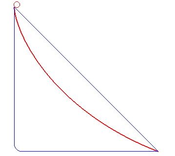
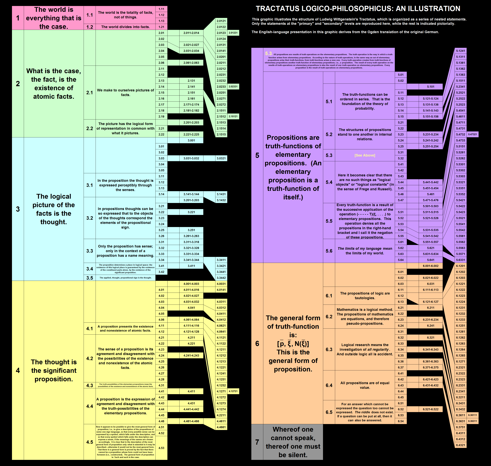

## Enduring Cognitive Impairment with Famous Scientists
#### [Sir Isaac Newton](https://en.wikipedia.org/wiki/Isaac_Newton)

    

> Sir Isaac Newton PRS (25 December 1642 – 20 March 1726/27) was an English mathematician, physicist, astronomer, theologian, and author (described in his own day as a "natural philosopher") who is widely recognised as one of the most influential scientists of all time and as a key figure in the scientific revolution. His book Philosophiæ Naturalis Principia Mathematica (Mathematical Principles of Natural Philosophy), first published in 1687, established classical mechanics. Newton also made seminal contributions to optics, and shares credit with Gottfried Wilhelm Leibniz for developing the infinitesimal calculus. 

    

> Newton was a fellow of Trinity College and the second Lucasian Professor of Mathematics at the University of Cambridge. He was a devout but unorthodox Christian who privately rejected the doctrine of the Trinity. Unusually for a member of the Cambridge faculty of the day, he refused to take holy orders in the Church of England. Beyond his work on the mathematical sciences, Newton dedicated much of his time to the study of alchemy and biblical chronology, but most of his work in those areas remained unpublished until long after his death. Politically and personally tied to the Whig party, Newton served two brief terms as Member of Parliament for the University of Cambridge, in 1689–90 and 1701–02. He was knighted by Queen Anne in 1705 and spent the last three decades of his life in London, serving as Warden (1696–1699) and Master (1699–1727) of the Royal Mint, as well as president of the Royal Society (1703–1727).

#### [Thomas Bayes](https://en.wikipedia.org/wiki/Thomas_Bayes)
> Thomas Bayes (c. 1701 – 7 April 1761) was an English statistician, philosopher and Presbyterian minister who is known for formulating a specific case of the theorem that bears his name: Bayes' theorem. Bayes never published what would become his most famous accomplishment; his notes were edited and published after his death by Richard Price.

#### [Carl Friedrich Gauss](https://en.wikipedia.org/wiki/Carl_Friedrich_Gauss)
> Johann Carl Friedrich Gauss (30 April 1777 – 23 February 1855) was a German mathematician and physicist who made significant contributions to many fields in mathematics and science. Sometimes referred to as the Princeps mathematicorum (Latin for '"the foremost of mathematicians"') and "the greatest mathematician since antiquity", Gauss had an exceptional influence in many fields of mathematics and science, and is ranked among history's most influential mathematicians.

#### [Ludwig Wittgenstein](https://en.wikipedia.org/wiki/Ludwig_Wittgenstein)
> Ludwig Josef Johann Wittgenstein (26 April 1889 – 29 April 1951) was an Austrian-British philosopher who worked primarily in logic, the philosophy of mathematics, the philosophy of mind, and the philosophy of language. From 1929 to 1947, Wittgenstein taught at the University of Cambridge. During his lifetime he published just one slim book (the 75-page Tractatus Logico-Philosophicus, 1921), one article ("Some Remarks on Logical Form", 1929), one book review and a children's dictionary. His voluminous manuscripts were edited and published posthumously. The first and best-known of this posthumous series is the 1953 book Philosophical Investigations. His teacher, Bertrand Russell, described Wittgenstein as "perhaps the most perfect example I have ever known of genius as traditionally conceived; passionate, profound, intense, and dominating."

#### [Marcel Grossman](https://en.wikipedia.org/wiki/Marcel_Grossmann), [Albert Einstein](http://einsteinrelativelyeasy.com/index.php) and [Michele Besso](https://en.wikipedia.org/wiki/Michele_Besso)

> Albert Einstein's friendship with Grossmann began with their school days in Zurich. Grossmann's careful and complete lecture notes at the Federal Polytechnic School proved to be a salvation for Einstein, who missed many lectures. Grossmann's father helped Einstein get his job at the Swiss Patent Office in Bern, and it was Grossmann who helped to conduct the negotiations to bring Einstein back from Prague as a professor of physics at the Zurich Polytechnic. Grossmann was an expert in differential geometry and tensor calculus; just the mathematical tools providing a proper mathematical framework for Einstein's work on gravity. Thus, it was natural that Einstein would enter into a scientific collaboration with Grossmann.

    

> It was Grossmann who emphasized the importance of a non-Euclidean geometry called Riemannian geometry (also elliptic geometry) to Einstein, which was a necessary step in the development of Einstein's general theory of relativity. Abraham Pais's book on Einstein suggests that Grossmann mentored Einstein in tensor theory as well. Grossmann introduced Einstein to the absolute differential calculus, started by Christoffel and fully developed by Ricci-Curbastro and Levi-Civita. Grossmann facilitated Einstein's unique synthesis of mathematical and theoretical physics in what is still today considered the most elegant and powerful theory of gravity: the general theory of relativity. The collaboration of Einstein and Grossmann led to a ground-breaking paper: "Outline of a Generalized Theory of Relativity and of a Theory of Gravitation", which was published in 1913 and was one of the two fundamental papers which established Einstein's theory of gravity.

    

[Turns Out Einstein Was A Cold-Hearted Misogynist Who Attempted To Control His Wife’s Every Move](https://medium.com/@editors_91459/turns-out-einstein-was-a-cold-hearted-misogynist-who-attempted-to-control-his-wifes-every-move-c3f1ff70bf8c)

#### [George Lemaître](https://en.wikipedia.org/wiki/Georges_Lema%C3%AEtre)
> Georges Henri Joseph Édouard Lemaître (17 July 1894 – 20 June 1966) was a Belgian Catholic priest, mathematician, astronomer, and professor of physics at the Catholic University of Louvain. He was the first to theorize that the recession of nearby galaxies can be explained by an expanding universe, which was observationally confirmed soon afterwards by Edwin Hubble. He first derived "Hubble's law", now called the Hubble–Lemaître law by the IAU, and published the first estimation of the Hubble constant in 1927, two years before Hubble's article. Lemaître also proposed the "Big Bang theory" of the origin of the universe, calling it the "hypothesis of the primeval atom", and later calling it "the beginning of the world".

## [What Makes Others Question their Faith](https://en.wikipedia.org/wiki/Carl_Friedrich_Gauss#Religious_views)

Mixing [**Religion**](https://en.wikipedia.org/wiki/Religion) and [**Numerology**](https://en.wikipedia.org/wiki/Numerology) makes some people lose faith:

0. [0x003](https://en.wikipedia.org/wiki/3#Religion)
0. [0x29A](https://en.wikipedia.org/wiki/666_(number)#Other_occurrences)
0. [0x3E7](https://en.wikipedia.org/wiki/999_(number)#Symbology_and_numerology)

if we are to engage in such practices there are better candidates:

0. [0 - beautiful, pleasant, good](https://en.wikipedia.org/wiki/0#Ancient_Near_East)
0. [φ](https://en.wikipedia.org/wiki/Golden_ratio)
0. [π](https://en.wikipedia.org/wiki/Pi)

[Religious views of Sir Isaac Newton](http://www.newtonproject.ox.ac.uk/view/contexts/CNTX00001)

    

> Isaac Newton (4 January 1643 – 31 March 1727) was considered an insightful and erudite theologian by his contemporaries. He wrote many works that would now be classified as occult studies and religious tracts dealing with the literal interpretation of the Bible.Newton's conception of the physical world provided a stable model of the natural world that would reinforce stability and harmony in the civic world. Newton saw a monotheistic God as the masterful creator whose existence could not be denied in the face of the grandeur of all creation. Although born into an Anglican family, by his thirties Newton held a Christian faith that, had it been made public, would not have been considered orthodox by mainstream Christians; Scholars now consider him an [Arian](https://en.wikipedia.org/wiki/Arianism). John Rogers in 2019 stated, "Heretics both, John Milton and Isaac Newton were, as most scholars now agree, Arians."

[Wittgenstein on the Gulf Between Believers and Non-Believers](https://link.springer.com/article/10.1007/s11406-012-9405-2)

    

> “It is a dogma of the Roman Church that the existence of God can be proved by natural reason. Now this dogma would make it impossible for me to be a Roman Catholic. If I thought of God as another being like myself, outside myself, only infinitely more powerful, then I would regard it as my duty to defy him.”

[George Lemaître and Pope Piux XII](http://inters.org/pius-xii-lemaitre)

    

> Pius XII in proposing a supposed link between the expansion of the universe hypothesis (Big Bang) – of which Lemaître was one of the first theorists – and the possibility to produce “scientific” evidence of the existence of God. According to a widely circulated version of events today, Pius XII supposedly claimed in a discussion held at the Pontifical Academy of Sciences in November 1951 that the recent astronomical discoveries confirmed the initial page of the Book of Genesis when the latter describes the creation of the universe as a Fiat lux. In essence, science, according to the Pontiff’s judgment, in those years was providing evidence for the existence of God. In a personal meeting expressly requested a short time later, Lemaître supposedly corrected the Pontiff on his errors, telling him he was mistaken in making “concordist” comments on science and Holy Scripture.

Just before my Catholic confirmation rite the priest asked us to ponder the following hypothesis.
> Imagine a dark skinned preagnant teenager in that time being stoned to death for being preagnant and unmarried. In those days there was no way of proving otherwise. If everyone believed in imaculate conception and tried to convince everyone else, two lives would be saved, if a single person doubted it, both would die. What would you do ?

If Saint Joseph was the foster father of Jesus, then **adoption** should be seen as a traditional family value. Pope Francis recently said:
> Homosexual people have the right to be in a family. They are children of God and have a right to a family. Nobody should be thrown out or be made miserable over it. What we have to have is a civil union law—that way they are legally covered. I supported that.

Pope Francis, by this comment, is considered to be the first pope to endorse same-sex civil unions. There are circa 1.329 billion catholic people in the world. [72 jurisdictions criminalise private, consensual, same-sex sexual activity. The majority of these jurisdictions explicitly criminalise sex between men via ‘sodomy’, ‘buggery’ and ‘unnatural offences’ laws. Almost half of them are Commonwealth jurisdictions.](https://www.humandignitytrust.org/lgbt-the-law/map-of-criminalisation/)

     

Carl Friedrich Gauss strongly upheld religious tolerance, believing 
> "that one is not justified in disturbing another's religious belief, in which they find consolation for earthly sorrows in time of trouble."

## How I keep my Faith
#### [Holy Trinity](https://en.wikipedia.org/wiki/Trinity)

> The Christian doctrine of the Trinity holds that God is one God, but three coeternal and consubstantial persons: the Father, the Son (Jesus Christ), and the Holy Spirit. The three persons are distinct, yet are one "substance, essence or nature" (homoousios). In this context, a "nature" is what one is, whereas a "person" is who one is.

> The subset of Christianity that accepts this doctrine is collectively known as Trinitarianism, while the subset that does not is referred to as Nontrinitarianism (see also Arianism). Trinitarianism contrasts with positions such as Binitarianism (one deity in two persons) and Monarchianism (no plurality of persons within God), of which Modalistic Monarchianism (one deity revealed in three modes) and Unitarianism (one deity in one person) are subsets.

> While the developed doctrine of the Trinity is not explicit in the books that constitute the New Testament, the New Testament possesses a "triadic" understanding of God and contains a number of Trinitarian formulas. The doctrine of the Trinity was first formulated among the early Christians and fathers of the Church as early Christians attempted to understand the relationship between Jesus and God in their scriptural documents and prior traditions.

#### [Stigmata](https://en.wikipedia.org/wiki/Stigmata)
> Stigmata in Christianity, are the appearance of bodily wounds, scars and pain in locations corresponding to the crucifixion wounds of Jesus Christ, such as the hands, wrists and feet. An individual bearing the wounds of stigmata is a stigmatist or a stigmatic.

In Galatians 6:17, Saint Paul says:
> From henceforth let no man trouble me: for I bear in my body the marks of the Lord Jesus.

A stígma is a mark on the skin.

> Stigmata are primarily associated with Roman Catholicism. Many reported stigmatics are members of Catholic religious orders. St. Francis of Assisi was the first recorded stigmatic. For over fifty years, St. Padre Pio of Pietrelcina of the Order of Friars Minor Capuchin reported stigmata which were studied by several 20th-century physicians. Stigmata are notably foreign to the Eastern Orthodox Church, which professes no official view on the matter; the first and only stigmatics have been Catholics who lived after the Great Schism of 1054.

> A high percentage (perhaps over 80%) of all stigmatics are women. In his Stigmata: A Medieval Phenomenon in a Modern Age, Ted Harrison suggests that there is no single mechanism whereby the marks of stigmata were produced. What is important is that the marks are recognised by others as of religious significance. Most cases of stigmata have been debunked as trickery.Some cases have also included reportings of a mysterious chalice in visions being given to stigmatics to drink from or the feeling of a sharp sword being driven into one's chest.

#### [Incorruptibility](https://en.wikipedia.org/wiki/Incorruptibility)
> Incorruptibility is a Roman Catholic and Eastern Orthodox belief that divine intervention allows some human bodies (specifically saints and beati) to avoid the normal process of decomposition after death as a sign of their holiness. Bodies that undergo little or no decomposition, or delayed decomposition, are sometimes referred to as incorrupt or incorruptible. Incorruptibility is thought to occur even in the presence of factors which normally hasten decomposition, as in the cases of saints Catherine of Genoa, Julie Billiart and Francis Xavier.

#### [Marian apparitions](https://en.wikipedia.org/wiki/List_of_Marian_apparitions)
> Marian apparitions are reported supernatural appearances by Mary, the mother of Jesus

## [Rubik's Cube](https://en.wikipedia.org/wiki/Missionary)

## [Enduring Cybertorture with unilateral disarmament](https://en.wikipedia.org/wiki/Octopussy)

    

