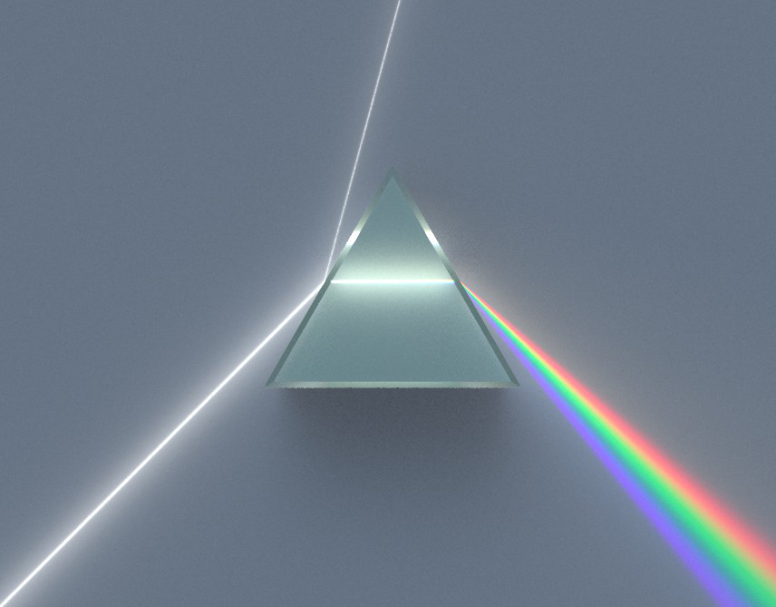
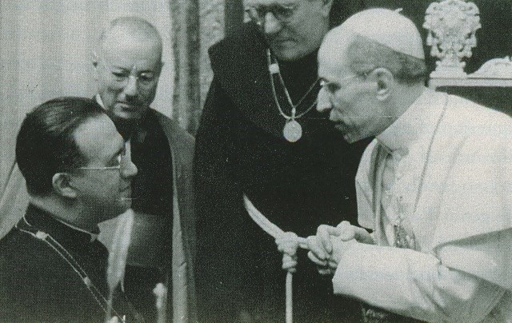

## [What Makes Others Question their Faith](https://en.wikipedia.org/wiki/Carl_Friedrich_Gauss#Religious_views)

Mixing [**Religion**](https://en.wikipedia.org/wiki/Religion) and [**Numerology**](https://en.wikipedia.org/wiki/Numerology) makes some people lose faith:

0. [0x003](https://en.wikipedia.org/wiki/3#Religion)
0. [0x29A](https://en.wikipedia.org/wiki/666_(number)#Other_occurrences)
0. [0x3E7](https://en.wikipedia.org/wiki/999_(number)#Symbology_and_numerology)

if we are to engage in such practices there are better candidates:

0. [0 - beautiful, pleasant, good](https://en.wikipedia.org/wiki/0#Ancient_Near_East)
0. [φ](https://en.wikipedia.org/wiki/Golden_ratio)
0. [π](https://en.wikipedia.org/wiki/Pi)

[Religious views of Sir Isaac Newton](http://www.newtonproject.ox.ac.uk/view/contexts/CNTX00001)

    

> Isaac Newton (4 January 1643 – 31 March 1727) was considered an insightful and erudite theologian by his contemporaries. He wrote many works that would now be classified as occult studies and religious tracts dealing with the literal interpretation of the Bible.Newton's conception of the physical world provided a stable model of the natural world that would reinforce stability and harmony in the civic world. Newton saw a monotheistic God as the masterful creator whose existence could not be denied in the face of the grandeur of all creation. Although born into an Anglican family, by his thirties Newton held a Christian faith that, had it been made public, would not have been considered orthodox by mainstream Christians; Scholars now consider him an [Arian](https://en.wikipedia.org/wiki/Arianism). John Rogers in 2019 stated, "Heretics both, John Milton and Isaac Newton were, as most scholars now agree, Arians."

[Wittgenstein on the Gulf Between Believers and Non-Believers](https://link.springer.com/article/10.1007/s11406-012-9405-2)

    

> “It is a dogma of the Roman Church that the existence of God can be proved by natural reason. Now this dogma would make it impossible for me to be a Roman Catholic. If I thought of God as another being like myself, outside myself, only infinitely more powerful, then I would regard it as my duty to defy him.”

[George Lemaître and Pope Piux XII](http://inters.org/pius-xii-lemaitre)

    

> Pius XII in proposing a supposed link between the expansion of the universe hypothesis (Big Bang) – of which Lemaître was one of the first theorists – and the possibility to produce “scientific” evidence of the existence of God. According to a widely circulated version of events today, Pius XII supposedly claimed in a discussion held at the Pontifical Academy of Sciences in November 1951 that the recent astronomical discoveries confirmed the initial page of the Book of Genesis when the latter describes the creation of the universe as a Fiat lux. In essence, science, according to the Pontiff’s judgment, in those years was providing evidence for the existence of God. In a personal meeting expressly requested a short time later, Lemaître supposedly corrected the Pontiff on his errors, telling him he was mistaken in making “concordist” comments on science and Holy Scripture.

Just before my Catholic confirmation rite the priest asked us to ponder the following hypothesis.
> Imagine a dark skinned preagnant teenager in that time being stoned to death for being preagnant and unmarried. In those days there was no way of proving otherwise. If everyone believed in imaculate conception and tried to convince everyone else, two lives would be saved, if a single person doubted it, both would die. What would you do ?

If Saint Joseph was the foster father of Jesus, then **adoption** should be seen as a traditional family value. Pope Francis recently said:
> Homosexual people have the right to be in a family. They are children of God and have a right to a family. Nobody should be thrown out or be made miserable over it. What we have to have is a civil union law—that way they are legally covered. I supported that.

Pope Francis, by this comment, is considered to be the first pope to endorse same-sex civil unions. There are circa 1.329 billion catholic people in the world. [72 jurisdictions criminalise private, consensual, same-sex sexual activity. The majority of these jurisdictions explicitly criminalise sex between men via ‘sodomy’, ‘buggery’ and ‘unnatural offences’ laws. Almost half of them are Commonwealth jurisdictions.](https://www.humandignitytrust.org/lgbt-the-law/map-of-criminalisation/)

     

Carl Friedrich Gauss strongly upheld religious tolerance, believing 
> "that one is not justified in disturbing another's religious belief, in which they find consolation for earthly sorrows in time of trouble."

## How I keep my Faith
#### [Holy Trinity](https://en.wikipedia.org/wiki/Trinity)

> The Christian doctrine of the Trinity holds that God is one God, but three coeternal and consubstantial persons: the Father, the Son (Jesus Christ), and the Holy Spirit. The three persons are distinct, yet are one "substance, essence or nature" (homoousios). In this context, a "nature" is what one is, whereas a "person" is who one is.

> The subset of Christianity that accepts this doctrine is collectively known as Trinitarianism, while the subset that does not is referred to as Nontrinitarianism (see also Arianism). Trinitarianism contrasts with positions such as Binitarianism (one deity in two persons) and Monarchianism (no plurality of persons within God), of which Modalistic Monarchianism (one deity revealed in three modes) and Unitarianism (one deity in one person) are subsets.

> While the developed doctrine of the Trinity is not explicit in the books that constitute the New Testament, the New Testament possesses a "triadic" understanding of God and contains a number of Trinitarian formulas. The doctrine of the Trinity was first formulated among the early Christians and fathers of the Church as early Christians attempted to understand the relationship between Jesus and God in their scriptural documents and prior traditions.

#### [Stigmata](https://en.wikipedia.org/wiki/Stigmata)
> Stigmata in Christianity, are the appearance of bodily wounds, scars and pain in locations corresponding to the crucifixion wounds of Jesus Christ, such as the hands, wrists and feet. An individual bearing the wounds of stigmata is a stigmatist or a stigmatic.

In Galatians 6:17, Saint Paul says:
> From henceforth let no man trouble me: for I bear in my body the marks of the Lord Jesus.

A stígma is a mark on the skin.

> Stigmata are primarily associated with Roman Catholicism. Many reported stigmatics are members of Catholic religious orders. St. Francis of Assisi was the first recorded stigmatic. For over fifty years, St. Padre Pio of Pietrelcina of the Order of Friars Minor Capuchin reported stigmata which were studied by several 20th-century physicians. Stigmata are notably foreign to the Eastern Orthodox Church, which professes no official view on the matter; the first and only stigmatics have been Catholics who lived after the Great Schism of 1054.

> A high percentage (perhaps over 80%) of all stigmatics are women. In his Stigmata: A Medieval Phenomenon in a Modern Age, Ted Harrison suggests that there is no single mechanism whereby the marks of stigmata were produced. What is important is that the marks are recognised by others as of religious significance. Most cases of stigmata have been debunked as trickery.Some cases have also included reportings of a mysterious chalice in visions being given to stigmatics to drink from or the feeling of a sharp sword being driven into one's chest.

#### [Incorruptibility](https://en.wikipedia.org/wiki/Incorruptibility)
> Incorruptibility is a Roman Catholic and Eastern Orthodox belief that divine intervention allows some human bodies (specifically saints and beati) to avoid the normal process of decomposition after death as a sign of their holiness. Bodies that undergo little or no decomposition, or delayed decomposition, are sometimes referred to as incorrupt or incorruptible. Incorruptibility is thought to occur even in the presence of factors which normally hasten decomposition, as in the cases of saints Catherine of Genoa, Julie Billiart and Francis Xavier.

#### [Marian apparitions](https://en.wikipedia.org/wiki/List_of_Marian_apparitions)
> Marian apparitions are reported supernatural appearances by Mary, the mother of Jesus

#### ["Deus Caritas Est"](http://www.vatican.va/content/benedict-xvi/en/encyclicals/documents/hf_ben-xvi_enc_20051225_deus-caritas-est.html)
Deus caritas est, subtitled De Christiano Amore, is a 2005 encyclical, the first written by Pope Benedict XVI, in large part derived from writings by his late predecessor, Pope John Paul II. Its subject is love, as seen from a Christian perspective, and God's place within all love.
