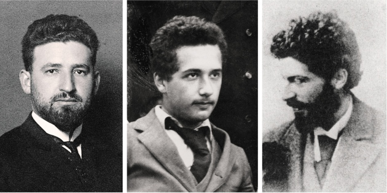
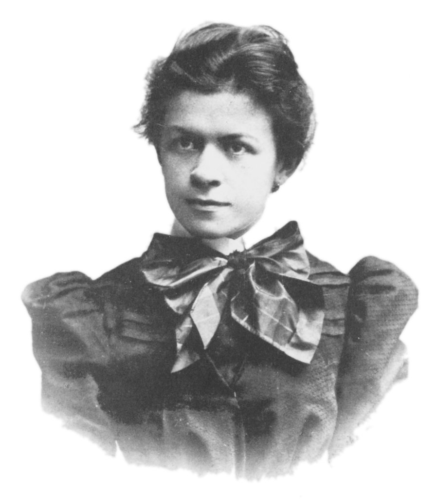

## Enduring Cognitive Impairment with Famous Scientists
#### [Sir Isaac Newton](https://en.wikipedia.org/wiki/Isaac_Newton)

    

> Sir Isaac Newton PRS (25 December 1642 – 20 March 1726/27) was an English mathematician, physicist, astronomer, theologian, and author (described in his own day as a "natural philosopher") who is widely recognised as one of the most influential scientists of all time and as a key figure in the scientific revolution. His book Philosophiæ Naturalis Principia Mathematica (Mathematical Principles of Natural Philosophy), first published in 1687, established classical mechanics. Newton also made seminal contributions to optics, and shares credit with Gottfried Wilhelm Leibniz for developing the infinitesimal calculus. 

    

> Newton was a fellow of Trinity College and the second Lucasian Professor of Mathematics at the University of Cambridge. He was a devout but unorthodox Christian who privately rejected the doctrine of the Trinity. Unusually for a member of the Cambridge faculty of the day, he refused to take holy orders in the Church of England. Beyond his work on the mathematical sciences, Newton dedicated much of his time to the study of alchemy and biblical chronology, but most of his work in those areas remained unpublished until long after his death. Politically and personally tied to the Whig party, Newton served two brief terms as Member of Parliament for the University of Cambridge, in 1689–90 and 1701–02. He was knighted by Queen Anne in 1705 and spent the last three decades of his life in London, serving as Warden (1696–1699) and Master (1699–1727) of the Royal Mint, as well as president of the Royal Society (1703–1727).

#### [Thomas Bayes](https://en.wikipedia.org/wiki/Thomas_Bayes)
> Thomas Bayes (c. 1701 – 7 April 1761) was an English statistician, philosopher and Presbyterian minister who is known for formulating a specific case of the theorem that bears his name: Bayes' theorem. Bayes never published what would become his most famous accomplishment; his notes were edited and published after his death by Richard Price.

#### [Carl Friedrich Gauss](https://en.wikipedia.org/wiki/Carl_Friedrich_Gauss)
> Johann Carl Friedrich Gauss (30 April 1777 – 23 February 1855) was a German mathematician and physicist who made significant contributions to many fields in mathematics and science. Sometimes referred to as the Princeps mathematicorum (Latin for '"the foremost of mathematicians"') and "the greatest mathematician since antiquity", Gauss had an exceptional influence in many fields of mathematics and science, and is ranked among history's most influential mathematicians.

#### [Ludwig Wittgenstein](https://en.wikipedia.org/wiki/Ludwig_Wittgenstein)
> Ludwig Josef Johann Wittgenstein (26 April 1889 – 29 April 1951) was an Austrian-British philosopher who worked primarily in logic, the philosophy of mathematics, the philosophy of mind, and the philosophy of language. From 1929 to 1947, Wittgenstein taught at the University of Cambridge. During his lifetime he published just one slim book (the 75-page Tractatus Logico-Philosophicus, 1921), one article ("Some Remarks on Logical Form", 1929), one book review and a children's dictionary. His voluminous manuscripts were edited and published posthumously. The first and best-known of this posthumous series is the 1953 book Philosophical Investigations. His teacher, Bertrand Russell, described Wittgenstein as "perhaps the most perfect example I have ever known of genius as traditionally conceived; passionate, profound, intense, and dominating."

#### [Marcel Grossman](https://en.wikipedia.org/wiki/Marcel_Grossmann), [Albert Einstein](http://einsteinrelativelyeasy.com/index.php) and [Michele Besso](https://en.wikipedia.org/wiki/Michele_Besso)

> Albert Einstein's friendship with Grossmann began with their school days in Zurich. Grossmann's careful and complete lecture notes at the Federal Polytechnic School proved to be a salvation for Einstein, who missed many lectures. Grossmann's father helped Einstein get his job at the Swiss Patent Office in Bern, and it was Grossmann who helped to conduct the negotiations to bring Einstein back from Prague as a professor of physics at the Zurich Polytechnic. Grossmann was an expert in differential geometry and tensor calculus; just the mathematical tools providing a proper mathematical framework for Einstein's work on gravity. Thus, it was natural that Einstein would enter into a scientific collaboration with Grossmann.

    

> It was Grossmann who emphasized the importance of a non-Euclidean geometry called Riemannian geometry (also elliptic geometry) to Einstein, which was a necessary step in the development of Einstein's general theory of relativity. Abraham Pais's book on Einstein suggests that Grossmann mentored Einstein in tensor theory as well. Grossmann introduced Einstein to the absolute differential calculus, started by Christoffel and fully developed by Ricci-Curbastro and Levi-Civita. Grossmann facilitated Einstein's unique synthesis of mathematical and theoretical physics in what is still today considered the most elegant and powerful theory of gravity: the general theory of relativity. The collaboration of Einstein and Grossmann led to a ground-breaking paper: "Outline of a Generalized Theory of Relativity and of a Theory of Gravitation", which was published in 1913 and was one of the two fundamental papers which established Einstein's theory of gravity.

    

[Turns Out Einstein Was A Cold-Hearted Misogynist Who Attempted To Control His Wife’s Every Move](https://medium.com/@editors_91459/turns-out-einstein-was-a-cold-hearted-misogynist-who-attempted-to-control-his-wifes-every-move-c3f1ff70bf8c)

#### [George Lemaître](https://en.wikipedia.org/wiki/Georges_Lema%C3%AEtre)
> Georges Henri Joseph Édouard Lemaître (17 July 1894 – 20 June 1966) was a Belgian Catholic priest, mathematician, astronomer, and professor of physics at the Catholic University of Louvain. He was the first to theorize that the recession of nearby galaxies can be explained by an expanding universe, which was observationally confirmed soon afterwards by Edwin Hubble. He first derived "Hubble's law", now called the Hubble–Lemaître law by the IAU, and published the first estimation of the Hubble constant in 1927, two years before Hubble's article. Lemaître also proposed the "Big Bang theory" of the origin of the universe, calling it the "hypothesis of the primeval atom", and later calling it "the beginning of the world".

