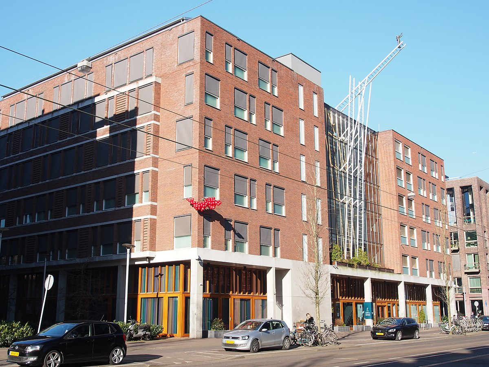
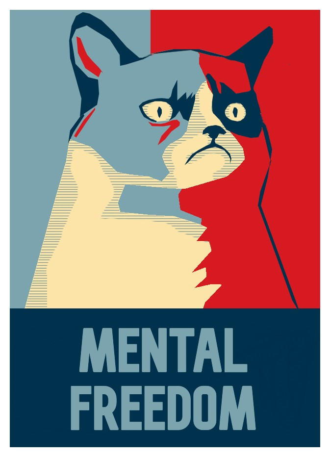

## Mentis Morbum Tuum 𝄫

#### I've exiled myself in the Netherlands and I refuse to return to Portugal under any terms or conditions where this treatment has been aggravated by Former [Colégio Militar](https://www.colegiomilitar.pt/) Students. Some worked for the security staff of the President of the Portuguese Republic and engaged in a Megalomaniac plot since I was 14 years old to exact an extrajudicial sentence of intercourse sabotage with involuntary perineum contractions, directing violence towards women and my parents. This has been pilled upon with a perpetual sentence of cognitive impairment misdiagnosed as paranoid schizophrenic as a coverup under constant vibrotactile genital torture and cyber Sodomy to force self-harm!

0. **Luis Nazareth Carvalho Figueira** (17 at Colégio Militar) @PSP who planned this since I was a teenager.
0. [**Tito Eurico Miranda Fernandes**](https://dre.pt/home/-/dre/115800591/details/maximized) (15 at Colégio Militar) @PSP - Tito was recruited by Luis Figueira and worked directly for the security staff of the President of the Portuguese Republic making it hard to understand why Europol doesn't take prompt action. Hopefully not to see an encore of the sad spectacle involving [**Jasper Kums**](https://nl.linkedin.com/in/jasperkums) who acted in criminal association with so many others on the 1st January 2017. Tito has been sabotaging prayer and telephone communication with my mother gambling self-harm via incessant vibrotactile payloads delivered to my ears and soft tissues in my head and is surrounded with individuals entertaining themselves by watching me break the few belongings I have!

Portuguese Law Enforcement Officers like:

0. [**Pedro Miguel Grilo**](https://pt.linkedin.com/in/pedro-grilo-8760013b) (427 at Colégio Militar) @PSP - instructed me to jump out of a rooftop in the Netherlands and out of the window in front of my mother whilst remotely gaping my anus as my mother complained she urinated herself in the middle of the night from watching me hit myself in the head!
0. João Pinheiro (277 at Colégio Militar) **exonerated** @PSP officer

The previous Former Colégio Militar students act in criminal association with several others such as:

0. [**Jasper Kums**](https://nl.linkedin.com/in/jasperkums) (my former employer @EenvoudAgency) who attempted to turn me into a stalker!
0. [**Gonçalo Carvalho**](https://nl.linkedin.com/in/gccarvalho/de) (my former colleague at @Quby and possibly related to [ISCPSI](http://www.iscpsi.pt/) where Pedro Miguel Grilo also used to work) who attempted to drive me insane by insinuating he was having sex with Queen Maxima of the Netherlands over synthetic telepathy as I was sexually abused remotely!
0. [**Gonçalo Bandeira Duarte**](https://pt.linkedin.com/in/gon%C3%A7alo-duarte-b71078107?trk=people-guest_people_search-card) (a known criminal who conspired to get me to mimick his xenophobic, homophobic and misogynistic behavior)
0. [**Tiago Jorge Roque**](https://www.facebook.com/tiago.j.roque) (Neighbor of Gonçalo Bandeira Duarte)
0. João Leiria (a former [Tapada Crew](https://www.tapadacrew.com/) employee @WorldCrewEvents. Employees at Tapada Crew have ties to Colégio Militar and neighbors of Gonçalo Bandeira Duarte)
0. A very large number of individuals associated to the former owners of ["Água pela Barba" next to Jardim do Adamastor at Rua do Almada, Lisboa](https://goo.gl/maps/S5dwABC3DVC2Zsjv9) some of which were recruited and sent to the Netherlands (like Jessica owner of the mobile phone +31 684166784) and involved their social groups (which include a couple consisting of a DJ who goes by the name of Dresh, his influential father who I never met and his girlfriend who may be a psychiatrist).
0. Carla Maria Marinho Rodrigues - who seems determined to force self-harm as revenge for insinuating she was a cocaine addict) and Nuno Correia. 
0. [Nuno Correia](https://pt.linkedin.com/in/nuno-correia-383a86154) - may be acting in criminal association with his mother, a nurse who claimed Portuguese doctors were better than Doctors in the Netherlands in a possible attempt to manipulate me to live with my mother in Portugal. His mother is my mothers neighbor at the 12th floor). I worked for Nuno for 3 day at Merkkurio Digital and I hope other members of his family (like his father and his brother) haven't turned the Justice System in the Netherlands into a Theatrical Circus.

These individuals enforce a cognitive impairment extrajudicial sentence, direct violence towards others (including women, my parents, police officers, psychiatrists and medical personnel) sabotage everything I do, including maintaining a regular breathing pattern, attempting to force self-harm instead, making it impossible to find a job working in the physical vicinity of others, trying to craft numerous psychological traumas and forcing me to live in celibacy and solitude to avoid arguments and violent confrontations. 

This sadly aids their cause of forcing psychiatric fraud and false therapy in the form of forced conventional pharmacotherapy to stab my gluteus maximus with a needle as a humiliation whilst trying to look like **Artists** at forcing me to hurt myself with amplified and distorted sonic and vibrotactile preludes of grotesque "Kisses" forced upon soft tissues in head and brain mass!

      <a href="https://en.wikipedia.org/wiki/Doubting_Thomas">
         
      </a>

They exact morbid extrajudicial cognitive impairment sentences for entertainment which in my case consist of:

0. articulating my tongue and jaw to force me to utter words in the Portuguese language
0. forcing me to feel slapped in an attempt to force self-harm delivering noxious payloads to the back of the head (cerebellum) every few seconds
0. attempting to force self-harm delivering vibrotactile payloads to my ears every few seconds
0. forcing me to extract teeth via remote control of blood flow and nociception with oscillatory patterns simulating masturbation
0. dislodging my skull from it's resting place so I can't keep my head straight every few seconds
0. watching me destroy my private property setting as targets mobile phone and laptop so I can't work or use social media
0. sensitizing nerve endings to maximize impact and forcing synthetic hyperhidrosis of hands and feet as a social exclusion measure
0. cybersodomy and synthetic nociception on my anus
0. all day vibrotactile genital torture every single day trying to guarantee synthetic psychotic behavior and self-harm
0. sabotage of all learning experiences
0. sabotage of multimedia experiences (listening to music or watching TV)
0. directing violence towards the people around me
0. trying to force me to spit on supermarket employees during the current SARS-CoV-2 pandemia at the moment of paying
0. trying to fill my home with fungi forcing me into the shower for relief for long periods with synthetic back pain

#### They intensify this treatment in the presence of my elderly mother jeopardizing her mental and physical well being as a sentence to both of us for not leaving Colégio Militar at age 14 after performing Faith Trials over synthetic telepathy and attempting to portrait me as a Pedo to force me out of school!

#### Luis Nazareth Carvalho Figueira asked me not to approach women in 2016 as those acting in criminal association with [Jasper Kums](https://nl.linkedin.com/in/jasperkums) conspired to turn me into a stalker and violent towards women without much success! As such I've taken vows of cellibacy in order to comply with his request!

#### Message sent to my lawyer [Mr. Edo Bruijn](https://bruijnadvocaten.nl/) on the 20th December 2020 as I await the decision of a court of Law in the Netherlands due to *"Doctor"* [Emile Barkhof](https://nl.linkedin.com/in/emile-barkhof-8277a6106) trying to force conventional antipsychotic pharmacotherapy upon me against my will, whilst knowing fully well I am being treated in a cruel and inhumane way via cybertorture to simulate [paranoid schizophrenia](https://en.wikipedia.org/wiki/Schizophrenia) (by individuals who direct violence towards women, my parents, the police and psychiatrists) and try to force acts of self-harm (every few seconds) under the false pretense of making me **_Cry_**!

> Hello Dr. Bruijn. I would like to reiterate the fact that cybertorture is being used to simulate behavior that may resemble paranoid schizophrenia by individuals I mentioned to you in the past and on my personal [github page](https://strikles.github.io). I would also like to state that the only type of therapy in which I would participate voluntarily if paranoid schizophrenia was my real condition would be via the use of electroceuticals (an example electroceutical being [electRx](https://www.darpa.mil/program/electrical-prescriptions)). Forcing suboptimal conventional pharmacotherapy when superior solutions are available is inhumane and doctors that insist on that particular form of "therapy" (if you can call it that) don't have the best interests of the patient at heart, since that particular kind of antipsychotic medication doesn't address the problems of the patient in the best possible way and corresponds to psychiatric fraud, medical malpractice and cruel and inhumane treatment. Further insisting on medication with side effects like [hyperprolactinaemia](https://www.ncbi.nlm.nih.gov/pmc/articles/PMC1122185/), [tardive dyskinesia](https://en.wikipedia.org/wiki/Tardive_dyskinesia) or [sexual dysfunction](https://en.wikipedia.org/wiki/Sexual_dysfunction) corresponds to [intentionally collaborating with forcing suicidal thoughts upon the patient](https://www.ncbi.nlm.nih.gov/pmc/articles/PMC5085732/). A good Sunday to you 🙏

During our first interview he insinuated this was being done to me due to my lack of knowledge on **_"how things work at the neurotransmitter level"_** and my **_previous work experience_**, giving me a **_judgemental look of disaproval_** when he attempted to redirect the conversation into how well previous pharmacotherapy approaches had worked and I interrupted suggesting **_neuromodulation via electroceuticals_**. He **_mocked me with a grin_** when I stated none of the previous pharmacotherapy approaches worked and **_rejected both my proposal and my request to see a psychologist to deal with the many traumas induced due to the cybertorture procedure_**, forcing me to meet him again whilst under severe cybertorture abuse and **_repeating himself over and over again_** trying to force me to accept a conventional pharmacological approach **_using diminutives_** trying to make his coercive initiative sound less harmful, followed by asking a court of law for conventional antipsychotic pharmacotherapy to be forced upon me, which is a clear violation of [The Right to Refuse Medical Treatment under the European Convention on Human Rights](https://academic.oup.com/medlaw/article-abstract/9/1/17/973865).

**_Psychiatrists who behave like this violating the [WPA Code of Ethics](https://www.wpanet.org/policies) seem to have more psychopathological issues than the patients they pretend to treat and remind me of South Park character Dr. William Janus - Season 15, Episode 6 - [City Sushy](https://www.southparkstudios.com/episodes/dhi2tb/south-park-city-sushi-season-15-ep-6)_**

This was followed by a videocall interview at the Mentrum Emergency Psychiatry Clinic in Eerste Constantijn Huygensstraat to talk to an independent psychiatrist and assert if I was a danger to myself where I found a statue named "How to meet an Angel" by Ilya and Emilia Kabakov was installed!

To the care of Ilya and Emilia Kabakov,

Dear Ilya and Emilia,

I write regarding the art piece "How to meet an Angel" installed at the Mentrum Emergency Psychiatry Clinic in Eerste Constantijn Huygensstraat

    <a href="https://nl.wikipedia.org/wiki/How_to_meet_an_angel">
        
    </a>

Cybertorture is recognized by the United Nations under A/HRC/43/49 and is used in grotesque rituals of social stratification (by law enforcement and others recruited for the purpose) to exact extrajudicial trials and sentences as an interactive spectacle encouraging participation, mongering tensions and hatred by preying on cognitive biases.

Those who exact the extrajudicial sentences resort to directing violence towards women, parents, creating drug addicts with synthetic pain and forcing acts of self-harm for entertainment, whilst attempting to portray themselves as Artists of human degradation, social stratification and self-harm, with grotesque preludes of vibrotactile and sonic payloads of "kisses" and setting synthetic pain, articulating tongue and jaw of the subject under torture, cyber sodomy, intercourse sabotage in males (via involuntary perineum contractions resorting to forced using a feather) and vibrotactile genital abuse in females (possibly resulting in Stockholm's Syndrome) as being standard in our society!

The procedure is hidden under a veil of medical malpractice via psychiatric fraud (violating every principle in the code of ethics set by the World Psychiatry Association), false therapy in the form of forced conventional pharmacotherapy (with an associated high risk of suicide) when it could be used to provide therapeutic payloads via the same medium, raising feelings of paranoia towards remote healthcare, neural engineering and electroceuticals where the risk of suicide would be nearly zero!

Since Cybertorture paired with Psychiatric Fraud and False therapy has been used for quite some time now to stratify society and several people complained about the installation of such an art piece at an emergency psychiatric institution that deals with individuals at risk of committing acts of self-harm and Wim Brands committed suicide,  may I humbly request the name of the statue "How to meet an Angel" to be renamed to something that doesn't make it seem like suicide is a recipe to meet Angels ?

My sincere apologies!

    <a href="https://www.frontiersin.org/research-topics/14276/neurorights-and-mental-freedom-emerging-challenges-to-debates-on-human-dignity-and-neurotechnologies">
        
    </a>

#### Attempts to perpetuate psychiatric fraud and false therapy under a misdiagnosis of **paranoid schizophrenia** as a cover for an illegal sentence of cognitive impairment, forcing me to live out of welfare or attempting to force my return to Portugal will result in seeking [legal action](https://www.macfound.org/networks/research-network-on-law-and-neuroscience/) leaving the European Union Synthetic Mental Illness Psychiatric Dictate and asking for [**Refugee Status**](https://www.redcross.org.uk/get-help/get-help-as-a-refugee) :(
