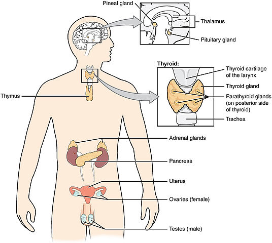
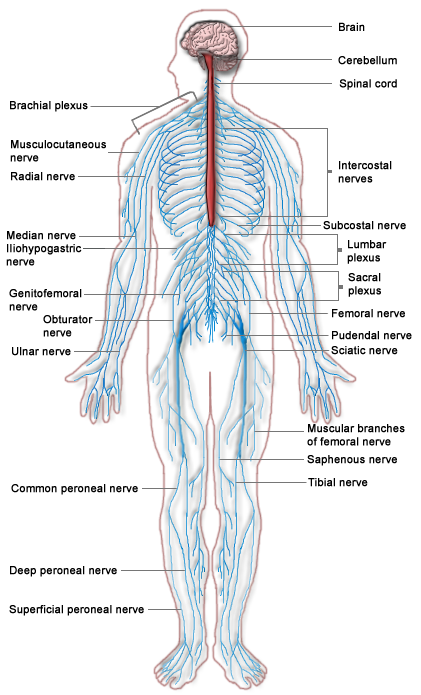

## [Neuroanatomy](https://www.coursera.org/learn/anatomy403-3x)
I was trying to follow a course on neuroanatomy, but since I'm under a cognitive impairment extrajudicial sentence 
to force me to break the few things I have and hurt myself maybe you can follow it

[https://www.coursera.org/learn/anatomy403-3x](https://www.coursera.org/learn/anatomy403-3x)

## [Difference Between Endocrine System and Nervous System](http://www.differencebetween.net/science/health/difference-between-endocrine-system-and-nervous-system/)

    <a href="img/Difference-Between-Endocrine-System-an-Nervous-System.jpg">
        
    </a>

#### Definition of Endocrine System:
The endocrine system is a system of glands that produce chemical messages called hormones which have an effect on various target cells throughout the human body.

#### Organs involved in Endocrine System:
The organs of the endocrine system are all glands that are found throughout the human body. Glands of the endocrine system often secrete more than one hormone, e.g. the adrenal gland which secretes adrenaline and cortisol.

Glands in the head region include the pituitary and pineal gland, which are found in the hypothalamus of the brain. The anterior part of the pituitary gland secretes hormones that trigger other glands to release hormones. The thyroid gland and parathyroid glands are both found in the neck region; pancreas and adrenal glands are both found in the abdomen. Reproductive glands include the ovaries in females and testes in males.

#### Transmission involved in Endocrine System:
Hormones are secreted by epithelial cells of the gland and then transported through the blood vessels to a target cell. At the cell the hormone will diffuse through the plasma membrane if it is soluble in lipids, else if not lipid-soluble it will bind to a hormone receptor on the plasma membrane. The transmission speed is somewhat slow since transmission is by means of the blood.

The transmission of hormones is always involuntary and not under conscious control. The response to a hormone may be short-lived but can be long-lived as well. For example the hormone adrenaline provides a short term response while the hormone cortisol provides a long term response.

#### Effects of Endocrine System:
There are several different types of hormones having a variety of effects, and acting by negative feedback mechanisms so as to maintain homeostasis. Growth, metabolism, water balance in the body, response to stress and inflammation, can all be regulated by the endocrine system.

    <a href="img/Difference-Between-Endocrine-System-and-Nervous-System.-.png">
        
    </a>

#### Definition of Nervous System:
The nervous system consists of the brain, spinal cord, and several nerve cells and fibers which send signals around the body in the form of a nerve impulse known as an action potential, which has an effect on a target cell.

#### Organs involved in Nervous System:
The organs of the nervous system include the brain and spinal cord. The brain is divided into several regions which have various functions and are responsible for interpreting information received via nerve input. The spinal cord attaches to the brain at the posterior region. It joins the brain stem or medulla oblongata of the hind brain. Various nerves enter and leave the brain and spinal cord. The spinal cord is also responsible for reflex arcs. The brain and spinal cord constitute the central nervous system while sensory and motor nerves (neurons) constitute the peripheral nervous system.

#### Transmission involved in Nervous System:
The message is transmitted as a nerve impulse called an action potential. The action potential is an all or none event and involves changes in the membrane potential of the axon of a nerve cell. The transmission can be under voluntary and involuntary control and brings about a localized response. The transmission speed can be very fast because nerve axons are myelinated allowing for rapid saltatory conduction. Response to the impulse is usually rapid and short-lived. Transmission of nerve impulses relies on specialized cells called neurons which are supported by Schwann cells and glial cells. Transmission can be under voluntary control (motor part of somatic system) and involuntary control (autonomic nervous system).

#### Effects of Nervous System:
Nerve impulses travel to and from the brain and spinal cord. Sensory receptors and organs all have sensory neurons (nerves) that travel to the brain where the information is interpreted. A response is then sent back along motor neurons to an effector. The effector can be a muscle or organ.

#### Difference between Endocrine System and Nervous System
Messengers involved in Endocrine System and Nervous System
Hormones are the chemical messengers in the endocrine system while nerve impulses called action potentials are the messengers in the nervous system.

#### Organs of Endocrine System and Nervous System
Glands are the organs of the endocrine system while the brain and spinal cord are the organs of the nervous system.

#### Cell types of Endocrine System and Nervous System
The nervous system includes nerve cells called neurons, Schwann cells, and glial cells, while the endocrine system includes epithelial cells.

#### Transmission in Endocrine System and Nervous System
Hormones are transmitted through the blood vessels while nerve impulses are transmitted by nerve cells called neurons.

#### Entry into target cell
Hormones either diffuse through a plasma membrane or bind to cell receptors. Nerve impulses use neurotransmitters at synaptic clefts and sodium and potassium channels.

#### Effects of Endocrine System and Nervous System
Nerve impulses in the nervous system have a rapid short-lived effect, while hormones of the endocrine system can have a slow long-lived effect or a rapid short-lived effect.

#### Control of Endocrine System and Nervous System
The nervous system is under both unconscious/involuntary control and conscious/voluntary control, while the endocrine system is under unconscious/involuntary control.

#### Sensory information in Endocrine System and Nervous System
The nervous system is involved in transmitting and interpreting sensory information while the endocrine system is not involved in transmitting and interpreting sensory information.

## [Difference Between Hormones and Neurotransmitters](http://www.differencebetween.net/science/health/difference-between-hormones-and-neurotransmitters/)

Some people may claim that hormones and neurotransmitters are exactly the same due to their similar roles as messengers in the body. Also, these chemicals significantly influence behavior and both may have protein forms. However, these are considered different entities which facilitate several and specific physiological processes. Hormones are chemical signals secreted by the endocrine glands into the circulatory system which convey regulatory messages within the body. On the other hand, neurotransmitters are the brain chemicals that relay information throughout the brain and the body. Below are some of the distinguishing factors that will further clarify the confusion between the two.

#### What are Hormones?
Hormones are chemical substances, released by cells into the extracellular fluids to regulate the metabolic function of other cells and are produced by the endocrine system. Nearly all of the hormones can be chemically classified into one of the following two large [groups](http://www.differencebetween.net/science/difference-between-periods-and-groups/) of biochemical molecules:

#### Amino acid-based hormones
These include the amines and thyroxine as well as peptides to protein macromolecules. Their molecular structures and sizes widely vary. 

#### Steroids
These [hormones are synthesized from cholesterol](http://www.differencebetween.net/science/health/difference-between-thyroid-and-hormones/). The only steroid type of hormones that are being produced by the major endocrine glands are adrenocortical and gonadal hormones.

#### What are Neurotransmitters?
Neurotransmitters are endogenous chemicals that send signals across a chemical synapse from one nerve cell to the other “target nerve cell”, gland cell, or muscle cell and are primarily found in the nervous system.

Neurotransmitters influence trans-membrane ion flow. These either increase or decrease the chance that the cell will produce an action potential.

The following are the two classifications regarding the facilitation of ion flow:

#### Excitatory Neurotransmitters
Excitatory neurotransmitters stimulate the brain and are somewhat overactive. They allow the postsynaptic neuron to produce action potential which increases the trans-membrane ion flow. Such neurotransmitters include dopamine, norepinephrine, and epinephrine.

#### Inhibitory Neurotransmitters
Inhibitory neurotransmitters help create balance by calming the brain. They decrease the trans-membrane ion flow, thus prohibiting the postsynaptic neuron to produce an action potential. Such neurotransmitters include serotonin, GABA (Gamma-amino butyric acid), and dopamine.

Neurotransmitters are also classified according to chemical or molecular structure:

Small molecule neurotransmitters
These neurotransmitters are synthesized locally within the axon terminal and are smaller than neuropeptides. Such neurotransmitters include the following:

Amino acid neurotransmitters: 

0. GABA
0. glycine
0. glutamate

Biogenic amines: 

0. dopamine
0. norepinephrine
0. epinephrine
0. serotonin
0. histamin

Purinergic neurotransmitters: 

0. ATP (Adenosine triphosphate)
0. adenosine

Acetylcholine (does not belong to any structural category)

Neuropeptides

These neurotransmitters are known to be larger compared to the molecule neurotransmitters as their structure is made up of three or more amino acids. Neuropeptides are composed of 3 to 36 amino acids. Such neurotransmitters include the following:

0. Endorphins
0. Enkephalins
0. Oxytocin
0. Vasopressin
0. Insulin
0. Glucagon

#### Difference between Hormones and Neurotransmitters
Organ System
Hormones are produced by the endocrine system while neurotransmitters are produced by the nervous system. The adrenals, pancreas, kidneys, gonads, thyroid, and other ductless glands secrete hormones while neurotransmitters are released from the terminal end buttons of neurons.

#### Mode of Transmission
Hormones relay signals through the circulatory system (blood stream) while neurotransmitters communicate signal across synaptic clefts.

#### Transmission Speed in Hormone and Neurotransmitter
Since hormones function to reach distant “target cells”, the speed or signal transmission is much slower (can take minutes to days) than the neurotransmitters’ signal transmission which sends messages in between nerve cells (usually within milliseconds).

#### Transmission Distance
Since hormones are transmitted through the blood stream, these act on distant sites from where these are produced. On the other hand, neurotransmitters are transmitted across the synaptic cleft, thus these react in direct proximity to their target cells.

#### Function of Hormone vs Neurotransmitter
Hormones have diverse functions that affect physiological processes such as growth and development, metabolism, mood, sexual function, reproduction, etc. On the other hand, neurotransmitters facilitate transmission between neurons by passing action potentials     from the axons to the dendrites.

#### Types of Hormone vs Neurotransmitter
The hormones’ two classifications are “amino acid-based and steroids”. As for neurotransmitters, it can be classified according to ion flow facilitation: “excitatory and inhibitory” and according to structure (chemical or molecular): “small molecule and neuropeptides”.

#### Capability
Hormones regulate specific organs and tissues while the capability of neurotransmitters is humbler as they merely stimulate postsynaptic neurons.

#### Summary of Hormone verses Neurotransmitter:

0. Both hormones and neurotransmitters act as chemical messengers in the body.
0. Hormones are chemical substances such as oxytocin, melatonin, estrogen, and testosterone which released by cells into the extracellular fluids to regulate the metabolic function of other cells and are produced by the endocrine system.
0. Neurotransmitters are endogenous chemicals such as dopamine, glutamate, endorphin, and serotonin that send signals across a chemical synapse from one nerve cell to the other.
0. The organ system of hormones is the endocrine system while that of neurotransmitters is the nervous system.
0. Hormones are conveyed via the blood stream while neurotransmitters are transmitted across the synaptic cleft.
0. Neurotransmitters are generally transmitted faster than hormones.
0. The transmission distance of hormones is farther as compared to that of neurotransmitters.
0. Hormones are classified into acid-based or steroids while neurotransmitters may be classified according to ion flow facilitation (excitatory and inhibitory) as well as according to structure (small molecule and neuropeptides).
0. Hormones regulate the target organs and tissues while neurotransmitters stimulate postsynaptic neurons.
 
## [Difference Between Somatic and Autonomic Nervous System](http://www.differencebetween.net/science/health/difference-between-somatic-and-autonomic-nervous-system/)

#### Introduction
The peripheral nervous system is an extension of the central nervous system. Its overall function is to carry information from the central nervous system to other parts of the body to maintain normal body function. It enables the body to react voluntarily and involuntarily to any stimuli. It is composed of nerve fibers bundles that lie beyond the brain and spinal cord. Some of the nerve fiber bundles proceed to innervate skeletal muscles and sensory receptors. These fibers comprise the somatic nervous system. The remaining nerve fibers innervate visceral organs, smooth muscles, glands and blood vessels. These fibers comprise the autonomic nervous system.

#### Somatic Nervous System
The somatic nervous system is composed of nerves that originate from the spinal cord. Nerves that supply muscles on the head originate from the brain. It is comprised of motor neurons that supply skeletal muscles to allow movement. Its axon is continuous from the spinal cord to the skeletal muscle, forming the neuromuscular junction. The neuromuscular junction is an important structure for neurotransmission to stimulate muscular contraction. Inhibition of locomotion occurs through inhibitory pathways coming from the central nervous system.

#### Transmitters and Receptors
The space between the motor neuron and the skeletal muscle is called a synaptic cleft. The axon terminal of motor neurons releases the neurotransmitter, acetylcholine, which is the only neurotransmitter for the somatic nervous system. Acetylcholine is stored within vesicles located on the knob-like terminal end of the nerve fiber, called a terminal button. The terminal button contains calcium channels.  When calcium is sufficiently released, this triggers the release of acetylcholine from the vesicles into the synaptic cleft. Acetylcholine binds to nicotinic cholinergic receptors, which activates a series of chemical reactions that changes the ionic composition of the motor endplate.

#### Effector Organs and Function
The release of acetylcholine stimulates the opening of ionic channels for sodium and potassium. Ionic particles carry an electrical charge and concentration gradient. This reaction generally moves sodium inward and potassium outward causing a depolarization of the motor end plate. This allows electrical current to flow from the depolarized motor end plate and adjacent areas triggering the opening of voltage-gated sodium channels. This propagates an action potential throughout the effector organ, which is the skeletal muscle. The initiated electrical potential activity spreads within the entire muscle allowing contraction of the skeletal muscle fiber. The aforementioned chain of events enables voluntary control of muscle groups that is essential for locomotion.

#### Autonomic Nervous System
The autonomic nervous is system is composed of nerves that originate from the brain and the spinal cord. It is also known as the visceral nervous system because its nerve bundles proceed to supply visceral organs and other internal structures. Its axon is discontinuous and is separated by a ganglion, forming a two-neuron chain. The autonomic nervous system has two functionally different subdivisions. The sympathetic division enables the human body to involuntary respond to emergency situations, creating a “fight or flight” response. The parasympathetic division enables normal visceral functions by allowing storage of energy to conserve body reserves.

#### Transmitters and Receptors
The autonomic nervous system preganglionic neurons release acetylcholine at the synaptic area, which binds to nicotinic cholinergic receptors at the postsynaptic membrane. In parasympathetic nervous system, post-ganglionic neurons also release acetylcholine, which binds to muscarinic receptors located in salivary glands, stomach, heart, smooth muscles and other glandular structures. In sympathetic nervous system, post-ganglionic neurons release norepinephrine, which binds to alpha-1 receptors in smooth muscles, beta-1 receptors in the heart muscle, beta-2 in smooth muscles and alpha-2 adrenergic receptors.

#### Effector Organs and Function
Both the sympathetic and parasympathetic nerve fibers are present in all visceral organs. The principal effector organs that regulate homeostatic organs are the skin, liver, pancreas, lungs, heart, blood vessels and kidneys. Nerve fibers from the sympathetic and parasympathetic subdivisions are complementary in function to allow involuntary mechanisms that preserve the internal homeostatic mechanisms. The skin serves to regulate the body’s core temperature by preserving or conserving water loss from sweat glands. The liver and the pancreas regulate the metabolism of glucose and lipids. The lungs regulate the concentration of oxygen and acidic particles in the blood by allowing oxygen inhalation and carbon dioxide exhalation. The heart and blood vessels regulate blood pressure through cardiac rhythmic nodes and blood vessel wall diameter changes. The kidneys regulate the excretion of toxins in the body. It also works synergistically with the lungs to maintain normal blood pH levels.

#### Summary
The somatic and autonomic nervous systems have salient anatomic and structural differences that give rise to different functions. Somatic nerves predominantly come from the spinal cord and are composed of motor neurons that travel to the skeletal muscle. It releases acetylcholine, which stimulates the voluntary contraction of skeletal muscles. Its function is controlled by central nervous system structures such as the motor cortex, basal ganglia, cerebellum, brainstem and the spinal cord. On the other hand, autonomic nerves come from both the spinal cord and the brain that travels to various internal organs, smooth muscles, glands and blood vessels. It is comprised of a two-neuron chain with a preganglionic area that releases acetylcholine, and a post-ganglionic area that releases acetylcholine for parasympathetic terminals and norepinephrine for sympathetic terminals. Neurotransmitter release allows involuntary control of visceral organs by stimulation or inhibition. This is regulated by central nervous system structures such as the prefrontal cortex, hypothalamus, medulla and spinal cord.
