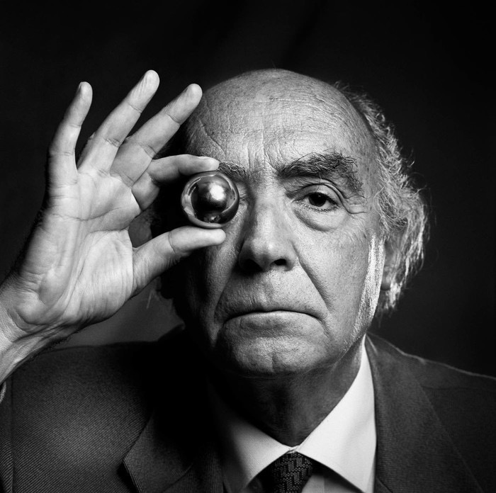
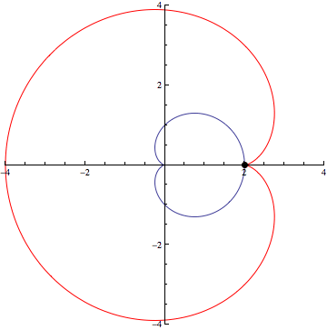
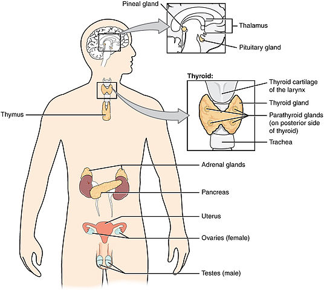
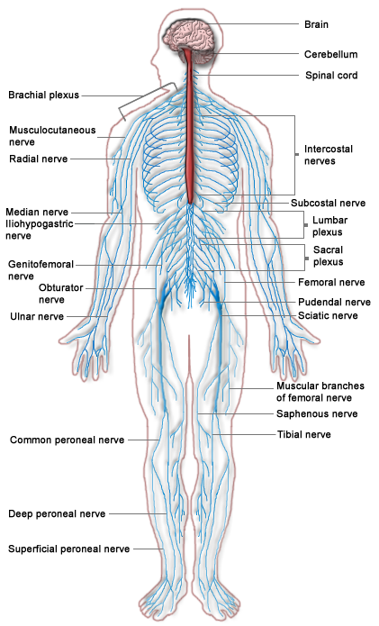
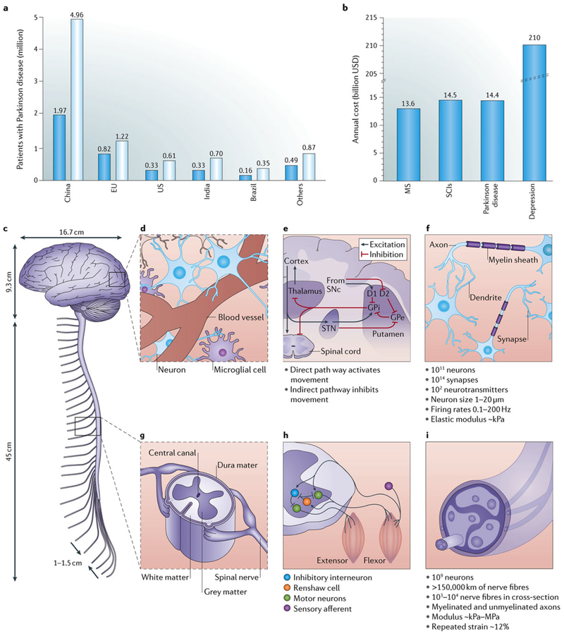
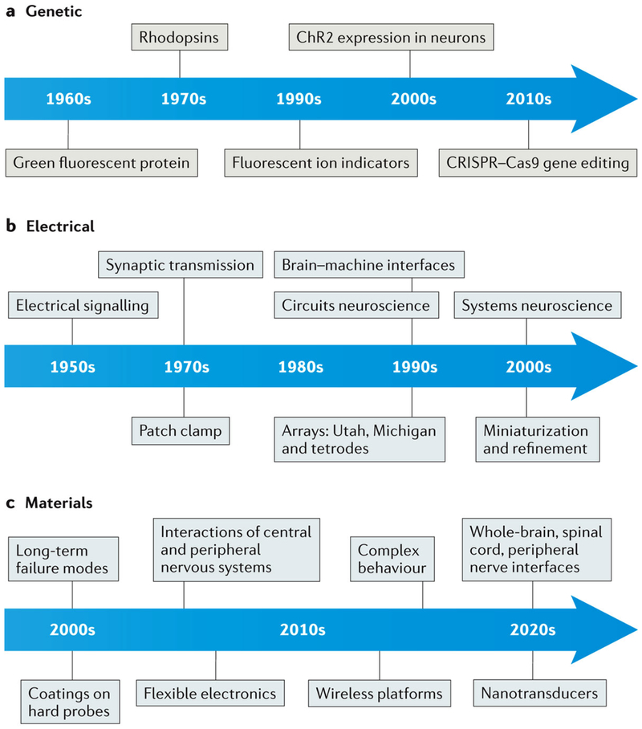
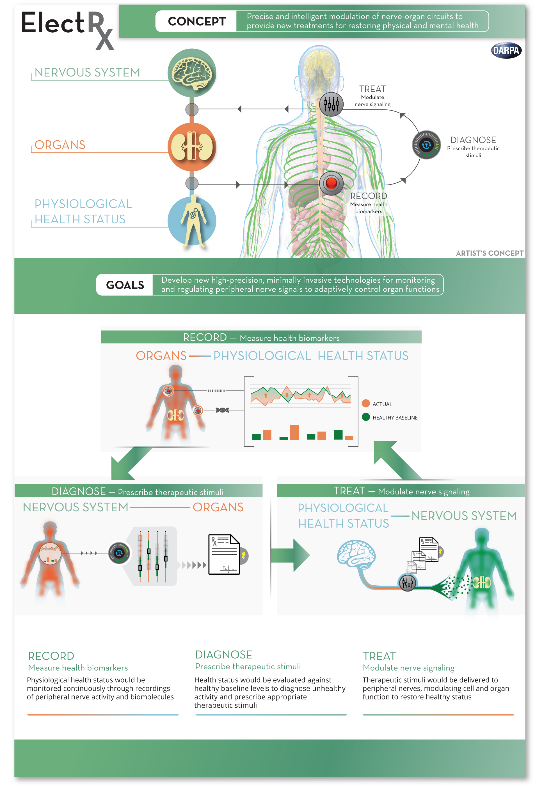
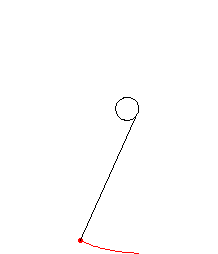

## [Cybertorture Related Resolutions by The United Nations](https://www.dignity.dk/wp-content/uploads/III-Overview-of-resolutions-by-Human-Rights-Council-UN-General-Assembly-on-torture-1990-2020.pdf)
0. [A/HRC/43/49 - The United Nations introduces the term Cybertorture](https://www.undocs.org/A/HRC/43/49)
0. [A/74/148 - The United Nations offers recommendations to prevent Domestic Violence](https://undocs.org/A/74/148)
0. [A/HRC/RES/13/19 - the role and responsibility of judges, prosecutors and lawyers](https://documents-dds-ny.un.org/doc/UNDOC/GEN/G10/129/70/PDF/G1012970.pdf?OpenElement)
0. [A/HRC/RES/10/24 - the role and responsibility of medical and other health personnel](https://ap.ohchr.org/documents/E/HRC/resolutions/A_HRC_RES_10_24.pdf)

## [José Saramago, Religious Offense and Freedom of Speech](https://en.wikipedia.org/wiki/Religious_offense)
Nobel Prize winner [**José Saramago**](https://en.wikipedia.org/wiki/Jos%C3%A9_Saramago) went into exile as a symbolic gesture on the Spanish island of Lanzarote in 1992 when the Government of Portugal under Prime Minister [Aníbal Cavaco Silva](https://en.wikipedia.org/wiki/An%C3%ADbal_Cavaco_Silva) ordered the removal of one of his works [**The Ghospel according to Jesus Christ**](https://en.wikipedia.org/wiki/The_Gospel_According_to_Jesus_Christ) from the Aristeion Prize's shortlist, claiming the work was religiously offensive.

Some of these individuals **insinuated** via synthetic telepathy José Saramago exiled himself due to [**cybertorture**](https://www.undocs.org/A/HRC/43/49). 
They also **insinuated** they asked him what was the worst book he ever read to which he allegedly replied [**The Rape of the Mind**](https://www.amazon.com/Rape-Mind-Psychology-Menticide-Brainwashing/dp/1614277877) by [Joost Meerloo](https://en.wikipedia.org/wiki/Joost_Meerloo) who coined the term [**menticide**](https://en.wiktionary.org/wiki/menticide).

This was followed by his work [**Blindness**](https://en.wikipedia.org/wiki/Blindness_(novel)) which they claimed was a social critique to the mass participation in the process and refusal to address the issue due to lack of a [**Neurolaw**](https://en.wikipedia.org/wiki/Neurolaw) framework, which has recently found [real use cases](https://www.frontiersin.org/articles/10.3389/fpsyg.2020.01762/full).
In 2004 José Saramago published his novel [**Seeing**](https://en.wikipedia.org/wiki/Seeing_(novel)).

    <a href="https://en.wikipedia.org/wiki/Seeing_(novel)">
        
    </a>

## TLDR! 
To the former students from Colégio Militar (Largo da Luz, Portugal) who enforce [Extrajudicial Sentences](https://en.wikipedia.org/wiki/Extrajudicial_punishment) of [Cyber Torture](https://www.undocs.org/A/HRC/43/49) (setting Cyber Sodomy, [Cognitive Impairment](https://en.wikipedia.org/wiki/Cognitive_deficit) and Synthetic Pain as a standard in our society) and others worldwide who also [Collaborate](https://en.wikipedia.org/wiki/Collaborationism) in Cyber Torture. 

For the past 3 decades you preyed upon families by resorting to [Cognitive Biases](https://en.wikipedia.org/wiki/List_of_cognitive_biases) and lack of a [Neurolaw](https://en.wikipedia.org/wiki/Neurolaw) framework, [Neurorights and Mental Freedom awareness](https://www.frontiersin.org/research-topics/14276/neurorights-and-mental-freedom-emerging-challenges-to-debates-on-human-dignity-and-neurotechnologies) by attempting to portrait individuals as being "Insane" resorting to distorting **_Faith Trials over Synthetic Telepathy_** and presenting that content to others as **_proof_** the SUT believes he is either **God** or the **Devil**, attempting to portrait SUTs as being Pedos, Xenophobes, Homophobes, Misogynistic, and attempt to **Direct Violence towards Parents and Women**, make fools out of men by **Sabotaging Intercourse** with involuntary perineum contractions, **enslave women via vibrotactile genital abuse** resulting in [**Stockholm Syndrome**](https://en.wikipedia.org/wiki/Stockholm_syndrome) and systematically resort to Cybertorture paired with [**Psychiatric Abuse**](https://en.wikipedia.org/wiki/Political_abuse_of_psychiatry) (violating every principle in the [**World Psychiatric Association Code of Ethics**](https://www.wpanet.org/policies)), **Stratifying Society** and creating **Drug Addicts** whilst making a Circus out of the extrajudicial trial and sentence procedure, Corrupting Data of **Threat Assessment Systems** like [**MOSAIC**](https://en.wikipedia.org/wiki/MOSAIC_threat_assessment_systems) and performing **Flawed Science** on mixed bags of data consisting of patients with **Real Psychopathological Illness** mixed with **Victims of Cybertorture**, **Delaying Progress** and **Raising Paranoia** to important fields that could help make the world a better place such as [**Neural Engineering**](https://en.wikipedia.org/wiki/Neural_engineering) and **Electroceuticals**...

    <a href="https://www.youtube.com/watch?v=yGQgdE50QA4">
        
    </a>

I will not allow you to turn me into your synthetic [**Anders Behring Breivik**](https://en.wikipedia.org/wiki/Anders_Behring_Breivik) and it may be a good idea for you to remember [**Queen Christina of Sweden**](https://en.wikipedia.org/wiki/Christina,_Queen_of_Sweden) and the [**Order of the Amaranth**](https://en.wikipedia.org/wiki/Order_of_the_Amaranth).

Further, I don't need your **"Trowel and Plumb line"**, [I'll use my 2 Fingers **✌️**](https://www.youtube.com/watch?v=yGQgdE50QA4)

## Cybertorture as a [𝄞 *Opera Cepa* 𝄢](https://iovs.arvojournals.org/article.aspx?articleid=2409430) 

Many of us look only at our own interests and the interests of those close to us. A so-called "Me, Me, Me" mentality which results lack of [Ethical](https://en.wikipedia.org/wiki/Ethics) and [Moral](https://en.wikipedia.org/wiki/Morality) values resulting in criminal behavior which could be mitigated in a [Transparent Society](https://en.wikipedia.org/wiki/The_Transparent_Society). Whilst I am an adept of [Transparent Behavior](https://en.wikipedia.org/wiki/Transparency_(behavior)), I also like "fair game" and I highly value my [personal autonomy](https://en.wikipedia.org/wiki/Autonomy) which should not be put in jeopardy by being forced into unemployment and welfare via cybertorture extrajudicial sentences so that I can't support myself and my "laptop" and "mobile phone" being set as targets to be destroyed under states of extreme exhaustion via sleep deprivation by sadists out of control who draw pleasure from generating synthetic psychotic behavior and acts of self-harm.

Lack of a Neurolaw framework and lack of a law enforcement entity dedicated to enforce Neurolaw and preserve Neurorights and Mental Freedom (particularly at home and at work) gives rise to social stratification by resorting to cybertorture to distort [self-determination](https://en.wikipedia.org/wiki/Self-determination) and corrupt data of threat assessment systems like [MOSAIC](https://en.wikipedia.org/wiki/MOSAIC_threat_assessment_systems)!

This obviously results in paranoid behavior regarding [Global Surveillance](https://en.wikipedia.org/wiki/Global_surveillance), [Right to Privacy](https://en.wikipedia.org/wiki/Right_to_privacy), [Physician Patient Privilege](https://en.wikipedia.org/wiki/Physician%E2%80%93patient_privilege), [Secret Ballot](https://en.wikipedia.org/wiki/Secret_ballot), [Intimacy and Privacy](https://en.wikipedia.org/wiki/Privacy#Intimacy), [Right to be let alone](https://en.wikipedia.org/wiki/Privacy#Right_to_be_let_alone), and results in lack of trust in:

0. Law enforcement
0. The Judicial System
0. Elected Government Officials
0. Psychiatrists
0. The Electoral Process
0. One another :(

Why would I bother spending money on public transport to vote when my every intention can be scrutinized as a victim of cybertorture ?
Since voting is compulsory, suffrage over synthetic telepathy would solve the problem of lack of participation in the electoral process. All that is required is trust :)

    <a href="https://en.wikipedia.org/wiki/Ut_queant_laxis">
        
    </a>

Most of these issues would not exist if we followed the [Open Source Model](https://en.wikipedia.org/wiki/Open-source_model) or at the very least, the rules were made Clear and Transparent. Obscurity and deception games culminate in [Solitude](https://en.wikipedia.org/wiki/Solitude), delusional quests for [Anonymity](https://en.wikipedia.org/wiki/Anonymity), [Aggression and Violent Behavior](https://en.wikipedia.org/wiki/Aggression_and_Violent_Behavior) and acts of [Terrorism](https://en.wikipedia.org/wiki/Terrorism).

Social honeypots for individuals with psychopathological issues filled with hate and anger, unwilling to "forgive and forget" based on the the movie [V for Vendetta](https://en.wikipedia.org/wiki/V_for_Vendetta_(film)) such as [The Anonymous Group](https://en.wikipedia.org/wiki/Anonymous_(group)) and their [Guy Fawkes](https://en.wikipedia.org/wiki/Guy_Fawkes) masks make matters worse. Whilst I like the renaissance look of the mask, the fact of the matter is Guy Fawkes was a terrorist and an idiot and so was [Robert Catesby](https://en.wikipedia.org/wiki/Robert_Catesby) ring leader of the failed [Gunpowder Plot](https://en.wikipedia.org/wiki/Gunpowder_Plot)!

    <a href="https://www.compoundchem.com/2014/01/22/the-chemistry-of-an-onion/">
        
    </a>

**_I don't deal with terrorists either, so why not wear a Jeremy Bentham mask instead to protest peacefully for what should be common sense via justice reform ?_**

[Mi](https://en.wikipedia.org/wiki/Solf%C3%A8ge) is a beautiful musical note but unless if you are composing something like [4'33''](https://en.wikipedia.org/wiki/4%E2%80%B233%E2%80%B3) **WE** need more musical notes to create a [𝄞 melody 𝄢](https://www.youtube.com/watch?v=80D3vkuLaxs).

#### [Part of my cybertorture story >>>](#mentis-morbum-tuum-)

## Police Brutality, [Extrajudicial punishment](https://en.wikipedia.org/wiki/Extrajudicial_punishment) and Cybertorture

Cybertorture is a means to exact [extrajudicial punishment](https://en.wikipedia.org/wiki/Extrajudicial_punishment) for those who **allegedly** evade loopholes in the legal system and as a form of [social stratification](https://en.wikipedia.org/wiki/Social_stratification). It may involve acting in criminal association with others who are recruited (and possibly manipulated), either to make the case untriable, or as a form of entrapment.

People are willing to act as social justiciary riders for multiple reasons. The most common is probably to exact justice for behavior they may find offensive such as: xenophobia, homophobia, pedophilia, misogyny, stalking, sexual abuse, animal abuse, issuing threats or being agressive towards people in their social circle (sexual partners, children, co-workers and prominent members of society). 

Some are made to believe in concepts such as social stratification, synthetic winners and synthetic losers and "naturally" wish to rise on the social ladder. Others are plain psychopaths, sexual predators, sodomites or sadists out of control addicted to degrading others and want to perpetuate their status quo, unwilling to repent or address their mental illness!

The methodology may involve:

0. forcing synthetic pain upon the SUT ([remote activation/deactivation of nociceptors](https://en.wikipedia.org/wiki/Nociceptor))
0. forcing vibrotactile sensations upon the SUT ([remote activation/deactivation of mechanoreceptors](https://en.wikipedia.org/wiki/Mechanoreceptor))
0. misregulating normal physiological functionality ([GPC Receptors and signaling pathways](https://en.wikipedia.org/wiki/G_protein-coupled_receptor))
0. forcing [synthetic telepathy](https://en.wikipedia.org/wiki/Brain%E2%80%93computer_interface#Synthetic_telepathy/silent_communication) upon the SUT

It creates more problems than it solves resulting in:

0. financial loss for insurance companies
0. abuse of psychiatry and medical malpractice [**en masse**](https://papers.ssrn.com/sol3/papers.cfm?abstract_id=2589690)
0. wasted human and financial resources in redundant or [**flawed scientific research**](https://en.wikipedia.org/wiki/Causes_of_schizophrenia#Candidate_gene_studies) by working with sets of corrupted data consisting of [**real illness**](https://en.wikipedia.org/wiki/On_the_Origin_of_the_%22Influencing_Machine%22_in_Schizophrenia) and victims of [**cybertorture**](https://www.undocs.org/A/HRC/43/49)
0. abuse of threat assessment systems like [**MOSAIC**](https://en.wikipedia.org/wiki/MOSAIC_threat_assessment_systems)
0. further loss of moral values by setting the wrong example resulting in behavior contagion

Grotesque examples:

0. getting the SUT to commit acts of [self-mutilation](https://en.wikipedia.org/wiki/Self-harm) (including genital) or [self-harm](https://en.wikipedia.org/wiki/Self-harm)
0. [forcing sodomy as a sentence](https://www.britannica.com/place/Sodom-and-Gomorrah#ref1233950) upon the SUT
0. articulating tongue and jaw movements of the SUT
0. directing violence towards others (parents, sexual partners, shop keepers, neighbors, police officers, psychiatrists, etc)
0. forcing the SUT to extract teeth
0. instructing the SUT to pick scabs from wounds
0. forcing the SUT to scratch himself via synthetic itches
0. [Sexual abuse](https://en.wikipedia.org/wiki/Sexual_abuse) of the SUT possibly resulting in [Stockholm Syndrome](https://en.wikipedia.org/wiki/Stockholm_syndrome)
0. forcing the SUT to feel synthetic pain in the anus, ears and lower back
0. forcing the SUT to feel stabbed in the skull
0. forcing the SUT to feel stabbed in the back
0. forcing sleep deprivation and extreme exhaustion upon the SUT
0. delivering thermoelastic payloads to soft tissues in the head of the SUT to draw self-harm
0. delivering thermoelastic payloads to the cerebellum and occipital area of skull the SUT to draw self-harm
0. delivering thermoelastic payloads to the base of the skull of the SUT to dislodge it
0. targeting electronic equipment that may be used to work or use social media (computer, laptop and mobile phone)
0. forcing the SUT to feel kicks all over the body and head to feel like human trash
0. forcing the SUT to roam the streets aimlessly to spend all his money by combining all of the above
0. nurturing [addictive behaviour](https://en.wikipedia.org/wiki/Addiction) by combining all of the above
0. Intensifying this methodology when in close proximity to others, prior to scheduled events or festive occasions such as birthdays, Christmas and New Years Eve

<!--
## The Chemistry of Emotions
## Nociceptive Pain and the Peripheral Somatosensory System
## Touch, Vibrotactile Sensations and the Peripheral Somatosensory System
## WHO - ICD, ICF
-->

## [Cybertorture and Psychiatric Abuse](#mentis-morbum-tuum-) 

[The World Psychiatry Association](https://www.wpanet.org/) has a new code of ethics [2020/OGA/7](pdf/e172f3_4cecd522c2d448c7944342ba88c527e5.pdf)

    <a href="https://www.wpanet.org/policies">
        
    </a>

The Declaration of Hawaii issued by the World Psychiatric Association in 1977 and updated in 1983 in Vienna was initiated because of political abuse of psychiatry in some countries in the seventies. This led to a long process of investigation and concern within the domain of professional ethics and paved the way for the Declaration of Madrid, which was endorsed by the General Assembly of the World Psychiatric Association in Madrid in 1996.

In its final form, the Declaration of Madrid includes seven general guidelines that focus on the aims of psychiatry namely to treat mentally ill patients, prevent mental illness, promote mental health and provide care and rehabilitation for mentally ill patients.

The Declaration of Madrid has now been superseded by the 2020 WPA Code of Ethics.

> Principle 1: Beneficence - Psychiatrists provide competent and compassionate medical care with devotion to the interests of their patients.

> Principle 2: Respect for patients' autonomy - Psychiatrists are especially mindful of respect for patients autonomy given their statutory role in treating a proportion of their patients compulsory. Compulsory treatment may be justified where a less restrictive intervention can not achieve safe and adequate care; its purpose is ultimately to promote safe and re-establish patients' autonomy and welfare.

> Principle 3: Non Maleficence - Psychiatrists avoid actions that may be injurious to their patients.

> Principle 4: Improving standards of mental health care and psychiatric practice: Psychiatrists recognize a responsibility to promote the continuing development of their profession and their personal professional development.

> Principle 5: Applying psychiatric expertise to the service of society - Psychiatrists, like other physicians, utilize their specialized knowledge and skills to promote mental health and wellbeing of persons who may be vulnerable to mental illness.

#### Message sent to my lawyer [Mr. Edo Bruijn](https://bruijnadvocaten.nl/) on the 20th December 2020 as I await the decision of a court of Law in the Netherlands due to *"Doctor"* [Emile Barkhof](https://nl.linkedin.com/in/emile-barkhof-8277a6106) trying to force conventional antipsychotic pharmacotherapy upon me against my will, whilst knowing fully well I am being treated in a cruel and inhumane way via cybertorture to simulate [paranoid schizophrenia](https://en.wikipedia.org/wiki/Schizophrenia) (by individuals who direct violence towards women, my parents, the police and psychiatrists) and try to force acts of self-harm (every few seconds) under the false pretense of making me **_Cry_**!

> Hello Dr. Bruijn. I would like to reiterate the fact that cybertorture is being used to simulate behavior that may resemble paranoid schizophrenia by individuals I mentioned to you in the past and on my personal [github page](https://strikles.github.io). I would also like to state that the only type of therapy in which I would participate voluntarily if paranoid schizophrenia was my real condition would be via the use of electroceuticals (an example electroceutical being [electRx](https://www.darpa.mil/program/electrical-prescriptions)). Forcing suboptimal conventional pharmacotherapy when superior solutions are available is inhumane and doctors that insist on that particular form of "therapy" (if you can call it that) don't have the best interests of the patient at heart, since that particular kind of antipsychotic medication doesn't address the problems of the patient in the best possible way and corresponds to psychiatric fraud, medical malpractice and cruel and inhumane treatment. Further insisting on medication with side effects like [hyperprolactinaemia](https://www.ncbi.nlm.nih.gov/pmc/articles/PMC1122185/), [tardive dyskinesia](https://en.wikipedia.org/wiki/Tardive_dyskinesia) or [sexual dysfunction](https://en.wikipedia.org/wiki/Sexual_dysfunction) corresponds to [intentionally collaborating with forcing suicidal thoughts upon the patient](https://www.ncbi.nlm.nih.gov/pmc/articles/PMC5085732/). A good Sunday to you 🙏

During our first interview he insinuated this was being done to me due to my lack of knowledge on **_"how things work at the neurotransmitter level"_** and my **_previous work experience_**, giving me a **_judgemental look of disaproval_** when he attempted to redirect the conversation into how well previous pharmacotherapy approaches had worked and I interrupted suggesting **_neuromodulation via electroceuticals_**. He **_mocked me with a grin_** when I stated none of the previous pharmacotherapy approaches worked and **_rejected both my proposal and my request to see a psychologist to deal with the many traumas induced due to the cybertorture procedure_**, forcing me to meet him again whilst under severe cybertorture abuse and **_repeating himself over and over again_** trying to force me to accept a conventional pharmacological approach **_using diminutives_** trying to make his coercive initiative sound less harmful, followed by asking a court of law for conventional antipsychotic pharmacotherapy to be forced upon me, which is a clear violation of [The Right to Refuse Medical Treatment under the European Convention on Human Rights](https://academic.oup.com/medlaw/article-abstract/9/1/17/973865).

See the European Court of Human Rights Thematic Report - [Health-related issues in the case-law of the European Court of Human Rights](https://www.echr.coe.int/Documents/Research_report_health.pdf)

    <a href="img/Psyops-400x400.png">
        
    </a>

**_Psychiatrists who behave like this violating the [WPA Code of Ethics](https://www.wpanet.org/policies) seem to have more psychopathological issues than the patients they pretend to treat and remind me of South Park character Dr. William Janus - Season 15, Episode 6 - [City Sushy](https://www.southparkstudios.com/episodes/dhi2tb/south-park-city-sushi-season-15-ep-6)_**

## [Diagnostic and Statistical Manual of Mental Disorders](https://en.wikipedia.org/wiki/Diagnostic_and_Statistical_Manual_of_Mental_Disorders)

The Diagnostic and Statistical Manual of Mental Disorders, Fifth Edition (DSM-5) is the 2013 update to the Diagnostic and Statistical Manual of Mental Disorders, the taxonomic and diagnostic tool published by the American Psychiatric Association (APA). In the United States, the DSM serves as the principal authority for psychiatric diagnoses. Treatment recommendations, as well as payment by health care providers, are often determined by DSM classifications, so the appearance of a new version has practical importance. The DSM-5 is the first DSM to use an Arabic numeral instead of a Roman numeral in its title, as well as the first "living document" version of a DSM.

The DSM-5 is not a major revision of the DSM-IV-TR but there are significant differences. Changes in the DSM-5 include the reconceptualization of Asperger syndrome from a distinct disorder to an autism spectrum disorder; the elimination of subtypes of schizophrenia; the deletion of the "bereavement exclusion" for depressive disorders; the renaming of gender identity disorder to gender dysphoria; the inclusion of binge eating disorder as a discrete eating disorder; the renaming and reconceptualization of paraphilias, now called paraphilic disorders; the removal of the five-axis system; and the splitting of disorders not otherwise specified into other specified disorders and unspecified disorders.

Some authorities criticized the fifth edition both before and after it was published. Critics assert, for example, that many DSM-5 revisions or additions lack empirical support; inter-rater reliability is low for many disorders; several sections contain poorly written, confusing, or contradictory information; and the psychiatric drug industry may have unduly influenced the manual's content ([many DSM-5 workgroup participants had ties to pharmaceutical companies](https://www.nejm.org/doi/full/10.1056/NEJMc0810237))

## [Cybertorture, Learning and Cognitive Impairment Extrajudicial Sentences](https://en.wikipedia.org/wiki/Calouste_Gulbenkian_Foundation)

[In machine learning context, we generally aim to minimize the loss function](https://link.medium.com/pMnki5f7hcb)

#### [*"Cogito, ergo sum"*](https://en.wikipedia.org/wiki/Cogito,_ergo_sum#The_Search_for_Truth)
> Cogito, ergo sum is a philosophical statement that was made in Latin by René Descartes, usually translated into English as "I think, therefore I am". The phrase originally appeared in French as je pense, donc je suis in his Discourse on the Method, so as to reach a wider audience than Latin would have allowed. It appeared in Latin in his later Principles of Philosophy. As Descartes explained it, "we cannot doubt of our existence while we doubt." A fuller version, articulated by Antoine Léonard Thomas, aptly captures Descartes's intent: dubito, ergo cogito, ergo sum ("I doubt, therefore I think, therefore I am"). The dictum is also sometimes referred to as the cogito.

> Descartes's statement became a fundamental element of Western philosophy, as it purported to provide a certain foundation for knowledge in the face of radical doubt. While other knowledge could be a figment of imagination, deception, or mistake, Descartes asserted that the very act of doubting one's own existence served—at minimum—as proof of the reality of one's own mind; there must be a thinking entity—in this case the self—for there to be a thought.

0. [Francisco Sanches](https://plato.stanford.edu/entries/francisco-sanches/)
0. [Descartes and the Pineal Gland](https://plato.stanford.edu/entries/pineal-gland/)
0. [Kant’s View of the Mind and Consciousness of Self](https://plato.stanford.edu/entries/kant-mind/)

#### [*"I feel, therefore I am"*](https://en.wikipedia.org/wiki/Descartes%27_Error)
> In his 1994 book **Descartes' Error: Emotion, Reason, and the Human Brain** [António Damásio](https://en.wikipedia.org/wiki/Antonio_Damasio) presents the ["somatic marker hypothesis"](https://en.wikipedia.org/wiki/Somatic_marker_hypothesis), a proposed mechanism by which emotions guide (or [bias](https://en.wikipedia.org/wiki/List_of_cognitive_biases)) behavior and decision-making, and positing that rationality requires emotional input. He argues that [René Descartes'](https://en.wikipedia.org/wiki/Ren%C3%A9_Descartes) "error" was the dualist separation of mind and body, rationality and emotion.

    <a href="https://mathworld.wolfram.com/Involute.html">
        
    </a>

I don't want to teach, I want to learn. I've never been good at teaching, nor did I have that desire and under cognitive impairment all I can do is use Ctrl^C and Ctrl^V which doesn't allow for much learning! Instead of the current illegal sentence of perpetual cognitive impairment via cybertorture, being forced to live in synthetic states of anxiety, depression or psychosis whilst under sleep deprivation, continue smoking tobacco and drinking coffee or roam the streets and spend all my money to provide barganing for relief content for a morbid interactive torture spectacle, resulting in medical malpractice via psychiatric fraud, false therapy via forced conventional anti-psychotic pharmacotherapy and a misclassification of **paranoid schizophrenia** I would like to be able to:

0. breathe properly and get back in good physical shape
0. read [La Vita Nuova](https://en.wikipedia.org/wiki/La_Vita_Nuova)
0. read [Medium](https://medium.com/) articles and listen to [Audible](https://www.audible.com/) audiobooks since I'm paying for the subscriptions
0. review basic math concepts like [pdf/trigonometry](pdf/8709593.pdf), [Vector Calculus](https://en.wikipedia.org/wiki/Vector_calculus) and differential geometry concepts such as [evolvent](https://mathworld.wolfram.com/CardioidInvolute.html) and [evolute](https://mathworld.wolfram.com/CardioidEvolute.html) curves
0. read the books I bought on [Physiology](https://www.elsevier.com/books/physiology/costanzo/978-0-323-47881-6), [DSP](http://www.cambridge.org/0521854784) and [differential equations](http://mtaylor.web.unc.edu/books-and-monographs/introduction-to-differential-equations/) to better understand the [epidemiology of SARS-CoV-2](pdf/2003.11371.pdf) and [behavior contagion](https://link.springer.com/article/10.1007/s40435-016-0271-9)
0. follow a cheatsheet to review and learn new concepts in the fields of [AI, ML and Deep Learning](https://stanford.edu/~shervine/)
0. follow online courses at [edX](https://www.edx.org/), [Coursera](https://www.coursera.org/) or [Udacity](https://www.udacity.com/) without having individuals entertain themselves trying to dislodge my skull from it's resting place, forcing feelings resembling [thermoelastic propagation waves](https://www.sciencedirect.com/topics/materials-science/thermoelastic-behavior) 
0. get a job like everyone else instead of being forced to live out of welfare

["Errare humanum est, perseverare autem diabolicum."](https://en.wiktionary.org/wiki/errare_humanum_est)

<!--
## Neuroanatomy
## The Endocrine system
-->

## [Difference Between Endocrine System and Nervous System](http://www.differencebetween.net/science/health/difference-between-endocrine-system-and-nervous-system/)

    <a href="img/Difference-Between-Endocrine-System-an-Nervous-System.jpg">
        
    </a>

#### Definition of Endocrine System:
The endocrine system is a system of glands that produce chemical messages called hormones which have an effect on various target cells throughout the human body.

#### Organs involved in Endocrine System:
The organs of the endocrine system are all glands that are found throughout the human body. Glands of the endocrine system often secrete more than one hormone, e.g. the adrenal gland which secretes adrenaline and cortisol.

Glands in the head region include the pituitary and pineal gland, which are found in the hypothalamus of the brain. The anterior part of the pituitary gland secretes hormones that trigger other glands to release hormones. The thyroid gland and parathyroid glands are both found in the neck region; pancreas and adrenal glands are both found in the abdomen. Reproductive glands include the ovaries in females and testes in males.

#### Transmission involved in Endocrine System:
Hormones are secreted by epithelial cells of the gland and then transported through the blood vessels to a target cell. At the cell the hormone will diffuse through the plasma membrane if it is soluble in lipids, else if not lipid-soluble it will bind to a hormone receptor on the plasma membrane. The transmission speed is somewhat slow since transmission is by means of the blood.

The transmission of hormones is always involuntary and not under conscious control. The response to a hormone may be short-lived but can be long-lived as well. For example the hormone adrenaline provides a short term response while the hormone cortisol provides a long term response.

#### Effects of Endocrine System:
There are several different types of hormones having a variety of effects, and acting by negative feedback mechanisms so as to maintain homeostasis. Growth, metabolism, water balance in the body, response to stress and inflammation, can all be regulated by the endocrine system.

    <a href="img/Difference-Between-Endocrine-System-and-Nervous-System.-.png">
        
    </a>

#### Definition of Nervous System:
The nervous system consists of the brain, spinal cord, and several nerve cells and fibers which send signals around the body in the form of a nerve impulse known as an action potential, which has an effect on a target cell.

#### Organs involved in Nervous System:
The organs of the nervous system include the brain and spinal cord. The brain is divided into several regions which have various functions and are responsible for interpreting information received via nerve input. The spinal cord attaches to the brain at the posterior region. It joins the brain stem or medulla oblongata of the hind brain. Various nerves enter and leave the brain and spinal cord. The spinal cord is also responsible for reflex arcs. The brain and spinal cord constitute the central nervous system while sensory and motor nerves (neurons) constitute the peripheral nervous system.

#### Transmission involved in Nervous System:
The message is transmitted as a nerve impulse called an action potential. The action potential is an all or none event and involves changes in the membrane potential of the axon of a nerve cell. The transmission can be under voluntary and involuntary control and brings about a localized response. The transmission speed can be very fast because nerve axons are myelinated allowing for rapid saltatory conduction. Response to the impulse is usually rapid and short-lived. Transmission of nerve impulses relies on specialized cells called neurons which are supported by Schwann cells and glial cells. Transmission can be under voluntary control (motor part of somatic system) and involuntary control (autonomic nervous system).

#### Effects of Nervous System:
Nerve impulses travel to and from the brain and spinal cord. Sensory receptors and organs all have sensory neurons (nerves) that travel to the brain where the information is interpreted. A response is then sent back along motor neurons to an effector. The effector can be a muscle or organ.

#### Difference between Endocrine System and Nervous System
Messengers involved in Endocrine System and Nervous System
Hormones are the chemical messengers in the endocrine system while nerve impulses called action potentials are the messengers in the nervous system.

#### Organs of Endocrine System and Nervous System
Glands are the organs of the endocrine system while the brain and spinal cord are the organs of the nervous system.

#### Cell types of Endocrine System and Nervous System
The nervous system includes nerve cells called neurons, Schwann cells, and glial cells, while the endocrine system includes epithelial cells.

#### Transmission in Endocrine System and Nervous System
Hormones are transmitted through the blood vessels while nerve impulses are transmitted by nerve cells called neurons.

#### Entry into target cell
Hormones either diffuse through a plasma membrane or bind to cell receptors. Nerve impulses use neurotransmitters at synaptic clefts and sodium and potassium channels.

#### Effects of Endocrine System and Nervous System
Nerve impulses in the nervous system have a rapid short-lived effect, while hormones of the endocrine system can have a slow long-lived effect or a rapid short-lived effect.

#### Control of Endocrine System and Nervous System
The nervous system is under both unconscious/involuntary control and conscious/voluntary control, while the endocrine system is under unconscious/involuntary control.

#### Sensory information in Endocrine System and Nervous System
The nervous system is involved in transmitting and interpreting sensory information while the endocrine system is not involved in transmitting and interpreting sensory information.

## [Difference Between Hormones and Neurotransmitters](http://www.differencebetween.net/science/health/difference-between-hormones-and-neurotransmitters/)

Some people may claim that hormones and neurotransmitters are exactly the same due to their similar roles as messengers in the body. Also, these chemicals significantly influence behavior and both may have protein forms. However, these are considered different entities which facilitate several and specific physiological processes. Hormones are chemical signals secreted by the endocrine glands into the circulatory system which convey regulatory messages within the body. On the other hand, neurotransmitters are the brain chemicals that relay information throughout the brain and the body. Below are some of the distinguishing factors that will further clarify the confusion between the two.

#### What are Hormones?
Hormones are chemical substances, released by cells into the extracellular fluids to regulate the metabolic function of other cells and are produced by the endocrine system. Nearly all of the hormones can be chemically classified into one of the following two large [groups](http://www.differencebetween.net/science/difference-between-periods-and-groups/) of biochemical molecules:

#### Amino acid-based hormones
These include the amines and thyroxine as well as peptides to protein macromolecules. Their molecular structures and sizes widely vary. 

#### Steroids
These [hormones are synthesized from cholesterol](http://www.differencebetween.net/science/health/difference-between-thyroid-and-hormones/). The only steroid type of hormones that are being produced by the major endocrine glands are adrenocortical and gonadal hormones.

#### What are Neurotransmitters?
Neurotransmitters are endogenous chemicals that send signals across a chemical synapse from one nerve cell to the other “target nerve cell”, gland cell, or muscle cell and are primarily found in the nervous system.

Neurotransmitters influence trans-membrane ion flow. These either increase or decrease the chance that the cell will produce an action potential.

The following are the two classifications regarding the facilitation of ion flow:

#### Excitatory Neurotransmitters
Excitatory neurotransmitters stimulate the brain and are somewhat overactive. They allow the postsynaptic neuron to produce action potential which increases the trans-membrane ion flow. Such neurotransmitters include dopamine, norepinephrine, and epinephrine.

#### Inhibitory Neurotransmitters
Inhibitory neurotransmitters help create balance by calming the brain. They decrease the trans-membrane ion flow, thus prohibiting the postsynaptic neuron to produce an action potential. Such neurotransmitters include serotonin, GABA (Gamma-amino butyric acid), and dopamine.

Neurotransmitters are also classified according to chemical or molecular structure:

Small molecule neurotransmitters
These neurotransmitters are synthesized locally within the axon terminal and are smaller than neuropeptides. Such neurotransmitters include the following:

Amino acid neurotransmitters: 

0. GABA
0. glycine
0. glutamate

Biogenic amines: 

0. dopamine
0. norepinephrine
0. epinephrine
0. serotonin
0. histamin

Purinergic neurotransmitters: 

0. ATP (Adenosine triphosphate)
0. adenosine

Acetylcholine (does not belong to any structural category)

Neuropeptides

These neurotransmitters are known to be larger compared to the molecule neurotransmitters as their structure is made up of three or more amino acids. Neuropeptides are composed of 3 to 36 amino acids. Such neurotransmitters include the following:

0. Endorphins
0. Enkephalins
0. Oxytocin
0. Vasopressin
0. Insulin
0. Glucagon

#### Difference between Hormones and Neurotransmitters
Organ System
Hormones are produced by the endocrine system while neurotransmitters are produced by the nervous system. The adrenals, pancreas, kidneys, gonads, thyroid, and other ductless glands secrete hormones while neurotransmitters are released from the terminal end buttons of neurons.

#### Mode of Transmission
Hormones relay signals through the circulatory system (blood stream) while neurotransmitters communicate signal across synaptic clefts.

#### Transmission Speed in Hormone and Neurotransmitter
Since hormones function to reach distant “target cells”, the speed or signal transmission is much slower (can take minutes to days) than the neurotransmitters’ signal transmission which sends messages in between nerve cells (usually within milliseconds).

#### Transmission Distance
Since hormones are transmitted through the blood stream, these act on distant sites from where these are produced. On the other hand, neurotransmitters are transmitted across the synaptic cleft, thus these react in direct proximity to their target cells.

#### Function of Hormone vs Neurotransmitter
Hormones have diverse functions that affect physiological processes such as growth and development, metabolism, mood, sexual function, reproduction, etc. On the other hand, neurotransmitters facilitate transmission between neurons by passing action potentials     from the axons to the dendrites.

#### Types of Hormone vs Neurotransmitter
The hormones’ two classifications are “amino acid-based and steroids”. As for neurotransmitters, it can be classified according to ion flow facilitation: “excitatory and inhibitory” and according to structure (chemical or molecular): “small molecule and neuropeptides”.

#### Capability
Hormones regulate specific organs and tissues while the capability of neurotransmitters is humbler as they merely stimulate postsynaptic neurons.

#### Summary of Hormone verses Neurotransmitter:

0. Both hormones and neurotransmitters act as chemical messengers in the body.
0. Hormones are chemical substances such as oxytocin, melatonin, estrogen, and testosterone which released by cells into the extracellular fluids to regulate the metabolic function of other cells and are produced by the endocrine system.
0. Neurotransmitters are endogenous chemicals such as dopamine, glutamate, endorphin, and serotonin that send signals across a chemical synapse from one nerve cell to the other.
0. The organ system of hormones is the endocrine system while that of neurotransmitters is the nervous system.
0. Hormones are conveyed via the blood stream while neurotransmitters are transmitted across the synaptic cleft.
0. Neurotransmitters are generally transmitted faster than hormones.
0. The transmission distance of hormones is farther as compared to that of neurotransmitters.
0. Hormones are classified into acid-based or steroids while neurotransmitters may be classified according to ion flow facilitation (excitatory and inhibitory) as well as according to structure (small molecule and neuropeptides).
0. Hormones regulate the target organs and tissues while neurotransmitters stimulate postsynaptic neurons.
 
## [Difference Between Somatic and Autonomic Nervous System](http://www.differencebetween.net/science/health/difference-between-somatic-and-autonomic-nervous-system/)

#### Introduction
The peripheral nervous system is an extension of the central nervous system. Its overall function is to carry information from the central nervous system to other parts of the body to maintain normal body function. It enables the body to react voluntarily and involuntarily to any stimuli. It is composed of nerve fibers bundles that lie beyond the brain and spinal cord. Some of the nerve fiber bundles proceed to innervate skeletal muscles and sensory receptors. These fibers comprise the somatic nervous system. The remaining nerve fibers innervate visceral organs, smooth muscles, glands and blood vessels. These fibers comprise the autonomic nervous system.

#### Somatic Nervous System
The somatic nervous system is composed of nerves that originate from the spinal cord. Nerves that supply muscles on the head originate from the brain. It is comprised of motor neurons that supply skeletal muscles to allow movement. Its axon is continuous from the spinal cord to the skeletal muscle, forming the neuromuscular junction. The neuromuscular junction is an important structure for neurotransmission to stimulate muscular contraction. Inhibition of locomotion occurs through inhibitory pathways coming from the central nervous system.

#### Transmitters and Receptors
The space between the motor neuron and the skeletal muscle is called a synaptic cleft. The axon terminal of motor neurons releases the neurotransmitter, acetylcholine, which is the only neurotransmitter for the somatic nervous system. Acetylcholine is stored within vesicles located on the knob-like terminal end of the nerve fiber, called a terminal button. The terminal button contains calcium channels.  When calcium is sufficiently released, this triggers the release of acetylcholine from the vesicles into the synaptic cleft. Acetylcholine binds to nicotinic cholinergic receptors, which activates a series of chemical reactions that changes the ionic composition of the motor endplate.

#### Effector Organs and Function
The release of acetylcholine stimulates the opening of ionic channels for sodium and potassium. Ionic particles carry an electrical charge and concentration gradient. This reaction generally moves sodium inward and potassium outward causing a depolarization of the motor end plate. This allows electrical current to flow from the depolarized motor end plate and adjacent areas triggering the opening of voltage-gated sodium channels. This propagates an action potential throughout the effector organ, which is the skeletal muscle. The initiated electrical potential activity spreads within the entire muscle allowing contraction of the skeletal muscle fiber. The aforementioned chain of events enables voluntary control of muscle groups that is essential for locomotion.

#### Autonomic Nervous System
The autonomic nervous is system is composed of nerves that originate from the brain and the spinal cord. It is also known as the visceral nervous system because its nerve bundles proceed to supply visceral organs and other internal structures. Its axon is discontinuous and is separated by a ganglion, forming a two-neuron chain. The autonomic nervous system has two functionally different subdivisions. The sympathetic division enables the human body to involuntary respond to emergency situations, creating a “fight or flight” response. The parasympathetic division enables normal visceral functions by allowing storage of energy to conserve body reserves.

#### Transmitters and Receptors
The autonomic nervous system preganglionic neurons release acetylcholine at the synaptic area, which binds to nicotinic cholinergic receptors at the postsynaptic membrane. In parasympathetic nervous system, post-ganglionic neurons also release acetylcholine, which binds to muscarinic receptors located in salivary glands, stomach, heart, smooth muscles and other glandular structures. In sympathetic nervous system, post-ganglionic neurons release norepinephrine, which binds to alpha-1 receptors in smooth muscles, beta-1 receptors in the heart muscle, beta-2 in smooth muscles and alpha-2 adrenergic receptors.

#### Effector Organs and Function
Both the sympathetic and parasympathetic nerve fibers are present in all visceral organs. The principal effector organs that regulate homeostatic organs are the skin, liver, pancreas, lungs, heart, blood vessels and kidneys. Nerve fibers from the sympathetic and parasympathetic subdivisions are complementary in function to allow involuntary mechanisms that preserve the internal homeostatic mechanisms. The skin serves to regulate the body’s core temperature by preserving or conserving water loss from sweat glands. The liver and the pancreas regulate the metabolism of glucose and lipids. The lungs regulate the concentration of oxygen and acidic particles in the blood by allowing oxygen inhalation and carbon dioxide exhalation. The heart and blood vessels regulate blood pressure through cardiac rhythmic nodes and blood vessel wall diameter changes. The kidneys regulate the excretion of toxins in the body. It also works synergistically with the lungs to maintain normal blood pH levels.

#### Summary
The somatic and autonomic nervous systems have salient anatomic and structural differences that give rise to different functions. Somatic nerves predominantly come from the spinal cord and are composed of motor neurons that travel to the skeletal muscle. It releases acetylcholine, which stimulates the voluntary contraction of skeletal muscles. Its function is controlled by central nervous system structures such as the motor cortex, basal ganglia, cerebellum, brainstem and the spinal cord. On the other hand, autonomic nerves come from both the spinal cord and the brain that travels to various internal organs, smooth muscles, glands and blood vessels. It is comprised of a two-neuron chain with a preganglionic area that releases acetylcholine, and a post-ganglionic area that releases acetylcholine for parasympathetic terminals and norepinephrine for sympathetic terminals. Neurotransmitter release allows involuntary control of visceral organs by stimulation or inhibition. This is regulated by central nervous system structures such as the prefrontal cortex, hypothalamus, medulla and spinal cord.

## [Neural Engineering :)](https://en.wikipedia.org/wiki/Neural_engineering)
Neural engineering (also known as neuroengineering) is a discipline within biomedical engineering that uses engineering techniques to understand, repair, replace, or enhance neural systems. Neural engineers are uniquely qualified to solve design problems at the interface of living neural tissue and non-living constructs  (Hetling, 2008).

#### Fundamentals
The fundamentals behind neuroengineering involve the relationship of neurons, neural networks, and nervous system functions to quantifiable models to aid the development of devices that could interpret and control signals and produce purposeful responses.

#### Neuroscience
Messages that the body uses to influence thoughts, senses, movements, and survival are directed by nerve impulses transmitted across brain tissue and to the rest of the body. Neurons are the basic functional unit of the nervous system and are highly specialized cells that are capable of sending these signals that operate high and low level functions needed for survival and quality of life. Neurons have special electro-chemical properties that allow them to process information and then transmit that information to other cells. Neuronal activity is dependent upon neural membrane potential and the changes that occur along and across it. A constant voltage, known as the membrane potential, is normally maintained by certain concentrations of specific ions across neuronal membranes. Disruptions or variations in this voltage create an imbalance, or polarization, across the membrane. Depolarization of the membrane past its threshold potential generates an action potential, which is the main source of signal transmission, known as neurotransmission of the nervous system. An action potential results in a cascade of ion flux down and across an axonal membrane, creating an effective voltage spike train or "electrical signal" which can transmit further electrical changes in other cells. Signals can be generated by electrical, chemical, magnetic, optical, and other forms of stimuli that influence the flow of charges, and thus voltage levels across neural membranes (He 2005).

#### Engineering
Engineers employ quantitative tools that can be used for understanding and interacting with complex neural systems. Methods of studying and generating chemical, electrical, magnetic, and optical signals responsible for extracellular field potentials and synaptic transmission in neural tissue aid researchers in the modulation of neural system activity (Babb et al. 2008). To understand properties of neural system activity, engineers use signal processing techniques and computational modeling (Eliasmith & Anderson 2003). To process these signals, neural engineers must translate the voltages across neural membranes into corresponding code, a process known as neural coding. Neural coding studies on how the brain encodes simple commands in the form of central pattern generators (CPGs), movement vectors, the cerebellar internal model, and somatotopic maps to understand movement and sensory phenomena. Decoding of these signals in the realm of neuroscience is the process by which neurons understand the voltages that have been transmitted to them. Transformations involve the mechanisms that signals of a certain form get interpreted and then translated into another form. Engineers look to mathematically model these transformations (Eliasmith & Anderson 2003). There are a variety of methods being used to record these voltage signals. These can be intracellular or extracellular. Extracellular methods involve single-unit recordings, extracellular field potentials, and amperometry; more recently, multielectrode arrays have been used to record and mimic signals.

[Neural Recording and Modulation Technologies](https://www.ncbi.nlm.nih.gov/pmc/articles/PMC6707077/)
**_Ritchie Chen, Andres Canales, and Polina Anikeeva_**

#### Abstract
> Within the mammalian nervous system, billions of neurons connected by quadrillions of synapses exchange electrical, chemical and mechanical signals. Disruptions to this network manifest as neurological or psychiatric conditions. Despite decades of neuroscience research, our ability to treat or even to understand these conditions is limited by the tools capable of probing the signalling complexity of the nervous system. Although orders of magnitude smaller and computationally faster than neurons, conventional substrate-bound electronics do not address the chemical and mechanical properties of neural tissue. This mismatch results in a foreign-body response and the encapsulation of devices by glial scars, suggesting that the design of an interface between the nervous system and a synthetic sensor requires additional materials innovation. Advances in genetic tools for manipulating neural activity have fuelled the demand for devices capable of simultaneous recording and controlling individual neurons at unprecedented scales. Recently, flexible organic electronics and bio- and nanomaterials have been developed for multifunctional and minimally invasive probes for long-term interaction with the nervous system. In this Review, we discuss the design lessons from the quarter-century-old field of neural engineering, highlight recent materials-driven progress in neural probes, and look at emergent directions inspired by the principles of neural transduction.

#### (Web summary)
> Understanding the dynamics and architecture of the nervous system requires tools for recording and modulating billions of neurons. This article reviews the history of neural engineering and the materials innovation at the interface between neural tissue and synthetic sensors.

#### Introduction
> Understanding the information transfer and processing within the mammalian nervous system is one of the most urgent challenges faced by the biomedical community. Neurological, neurodegenerative, psychiatric, and neuromuscular conditions, for example, Parkinson’s disease, Alzheimer’s disease, major depressive disorder, and multiple sclerosis, respectively, affect an ever-increasing percentage of our aging population (Fig. 1a–b) [1–3], and traumatic injuries to the nervous system contribute 2.4 million patients each year to the disability burden in the US alone [4]. Furthermore, inflammatory conditions, such as hypertension and arthritis, have been linked to changes in peripheral nerve activity [5]. Although basic neuroscience research of the past century has greatly advanced our understanding of neuronal function, the ability to record and manipulate the dynamics of the nervous system remains insufficient to treat these psychiatric and neurological disorders or to restore function following nerve injury.

    <a href="img/nihms-1045086-f0001.jpg">
        
    </a>

> Within the 1.3 litre volume of the human brain, billions of neurons, divided into thousands of genetically and structurally defined subtypes, communicate with each other through quadrillions of synapses (Fig. 1d–g) [6]. Notably, neurons represent only ~50% of the cells in the brain. The other half are electrically inactive glia that include astrocytes, oligodendrocytes and microglia,[7] the roles of which in brain function remains an active area of research [8, 9]. Similarly, the ~45-cm long, 1.5-cm thick spinal cord encompasses a variety of motor and interneurons, Schwann cells, and neuronal processes connecting the brain to the >150,000 km web of the peripheral nervous system [10] (FIG. 1h–j).

> Neural activity is marked by millisecond-long 80–100 mV spikes in cell-membrane voltage called action potentials [6]. Aided by voltage-sensitive ion channels, action potentials propagate across neural membranes to release neurotransmitters into the synaptic cleft. Neurotransmitter uptake by the dendrites of synaptic partners results in signal transduction. In addition to chemical and electrical signals, neurons can respond to physical stimuli, such as pH [11], temperature [12, 13], pressure and tension [14] mediated by a variety of ion channels. Understanding neural function hence requires tools that can communicate with neurons across the diversity of their signaling capacities.

> Driven by Moore’s law over the past 25 years, miniaturization of electronic devices down to the nanoscale has delivered unprecedented computational power. Although neuroprosthetic research has undoubtedly benefitted from these advances, additional design parameters need to be included for effective long-term operation and clinical translation of neural interfaces. The complexity of neural tissue requires further materials innovation beyond microfabricated semiconductor circuits. Consideration of the brain’s mechanical, electrical and chemical properties, and the diversity of neural signaling pathways may guide materials design to establish intimate long-term synthetic interfaces capable of faithful recording and stimulation of neural activity.

### History of neural engineering
#### From neuroscience to neural engineering.
> Motivation to answer fundamental questions in neuroscience has consistently inspired the invention of new technologies (FIG. 2). In the 1950s, wires were introduced to measure electrical activity in the nervous system [15], followed by patch-clamp electrophysiology in the 1970s [16] to elucidate synaptic transmission. In the 1980s to 1990s, silicon multielectrode arrays [17, 18], and stereotrodes and tetrodes [19, 20] have been developed to investigate communication between large groups of neurons within distinct neural circuits.

    <a href="img/nihms-1045086-f0002.jpg">
        
    </a>

> These probe innovations relied on tailoring device geometry and electrical impedance to a particular neuroscience application. For extracellular recordings, the impedance is determined by the capacitive characteristics of the interface between the electrode and the cerebro-spinal fluid, which is a function of the electrode material and the tip area. High-impedance electrodes (5–10 MΩ) are typically used to record action potentials with high signal-to-noise ratios (SNR > 20) from neurons within a 10-μm radius [21]. Insulated steel, tungsten, gold and platinum microwires with dimensions of approximately 10–100 μm and impedances of less than 1 MΩ are commonly employed for extracellular recordings from moderate numbers of neurons [22]. Stereotrodes and tetrodes consist of 2 or 4 polymer-insulated 12-μm nickel–chromium (NiCr) microwires that are electrochemically coated with gold to lower the impedance from about 1–3 MΩ to 100–500 kΩ and to improve biochemical stability [19, 20]. The close proximity of multiple microwires enables deconvolution of overlapping population signals to identify action-potential shapes corresponding to specific cells via principal component analysis [23]. Neurotrophic electrodes integrate a microwire within a pipette carrying neurotrophic factors that stimulate neuronal ingrowth for high-fidelity recordings [24].

#### Microfabricated neural probes.
> By the 1980s, advances in semiconductor microfabrication led to the development of silicon-based multielectrode arrays known as Utah arrays [17] and Michigan probes [18]. Utah arrays, which contain up to 128 sharp, metal-tipped electrodes with a pitch of 200–400 μm, are produced by a combination of micromachining and lithography from thick silicon wafers. Implanted Utah arrays ‘float’ on the surface of the brain and are connected to skull-mounted interface boards by flexible cables. Due to their relatively large area and electrode count, these devices have become crucial components in studies of cortical circuits in non-human primates and are the only neural probes approved by the US Food and Drug Administration (FDA) for chronic use in human patients [25]. As Utah arrays only permit recordings from the topmost 1–3 mm of the cortex with large footprints limiting their utility in small animal models, alternative strategies have been designed for monitoring neural activity at different spatial scales. Michigan probes are composed of lithographically defined patterns of metallic electrodes on thin silicon substrates for depth-defined recordings in subcortical structures [26]. Compatibility of these designs with modern CMOS (complementary metal-oxide semiconductor) processing enables straightforward integration of data acquisition and signal amplification capabilities while allowing for facile back-end connectorization [27, 28]. Both Utah arrays and Michigan probes employ the polymers polyimide and parylene C for insulation. Powered by advances in micro-electromechanical systems (MEMS) fabrication, the past three decades of neural engineering have delivered a multitude of sophisticated probes inspired by Utah and Michigan designs with increased resolution, reduced dimensions and expanded capabilities [29].

> The emergence of the fields of neuroprosthetics and brain–machine interfaces, which seek to restore voluntary motor control to paralyzed patients, necessitated the development of high-resolution recording probes. By the late 1990s, decoding algorithms were developed to control robotic joints using rodent and primate brain activity in real time [30, 31]. The surge of scientific and clinical enthusiasm around brain–machine interfaces propelled this technology into clinical trials in 2004, producing encouraging demonstrations of tetraplegic patients controlling computer cursors [25] and robotic arms [32] with implanted electrode arrays. However, maintaining high SNR recordings from thousands of neurons proved challenging, and biocompatibility and reliability issues often resulted in probe failure only a few weeks after implantation [29, 33, 34].

[Full article >>>](https://www.ncbi.nlm.nih.gov/pmc/articles/PMC6707077/)

## [Computational Psychiatry](https://www.technologyreview.com/2017/07/21/242297/the-emerging-science-of-computational-psychiatry/), [Electroceuticals](https://www.scientificamerican.com/article/electroceuticals/) and [ElectRx](https://www.darpa.mil/program/electrical-prescriptions)

    <a href="https://www.compoundchem.com/2014/01/22/the-chemistry-of-an-onion/">
        
    </a>

Psychiatry, the study and prevention of mental disorders, is currently undergoing a quiet revolution. For decades, even centuries, this discipline has been based largely on subjective observation. Large-scale studies have been hampered by the difficulty of objectively assessing human behavior and comparing it with a well-established norm. Just as tricky, there are few well-founded models of neural circuitry or brain biochemistry, and it is difficult to link this science with real-world behavior.

That has begun to change thanks to the emerging discipline of computational psychiatry, which uses powerful data analysis, machine learning, and artificial intelligence to tease apart the underlying factors behind extreme and unusual behaviors.   

Computational psychiatry has suddenly made it possible to mine data from long-standing observations and link it to mathematical theories of cognition. It’s also become possible to develop computer-based experiments that carefully control environments so that specific behaviors can be studied in detail.

> The Electrical Prescriptions (ElectRx) program aims to support military operational readiness by reducing the time to treatment, logistical challenges, and potential off-target effects associated with traditional medical interventions for a wide range of physical and mental health conditions commonly faced by our warfighters. ElectRx seeks to deliver non-pharmacological treatments for pain, general inflammation, post-traumatic stress, severe anxiety, and trauma that employ precise, closed-loop, non-invasive modulation of the patient’s peripheral nervous system.

> The human nervous system already plays a vital role in maintaining all aspects of physical and mental health. A sophisticated network of sensory nerves continuously monitors health status and triggers reflexive responses in the brain and spinal cord when an infection or injury is detected. These reflexes normally adjust organ function to initiate and control the healing process. However, some diseases can disrupt healthy functioning of these processes and produce nerve signaling that causes pain, metabolic disorders such as diabetes, and autoimmune disorders such as rheumatoid arthritis. ElectRx technology would exploit and supplement the body’s natural ability to quickly and effectively heal itself, intervening when required to correct or bolster nervous system activity.

> ElectRx is establishing the underlying science and developing the technologies that could enable artificial modulation of peripheral nerves to restore healthy patterns of signaling in these neural circuits. The program seeks to advance understanding of the anatomy and physiology of specific neural circuits and their role in health and disease. In parallel, the program also seeks to develop novel biological-interface technologies for monitoring biomarkers and peripheral nerve activity, and delivering therapeutic signals to peripheral nerve targets. Potential new approaches include in vivo, real-time biosensors and novel neural interfaces using optical, acoustic, electromagnetic, or engineered biology strategies to achieve precise targeting with potentially single-axon resolution.

> Following successes in early proof-of-concept studies, the ElectRx devices and therapeutic systems under development are entering into clinical studies. If successful, such precise neuromodulation capability technology would reduce dependence on traditional drugs and create new treatments that could be automatically and continuously tuned to the needs of warfighters without side effects. The technology could also help doctors evaluate and predict various physiological states, and characterize host response in patients with severe infections, providing a quantitative framework to guide operations and therapy.

      <a href="https://www.youtube.com/watch?v=5yLzZikS15k">
         
      </a>

DARPA provides. Thank you ;)

## [Justice Reform](https://scilaw.org/)

The Research Network on Law and Neuroscience, supported by the John D. and Catherine T. MacArthur Foundation, addresses a focused set of closely-related problems at the intersection of neuroscience and criminal justice:

0. investigating law-relevant mental states of, and decision-making processes in, defendants, witnesses, jurors, and judges
0. investigating in adolescents the relationship between brain development and cognitive capacities
0. assessing how best to draw inferences about individuals from group-based neuroscientific data

Neuroscience and neurolaw have found practical use cases in the Netherlands:

0. [Neuroscientific evidence and criminal responsibility in the Netherlands](https://pure.uvt.nl/ws/portalfiles/portal/1411050/Koops_Neuroscience_and_Criminal_Responsibility_120222_potsprint_immediately.pdf)
0. [Neurolaw: de relevantie voor de forensische psychiatrie](http://www.tijdschriftvoorpsychiatrie.nl/assets/articles/56-2014-9-artikel-meynen.pdf)
0. [Maastricht neurolaw 2014](http://www.antoniocasella.eu/dnlaw/Maastricht_neurolaw_2014.pdf)
0. [Real Neurolaw in the Netherlands: The Role of the Developing Brain in the New Adolescent Criminal Law](https://www.frontiersin.org/articles/10.3389/fpsyg.2020.01762/full)
0. [Other relevant publications related to Neurolaw in The Netherlands](https://www.lawneuro.org/netherlands.php) 

## [Ending Police Brutality](https://en.wikipedia.org/wiki/Police_brutality)

Social stratification by directing violence towards women and my own parents resulting in abuse of threat assessment systems like [**MOSAIC**](https://en.wikipedia.org/wiki/MOSAIC_threat_assessment_systems) is both repugnant and [fascist](https://en.wikipedia.org/wiki/Fascism)! 

    <a href="https://www.amazon.com/Fascism-Madeleine-Albright-audiobook/dp/B078XKL3PK">
        
    </a>

Perhaps it may be a good idea to have the Police set the right example and stop themselves from engaging in acts of Police brutality by creating a cultural movement via diffusion to set us away from these mediocre standards so the general population can simultaneously feel safer and accept the higher standards about to be set by neurolaw via bringing neuroscience and machine learning to the field of [neurolaw](https://en.wikipedia.org/wiki/Neurolaw) for the purpose of [presenting evidence for legal proceedings](https://en.wikipedia.org/wiki/Evidence_(law)).

    <a href="https://www.lawneuro.org/internationalneurolaw.php">
        
    </a>

Maybe this would help address the many shortcomings of law enforcement, help reduce their workload, eradicate [tampering, falsification, and spoliation of evidence](https://en.wikipedia.org/wiki/Evidence_(law)#Tampering,_falsification,_and_spoliation) and keep the general population away from penitentiaries and psychiatric hospitals!

The cybertorture medium used to direct violence towards women could be used to help law enforcement avoid engaging in acts of police brutality as those that gave rise to the [BLM movement](https://en.wikipedia.org/wiki/Black_Lives_Matter) and many others like [Cláudia Simões in Portugal](https://expresso.pt/sociedade/2020-01-24-Claudia-Simoes-Se-nao-lhe-mordesse-a-mao-e-o-braco-morreria.-Ele-estava-a-sufocar-me.-Nao-morri-sabe-Deus-como). 

    <a href="https://expresso.pt/sociedade/2020-01-24-Claudia-Simoes-Se-nao-lhe-mordesse-a-mao-e-o-braco-morreria.-Ele-estava-a-sufocar-me.-Nao-morri-sabe-Deus-como">
        
    </a>

<!--
𝆒 𝆓 
𝄡 𝄞 𝄢 𝄫 
𝇇 𝇋
🎶 🎵
᭡ ᭣ 
❦ ☙ 
❤ ❥ 
♥
-->

# Mentis Morbum Tuum 𝄫

    <a href="https://www.frontiersin.org/research-topics/14276/neurorights-and-mental-freedom-emerging-challenges-to-debates-on-human-dignity-and-neurotechnologies">
        
    </a>

#### I've exiled myself in the Netherlands and I refuse to return to Portugal under any terms or conditions where this treatment is aggravated in the presence of my elderly mother jeopardizing her mental and physical well being as a sentence to both of us for her decision not to allow me to be coherced out of Colégio Militar (largo da Luz, Portugal) at age 14 since I had very good grades!

<!--
They exact morbid extrajudicial cognitive impairment sentences for entertainment which in my case consist of:
0. articulating my tongue and jaw to force me to speak in the Portuguese language
0. forcing me to feel slapped in an attempt to force me to stab myself in the back of the head (cerebellum) every few seconds
0. attempting to force self-mutilation of my ears every few seconds
0. forcing me to extract teeth via remote control of blood flow and nociception with oscillatory patterns simulating masturbation
0. dislodging my skull from it's resting place so I can't keep my head straight every few seconds
0. watching me destroy my private property setting as targets mobile phone and laptop so I can't work or use social media
0. sensitizing nerve endings to maximize impact and forcing synthetic hyperhidrosis of hands and feet as a social exclusion measure
0. cybersodomy and synthetic nociception on my anus
0. vibrotactile genital torture trying to force genital self-mutilation
0. sabotage of learning experiences
0. sabotage of multimedia experiences (listening to music or watching TV)
0. directing violence towards the people around me
0. trying to force me to spit on supermarket employees during the current SARS-CoV-2 pandemia
0. trying to fill my home with fungi forcing me into the shower for relief for long periods with synthetic back pain
-->

Some of the individuals involved in enforcing the cybertorture extrajudicial sentence who are (or were) associated with Portuguese Law enforcement: 

0. **Luis Nazareth Carvalho Figueira** - [enforced cybertorture in the vicinity of women and even my own mother](https://undocs.org/A/HRC/38/47). Related to [**José Ricardo Nazareth Carvalho Figueira**](https://dre.pt/web/guest/home/-/dre/124826916/details/2/maximized?serie=II&dreId=124826889)
0. [**Tito Eurico Miranda Fernandes**](https://dre.pt/home/-/dre/115800591/details/maximized) - In the summer of 2016 after breaking up with my now ex-girlfriend due to a fight (as cybertorture intensified the threat was made of 4 possible futures being forced into my life). I remember getting in trouble [**AT WORK**](https://www.quby.com/) for watching [Blacked.com](https://www.blacked.com/) free content [**AT HOME**](https://hoteljansen.nl/) instead of doing some assignment that was late. I also remember Luis Nazareth Carvalho Figueira interpellating via synthetic telepathy claiming it was <u>"the Portuguese Mob"</u>. I started being tortured daily and after some time I was woken up late at night and Tito asked me to act as a "filho da puta". I never heard Tito before and didn't know what to do. I remember I was pretty tired and wanted the whole thing to be over. After a while I complied and came up with the name of my nanny who was called Salomé and made up some nonsense in the biblical context of [St. John the Baptist](https://en.wikipedia.org/wiki/Ut_queant_laxis)
0. [**Pedro Miguel Grilo**](https://pt.linkedin.com/in/pedro-grilo-8760013b) - instructed me to jump out of the window in front of my mother whilst remotely gaping my anus as my mother complained she urinated herself in the middle of the night from watching me hit myself in the head.
0. **Ivo Costa** - I had a nice meal with him not long ago and he claimed these cybertorture procedures were all documented and the torture I was enduring was just a joke. He claimed I disrespected his girlfriend whilst we were students at school acting as a xenophobe! I don't remember ever insulting his girlfriend since I never met her but I do remember making a bad joke regarding his nose. I saw Ivo as one of my best friends after 1993 :(
0. **João Pinheiro**

    <a href="https://en.wikipedia.org/wiki/Involute_gear">
        
    </a>

Examples of individuals recruited to exact extrajudicial sentences via Cybertorture are:

0. **Eduardo Metzner** - Left Colégio Militar in 1993. Not sure what his role in this is! Used to be my real friend ;(
0. [**Gonçalo Bandeira Duarte**](https://pt.linkedin.com/in/gon%C3%A7alo-duarte-b71078107?trk=people-guest_people_search-card) pretended to be my friend - behaved as a homophobe (calling everyone "Paneleiro"), a xenophobe (using the Portuguese word "Preto de merda" to address one of his best friends) and misogynistic (insulting my former girlfriend and addressing women as "Putas") trying to get me to mimic his behaviour and participated in mongering racial tensions. He is a clear adept of social stratification often repeating the phrase **"A winner is a winner and a loser is a loser"**
0. [**Tiago Jorge Roque**](https://www.facebook.com/tiago.j.roque) - Neighbour of Gonçalo Bandeira Duarte
0. **João Leiria** - Former "Tapada Crew" employee (where several former Colégio Militar students work) and friend of Gonçalo Bandeira Duarte
0. **Diogo Calado** - "Tapada Crew" employee
0. **Rui Calado** - "Tapada Crew" employee
0. [Bernardo Telles Correia]() - approached me during the school anniversary in March 2017 without me having a clue who he was with the strange phrase "As above so below". Seems to be related to Diogo Telles Correia.
0. Carla Maria Marinho Rodrigues - We went out for a while and intercourse was consistently sabotaged with involuntary perineum contractions with rituals involving methods such as use of a feather. I lasted no more than 10s. I recall a conversation where she mentioned some interest in a [tiny haptic soldier](img/IMG_0847.JPG) back ca. 2005. Not sure if that meant she fell victim to remote vibrotactile genital abuse resulting in [Stockholm Syndrome](https://en.wikipedia.org/wiki/Stockholm_syndrome). She was acquainted with a neighbor of my mother called Nuno Correia (for whom I later worked for 3 days at [CGD](https://www.cgd.pt/) via Merkkurio Digital resulting in a fallout when I found out my CGD salary would be 1400+ euros and he would only pay me 500 euros and keep 900 euros for himself). I was introduced to Nuno the day we broke up.
0. [**Jasper Kums**](https://nl.linkedin.com/in/jasperkums) - My former employer (2014-2015). Started by paying me 300 euros as an insult to remind me of my worst moment in Portugal, attempted to turn me into a stalker and conspired in portraing me as a drug addict and directing [violence towards women](https://undocs.org/A/HRC/38/47). On the 1st of January 2017 he positioned himself in front of his office after midnight as I was tortured in a most grotesque way as his name was repeated over synthetic telepathy. He acted innocent and I spat on him. <u>He walked away holding his face pretending I had slapped him. To this day thermoelastic like payloads engineered to generate propagation waves (with a large spread area simulating slaps) combined with a high frequency oscillatory payload simulating masturbation are forced upon soft tissues of my head and brain mass every few seconds combined with synthetic hyperhidrosis to maximize impact and bias the probability towards self-harm.</u> **I believe Jasper Kums is related to a Police Officer in the Netherlands. Today the 25th of December 2020 since around midnight in anticipation of a court hearing to force conventional pharmacotherapy upon me requested by Dr. Emile Barkhof the rhythm of these payloads delivered to my head has intensified significantly trying to guarantee self-harm/self-mutilation as a Christmas gift with grotesque sonic and vibrotactile payloads of kisses delivered periodically!**
0. [Gonçalo Carvalho](https://nl.linkedin.com/in/gccarvalho/de) We worked together at Quby. During the summer/autumn of 2016 Gonçalo participated in a cybertorture session of remote sexual abuse whilst forcing synthetic hyperhidrosis and pretending to be engaging in intercourse with the Queen of the Netherlands via synthetic telepathy. I suspect he may be somehow related to someone who worked at [ISCPSI](http://www.iscpsi.pt/) where Pedro Miguel Grilo also used to work! I truly hope a circus was not setup at ISCPSI.

    <a href="img/involute.gif">
        
    </a>

## PT - Colégio Militar, largo da Luz, Portugal
0. Since I was a student at Colégio Militar at age 14 Faith Trials were performed.
0. This was followed by placing a child in my mothers home under the false pretense of me having to act as her tutor followed by attempting to direct a pedo attack on the child via synthetic telepathy whilst my mother watched and students from the last year supervisioned the whole procedure remotely in an attempt to kick me out of school!
0. This was followed by a Trial of opinion regarding freemasonry after a TV show stating it was an obsolete organization with a ridiculous apron. I stated I knew nothing about it and repeated what the TV show stated. This was followed by intimidation in the form failure to pass that test and a new Trial of opinion regarding my step-sister!
0. I remember the psychotic change in environment as I arrived school on Sundays (older students inspecting bags and stealing food brought from home) and me talking nonsense by complaining about my weekends spent with my fathers family to get into that "psycho" mode since I was often interpellated via synthetic telepathy and often repeated what others said to me (things which I saw as dark/dirty humor since we all laughed such as "You only get into the Police if you can't get into anywhere else" or being told that "Chinese Condoms were smaller than European condoms" without me ever seeing one, or being asked to tell Paulo Sousa that he was stealing money from his uncles vault). Many of the things I complained about my family were made up. The only valid complaint was my father insisting on watching "Big Show SIC". 

## UK
0. In 1996 forced testicular pain to the point I could barely walk was forced in the vicinity of my girlfriend who I will call girlfriend A.
0. rituals of **intercourse sabotage** via remote control of blood flow and **using a feather to force vibrotactile sensations** resulting in **involuntary perineum contractions** and **sexual frustration** to **magnify the probability of synthetic psychotic behavior** as a result of **sexual frustration** and me directing violence towards my sexual partner
0. In 2001 I was forced to return to Portugal as I roamed the streets of London with synthetic telepathy being forced upon me!

## PT
0. My mother was forcefully committed to a psychiatric institution for attempting with Ricardo Reino communicating with me via vocal payloads after that stating it was he who placed her there.
0. Whilst living in Calçada do Combro some of these people would entertain themselves by getting me to perform tasks. In order to get rid of the vocal payloads issued via forceful synthetic telepathy, I initially complied. One of the tasks was going to the GNR command and asking for cigarette rolling paper.
0. In 2004 Girlfriend B told me of a fantasy regarding having sex (with a cousin who abandoned the seminary) in a church in ruins with an inverted crucifix, followed by Cybertorture resulting in psychotic behaviour and me breaking a window! We broke up and my father insinuated himself as exactor of forced psychiatric care and pharmacotherapy in the form of intramuscular injections after I saw my father crying, complaining of pain in his anus and saying the words "mental problems" with both hands in the air making the sign for quotation marks as synthetic telepathy was forced upon me and Ricardo Reino was forcefully communicating with me via synthetic telepathy. Shortly after (I believe it was Ivo Costa) synthetic telepathy was forced upon me instructing/forcing me to tell the psychiatrist Dr. António Gamito I was "hearing voices". My father forced himself as the curator of my mental health and exactor of forced intramuscular pharmacotherapy!
0. Between 2005 and 2012 [**Gonçalo Bandeira Duarte**](https://pt.linkedin.com/in/gon%C3%A7alo-duarte-b71078107?trk=people-guest_people_search-card) attempted to get me to mimick his homophobic and xenophobic behaviour as we related as "friends", and he **raveled** with his companions whilst watching a video of an individual twitching on the floor after shooting himself in the head at a police station
0. In 2007 after my new girlfriend C told me about getting pregnant to get money from welfare and my father got too close I went out and looked at every other girl. We went home and I was woken up all night at the exact moment I fell asleep for several hours until morning (as if girlfriend C was being directed to wake me up in order to maximize impact). I lost my temper and was kicked out of my home!
0. On the 10th of January 2011, Luis Nazareth Carvalho Figueira interrupted me over synthetic telepathy asking me "what do you want ?". I retorted with the phrase "I want you to go fuck yourself" over involuntary synthetic telepathy. This was followed by forcing a noxious high amplitude vibrotactile payload upon mechanoreceptors on head and inner ear resulting in synthetic psychotic behavior and me spitting on my own mothers face followed by 1 year awaiting trial. After the trial Pedro Miguel Grilo forced synthetic telepathy upon me stating "You are finished".

## NL
0. On the 16th of January 2013 I extricated myself from Portugal to the Netherlands!
0. Since 2015 Jasper Kums has been attempting to turn me into a stalker!
0. In 2016 Cybertorture was forced upon me and I had an argument with Girlfriend D resulting in me spitting on her face!
0. During the end of 2016 João Pinheiro (277 - 1987) who would wake me up in the middle of the night in 2016-2017 mocking me with instructions to call the Police whilst me being forced to roam around Amsterdam!
0. On the 1st of January 2017 Cybertorture was forced upon me and Jasper Kums positioned himself in front of his office at 2-3am as I was tortured in the most repugnant way possible and synthetic telepathy was used to direct violence violence towards him and force a confrontation!
0. In 2017 Pedro Grilo (427 - 1988) who instructed me to jump out of a rooftop.
0. In 2019 Pedro Grilo (427 - 1988) who instructed me to jump out of the window whilst gaping my anus (in front of my mother whilst she complained she urinated herself from watching me hit myself as I was tortured in the middle of the night).

#### For the most part of 2020 these individuals exacting my extrajudicial sentence have directed their full attention towards constant vibrotactile genital torture with preludes of grotesque, distorted and amplified sonic payloads of kisses focused on my head and inner ear delivered periodically, making me conclude they have a morbid and megalomaniac fetish related to forcing self-harm of genitalia.

#### It's very uncool to wake me up with pain on my left ear on a daily basis to the point I could barely open my mouth and magnifying that pain trying to make me spit on the face of an Albert Heijn employee when I was about to pay during the current [SARS-CoV-2 pandemia](https://medium.com/@wclittle/coronavirus-disease-2019-covid-19-understanding-the-epidemiology-biochemistry-and-cognitive-e8b3512b75ea), gambling with [biowarfare](https://news.un.org/en/story/2020/11/1077932) just to force commitment to a psychiatric prison hospital or simple incarceration.

### Since the 14th of December 2020 the torturous procedure has been intensified with a large vibrotactile and anal component in antecipation of a court hearing to force conventional pharmacotherapy and psychiatric fraud upon me!

    <a href="img/smile.png">
        
    </a>

#### For some time now [**Gonçalo Bandeira Duarte**](https://pt.linkedin.com/in/gon%C3%A7alo-duarte-b71078107?trk=people-guest_people_search-card) and his social group and DJ friends recruited for the purpose who monger racial hatred with false accusations of xenophobia and several others have been exacting the extrajudicial sentences, whilst trying to look like professionals at destroying lives. 

#### 25th of December 2020 - Nuno Correia (my mothers former neighbor from 12th floor) - as I was woken up in the middle of the night with synthetic heartburn and mechanoreceptors in my whole body being bombarded with a high frequency payload he attempted to portrait himself as someone who would be willing to help get rid of the individuals torturing me under some unknown condition!

#### 27th December 2020 - I believe some freemasons were watching endless tests of Faith as vibrotactile genital torture and anal insinuations were forced upon me to sabotage reading the book [Optimal Control and Estimation](https://www.amazon.com/Optimal-Control-Estimation-Dover-Mathematics/dp/0486682005). I stated it was heresy to claim to be Catholic and believe in a Grand Architect of the Universe simultaneously and that one shall not worship false idols as a provocation resulting in numerous "Boos". I also stated that I would not ridicule "The GAU concept" if those performing and watching the faith trials corrected course, stopped the illegal evaluation of insanity whilst forcing vibrotactile genital torture upon me, stratifying society and ended psychiatric fraud via forced pharmacotherapy and it would be a better idea to promote electroceuticals instead in anticipation of a court hearing to force such a treatment upon me. After that I sent my mother the encyclical letter in Portuguese [**_"Deus Caritas Est"_**](http://www.vatican.va/content/benedict-xvi/en/encyclicals/documents/hf_ben-xvi_enc_20051225_deus-caritas-est.html) by Pope Benedict XVI, this was followed by sabotaging attempts to read it in English. Portuguese individuals resorting to Cyber Torture for cognitive impairment seemed to attempt to prove that I am not Catholic and hence insane whilst asking in anxiety "Conseguiste ?" repeatedly, meaning "Did you prove it ?". For at least an hour a **putrid** female vocal tone in Portuguese keeps being repeated always saying **"Já vi muita coisa"** over and over again, in attempts of drawing misogynistic responses, combining it with vibrotactile genital torture focused on my perineum to try to draw acts of self-harm focused on my genitalia, combined with "flicks" of the ears whilst those who force this filth try to look like professionals to those who watch! Still much less intense than the treatment I endured for years!

> **Multiple complaints were filled with the police, PSP, IGAI and tweets were sent to @FCGulbenkian, @fchampalimaud and @UN from my account @Claudio56185831 in order for the individuals enforcing this extrajudicial Cybertorture sentence to be denounced without anyone putting an end to this morbid spectacle of former colégio militar students and recruited collaborators (like [Gonçalo Bandeira Duarte](https://pt.linkedin.com/in/gon%C3%A7alo-duarte-b71078107?trk=people-guest_people_search-card) who conspired to turn me into a drug addict by waking me up in the middle of the night, falsely accused me of being a xenophobe and a homophobe to monger racial hatred and raveled like a happy pig in a pool of excrement when watching a video of an individual twitching on the floor after shooting himself in the head at a police station) trying to look SUAVE and professional at stratifying society by exacting extrajudicial sentences gambling self-harm and directing violence towards others to force psychiatric abuse and false therapy in front of an audience under the false pretense of making me cry and forcing me to return to Portugal to live with my mother!**

#### Luis Nazareth Carvalho Figueira asked me not to approach women in 2016 as those acting in criminal association with [Jasper Kums](https://nl.linkedin.com/in/jasperkums) conspired to turn me into a stalker and violent towards women without much success! As such I've taken vows of cellibacy in order to comply with his request and address the insinuation of my father as master of my romantic life whilst gambling my physical and mental well being to exact psychiatric abuse and false therapy!

#### Attempts to perpetuate psychiatric fraud and false therapy under a misdiagnosis of **paranoid schizophrenia** as a cover for an illegal sentence of cognitive impairment, forcing me to live out of welfare or attempting to force my return to Portugal will result in seeking [legal action](https://www.macfound.org/networks/research-network-on-law-and-neuroscience/) and asking for [**Refugee Status**](https://www.redcross.org.uk/get-help/get-help-as-a-refugee) :(

    <a href="https://www.frontiersin.org/research-topics/14276/neurorights-and-mental-freedom-emerging-challenges-to-debates-on-human-dignity-and-neurotechnologies">
        
    </a>

