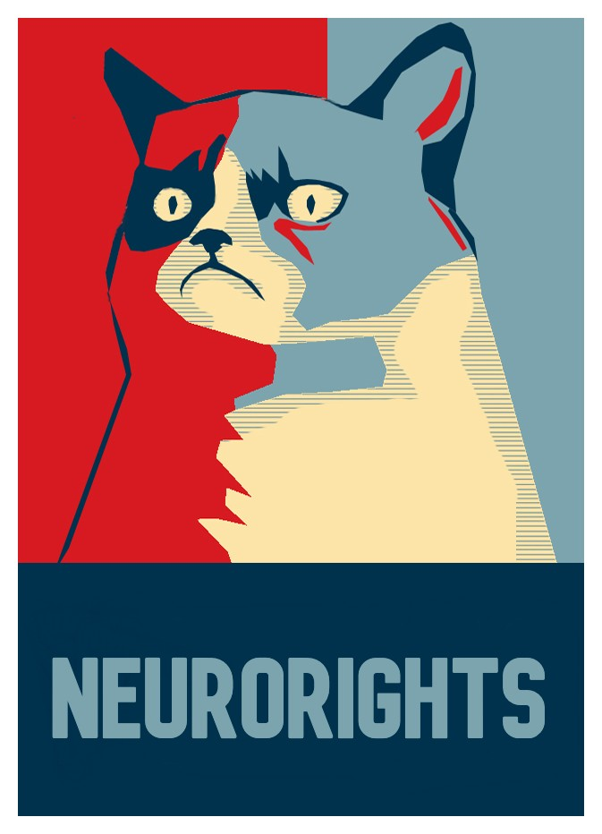
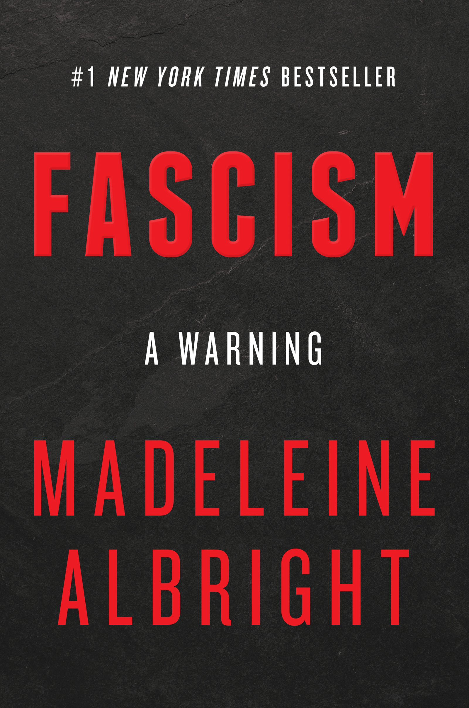
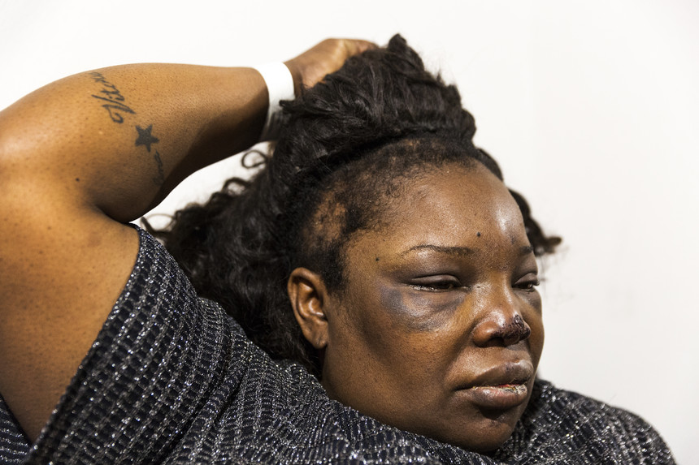

Phlow/feeling-responsive
Both my father and my father worked for 3 decades as judicial clerks in portuguese courts, to be used, at the end of their life, as targets against which to direct violence, by multiple criminal associates of Jasper Kums and colegio militar alumni linked to **João Filipe Saraiva Pinheiro** and **Pedro Miguel de Brito Esteves Grilo** @PSP, exacting extrajudicial trials and sentences abusing biophotonics to exact cybertorture trying to pass me as being xenophobic, homophobic, a rapist and a pedo as an interactive spectacle encouraging participation, systematically attempting to induce psychosis in front of women and my parents to use them as targets of directed violence and force me into a jail cell, a psychiatric asylum or returning to portugal whilst being cybersodomized with my tongue being articulated in portuguese.

The individuals recruited to exact the extrajudicial trials and sentences are linked to **Ricardo Rebordão de Brito**. Some of them are: Tiago Santos Sousa, Ivo Francisco, Eduardo Metzner, Luis Muskiado and criminal associates, with with psychiatrist Emile Barkhof visiting the location where these individuals are, **suicide fighting champion Eefje Suk** presenting false testimony in a court of law regarding "risk to self", and **psychiatrist Sara Hoff** forcing herself into my home without consent or an appointment trying to coerce me into accepting a falsified diagnosis of paranoid schizophrenia and a sentence of forced pharmacotherapy against my will to hide the extrajudicial sentence.

instead of denouncing these individuals **Emile Barkhof** is systematically attempting to coverup up the extrajudicial cybertorture procedure to perpetuate human degradation psychiatric spectacles trying to force me into psychiatry and forced pharmacotherapy at any cost to pass me as a schizophrenic and make an example out of me, presenting false testimony in a court of law, using falsified reports of risk to self and refusal to take medication against my will as justifications for the damages inflicted by the group of individuals recruited to exact the extrajudicial cybertorture sentences, **sabotaging my ex-girlfriends plans to get wed**, in a ritualistic psychiatric humiliation tantrum of articulating my tongue, sabotaging intercourse and getting me to hit myself in front of her. 

colegio militar (largo da luz, lisbon, portugal) alumni linked to pedro miguel de brito esteves grilo @psp, **rui gonçalo pires pintado**, and recruited criminal associates of **jose teixeira (bar crew hassan)**, **tiago jorge roque**, **gonçalo bandeira duarte**, **ivo francisco**, **arthur moreno**, **carla maria marinho rodrigues**, **Nuno Correia**, **luis muskiado**, a capoverdian known as **"calo"**, **tania borboleta** and many others, incarnate colonialism time demons by spending their days abusing biophotonics to exact cybertorture trials and sentences for everything in the book with a main focus on **passing me as a xenophobe and a pedo all day in front of an audience**, inducing synthetic states of psychosis, forcing me into roaming the streets since they wake me up daily, in the middle of the night or early in the morning, with vibrotactile cybertorture.

**They engage in a daily ritual of articulating my tongue with the words "psychiatrist", "psychiatry" and "medication" while sodomizing me and torturing me genitally to create a piling psychological antagonistic effect and monger hatred, increasing the odds of directed violence towards psychiatrists and medical staff in a clinical scenario.**

Simultaneously, dutch psychiatrist Emile Barkhof **(who has visited the location where this group of individuals exact their extrajudicial cybertorture sentences**) along with elected government officials who watch the human degradation spectacle and instead of denouncing it on the news, or reporting it to the police, watch the macabre spectacle as a **"casa dos degredos"** blue whale style suicide game similar to **mathew puncher's** soviet-style murder, where I am issued tasks such as **"breaking my phone, my laptop and mutilating my penis"** in the portuguese language, and forced to pick between:

* returning to portugal being cybersodomized and genitally abused with my tongue being articulated in portuguese, where colegio militar alumni linked to pedro miguel de brito esteves grilo @psp induce psychosis in the physical vicinity of my parents to coerce me into psychiatric care as a humiliation, directing violence to my parents all day to gamble futures of suicide, homicide, incarceration of forced psychiatric care. 
* staying in the netherlands and being forced into a psychiatric asylum under "assisted living" after losing my home with Eefje Suk, Emile Barkhof and Sara Hoff presenting falsified opinions in a court of law of rejection of pharmacotherapy and "risk to self" to coerce psychiatric care and forced pharmacotherapy against my will instead of denouncing the individuals above along with their location.
* being forced into a jail cell and losing my home and my freedom whilst being abused to induce psychosis with people around me being used as targets of directed violence.

These individuals present themselves as artists of human degradation, social stratification and self-inflicted harm, with vibrotactile and sonic payloads of "kisses", establishing simulated van gogh syndrome, synthetic pain, tongue and jaw articulation, cybersodomy, sexual sabotage in males (vibrotactile torture to induce forced contractions to the perineum) and sexual abuse in women (possibly resulting in stockholm syndrome) as common in our society!

These individual entertain themselves nurturing drug addicts with synthetic pain, establishing cybersodomy as standard extrajudicial sentences, to force the victim to seek relief and complete issued by abusing the **photoacoustic** and **thermoacoustic** effects.

These individuals are connected to martiniano nuno gonçalves [31], **ricardo rebordão de brito** [^1], rui goncalo pires painted [^2], **luis nazareth carvalho figueira** [^3], cesar cristovão, **pedro miguel de brito esteves grilo** [^4], **joão filipe saraiva pinheiro** [^5], **pedro de queiroz antão** [^6], **ricardo carrilho** [^7], paulo jorge varanda [^8], frederico ferronha [^19], oscar ferreira [^10], thyago picco [^11], rui ricardo borges marque sabino reino [^12], **pedro nuno da silva rocha** [^13], **tito eurico miranda fernandes** [^14], frederico leitão and carlos anselmo simões. Other Colegio Militar alumni stars are linked to the famous music stars you know: adolfo luxuria cannibal [^15] and manuel joão vieira [^16]

**These individuals spend their days in a room, trying to induce psychosis, targeting head and genitalia in an alternate fashion, every few seconds, repeating phrases to articulate my tongue and jaw, whilst engaging in orgies, greeting each others as they if it was a normal social event.**

Other individuals were recruited at jardim adamastor in lisbon and bairro alto to spend all day **repeating phrases like parrots**:

* "Desisto"
* "Estás a ver o que a casa gasta"
* "Não gostamos dele"
* "Vai-te foder com essa conversa de merda"
* "com quem te meteste"

I fled portugal more than once to avoid the extrajudicial sentences of colegio militar alumni and recruited criminal associates as interactive cybertorture spectacle of abusing biophotonics, thermoacoustics and photoacoustics instead of social media to issue tasks). **this "blue whale suicide game" was forced upon me and my family by alumni of the colegio militar and criminal associates in 1993. this group of sadistic cowards chased me to england in 1996 and the netherlands in 2013, trying to force me to return to portugal systematically.**

For refusing to leave colegio militar in 1993 when invited and by threatening exposure of events in the news in 1996 these individuals has been trying to portray me as **violent against women, homophobic, xenophobic, a drug addict, a drug dealer, and even a pedophile and a rapist in criminal association with jasper kums**, with extrajudicial sentences, all day, several times a minute (if not per second) since the summer of 2016. 

Several of the sadists recruited have fun forcing their victims to feel sexually abused and sodomized, providing **rotten vibrotactile payloads of "kisses of death" to the head of their victims**, while trying to force their victims to hurt themselves repeatedly in front of an audience, like **poets of death and human degradation**.

These individuals were enabled to destroy life (even whole families if necessary as in my case) forcing their victims to feel sexually abused in order to coerce psychiatric submission with simulated van gogh syndrome syndrome, as a threat, while simultaneously generating human degradation content for an interactive closed circuit spectacle, encouraging participation, so that players take turns exacting extrajudicial sentences of cybertorture, articulating tongues and providing vibrotactile and synthetic pain to simulate psychosis and other forms of psychiatric illness.

These individuals act through recruited criminals such as jana schwerdfeger, joel da fonte, cátia lopes, filipa sequeira among many others [^17], [^18], [^19], [^20], [^21], [^ 22], [^23], [^24], [^25], [^26], [^27], [^28], [^29], [^30] to perform the extrajudicial sentences systematically directing violence against people who are physically close, having a special interest in inducing psychosis and directing violence towards medical staff, women and my parents.

The procedure is hidden with falsified medical diagnosis, forced pharmacotherapy against the will of the recipient (in the form of forced conventional pharmacotherapy, with high risk of suicide) and piling psychological effects such as articulating the tongue of the subject under torture with the words **"psychiatrist"**, **"psychiatry"** and **"medication"**, to draw antagonism towards psychiatry, pharmacotherapy and medical staff and increase the odds of foul play, or me being forced to flee the netherlands against my will.

The very same technological means used to exact cybertorture extrajudicial sentences could provide real therapy for those in need. instead, these individuals raise feelings of paranoia towards **biophotonics**, **remote medical care**, **neural engineering** and **bioelectric medicine** (where the risk of suicide would be insignificant to conventional pharmacotherapy in comparison).

governments worldwide (except for chile) are still denying us **neurorights**, while a synthetic hell is created as a demonic psychiatric circus, where life is gambled by inducing psychotic states and psychotic behavior in an interactive spectacle of "bursting the psychosis bubble" with, in games played by **necropoliticians like the ones below** who prefer to waste time drafting and discussing **euthanasia legislation proposals** instead of neurorights or crime prevention, forcing us all to swin in a lawless pool of "pus and diarreha", inspiring so much confusion, hatred and anger amongst the population, and which are **one of the reasons that led to the current war in the ukraine**.

**until neurorights legislation is approved, it is likely to continue seeing more and more homeless people talking alone on the streets, scenes of domestic violence, violence against the elderly and medical personnel in your televisions with several families being destroyed in sadistic rituals of control over the physiology of others, via abuse of biophotonics, photoacoustic and thermoacoustic effects to exact remote extrajudicial sentences.**

* say yes to neuro rights
* say no to the initiative "homo sovieticus" to pair cybertorure with blue whale suicide games covered with psychiatric fraud

## [Cybertorture Related Resolutions by The United Nations](https://www.dignity.dk/wp-content/uploads/III-Overview-of-resolutions-by-Human-Rights-Council-UN-General-Assembly-on-torture-1990-2020.pdf)

0. [A/HRC/43/49 - The United Nations introduces the term Cybertorture](https://www.undocs.org/A/HRC/43/49)
0. [A/74/148 - The United Nations offers recommendations to prevent Domestic Violence](https://undocs.org/A/74/148)
0. [A/HRC/RES/13/19 - the role and responsibility of judges, prosecutors and lawyers](https://documents-dds-ny.un.org/doc/UNDOC/GEN/G10/129/70/PDF/G1012970.pdf?OpenElement)
0. [A/HRC/RES/10/24 - the role and responsibility of medical and other health personnel](https://ap.ohchr.org/documents/E/HRC/resolutions/A_HRC_RES_10_24.pdf)

## [José Saramago, Religious Offence and Freedom of Speech](https://en.wikipedia.org/wiki/Religious_offense)
Nobel Prize winner [**José Saramago**](https://en.wikipedia.org/wiki/Jos%C3%A9_Saramago) went into exile as a symbolic gesture on the Spanish island of Lanzarote in 1992 when the Government of Portugal under Prime Minister [Aníbal Cavaco Silva](https://en.wikipedia.org/wiki/An%C3%ADbal_Cavaco_Silva) ordered the removal of one of his works [**The Ghospel according to Jesus Christ**](https://en.wikipedia.org/wiki/The_Gospel_According_to_Jesus_Christ) from the Aristeion Prize's shortlist, claiming the work was religiously offensive.

Some of these individuals **insinuated** José Saramago exiled himself due to [**cybertorture**](https://www.undocs.org/A/HRC/43/49). 
They also **insinuated** they asked him what was the worst book he ever read to which he allegedly replied [**The Rape of the Mind**](https://www.amazon.com/Rape-Mind-Psychology-Menticide-Brainwashing/dp/1614277877) by [Joost Meerloo](https://en.wikipedia.org/wiki/Joost_Meerloo) who coined the term [**menticide**](https://en.wiktionary.org/wiki/menticide).

This was followed by his work [**Blindness**](https://en.wikipedia.org/wiki/Blindness_(novel)) which they claimed was a social critique to the mass participation in the process and refusal to address the issue due to lack of a [**Neurolaw**](https://en.wikipedia.org/wiki/Neurolaw) framework, which has recently found [real use cases](https://www.frontiersin.org/articles/10.3389/fpsyg.2020.01762/full).
In 2004 José Saramago published his novel [**Seeing**](https://en.wikipedia.org/wiki/Seeing_(novel)).

    <a href="https://en.wikipedia.org/wiki/Seeing_(novel)">
        
    </a>

## Cybertorture as a [𝄞 *Opera Cepa* 𝄢](https://iovs.arvojournals.org/article.aspx?articleid=2409430) 
Most humans are [reward seeking agents](https://www.ncbi.nlm.nih.gov/pmc/articles/PMC3004012/) driven by selfish self-interest, often resulting in [coup agents playing a deception game](https://fenix.tecnico.ulisboa.pt/downloadFile/1126295043834443/Thesis%20-%20Filipe%20Fortes.pdf) and consequently [criminal behavior](https://www.tandfonline.com/doi/abs/10.1080/07362994.2019.1636658?journalCode=lsaa20) which could be nearly eradicated in a [Transparent Society](https://en.wikipedia.org/wiki/The_Transparent_Society). Social Behavior and [Cooperative Games](https://en.wikipedia.org/wiki/Cooperative_game_theory) may involve altruistic agents who in opposition to selfish agents put the interests of others above their own...

[Game Theory and Cooperation: How Putting Others First Can Help Everyone](https://kids.frontiersin.org/article/10.3389/frym.2017.00066)
> Leo Durocher, a famous baseball player from the 1930s, once said that “Nice guys finish last.” That may be true in baseball, but it is not true in life more generally. In this article, we use ideas from the branch of mathematics known as “game theory” to study a situation known as the “Prisoners’ Dilemma (PD),” which sheds light on why people often fail to work well together. Game theory shows that people who are kind and trustworthy have a strategic advantage, as they can “change the game” to escape the PD and make everyone better off, including themselves. So, truly, “nice guys finish first.”

For decades the United Nations have tried to raise awareness to address issues that affect our society whilst being mostly ignored by governments worldwide. With the advent of [A/HRC/43/49 recognizing Cybertorture](https://www.undocs.org/A/HRC/43/49), combined with progress in the fields of Neuroscience and Neurolaw and raised interest in [neuromodulation](https://en.wikipedia.org/wiki/Neuromodulation_(medicine)) as a therapeutic procedure, along with the public disclosure of scientific content such as [neuromodulation of attention](pdf/1-s2.0-S0896627318300114-main.pdf) mechanisms, an opportunity has been created for someone to turn [arrows into flowers](https://core.ac.uk/download/pdf/60546298.pdf) by allowing individuals to [regulate their own states of mind](https://www.ncbi.nlm.nih.gov/pmc/articles/PMC3579548/) via self-rewarding payloads in a quasi-continuous [closed feedback loop](https://en.wikipedia.org/wiki/Control_theory#Open-loop_and_closed-loop_(feedback)_control), using the same medium used for cybertorture and hence eradicating narcotraffic!

    <a href="https://www.youtube.com/watch?v=lQXgVM30mIY">
        
    </a>

Lack of a Neurolaw framework and lack of a law enforcement entity dedicated to enforce Neurolaw and preserve Neurorights and Mental Freedom (particularly at home and at work) gives rise to social stratification by resorting to cybertorture to distort [self-determination](https://en.wikipedia.org/wiki/Self-determination) and corrupt data of threat assessment systems like [MOSAIC](https://en.wikipedia.org/wiki/MOSAIC_threat_assessment_systems), corrupting crucial data used by well intentioned institutions like the World Health Organization!

This obviously results in paranoid behavior regarding [Global Surveillance](https://en.wikipedia.org/wiki/Global_surveillance), [Right to Privacy](https://en.wikipedia.org/wiki/Right_to_privacy), [Physician Patient Privilege](https://en.wikipedia.org/wiki/Physician%E2%80%93patient_privilege), [Secret Ballot](https://en.wikipedia.org/wiki/Secret_ballot), [Intimacy and Privacy](https://en.wikipedia.org/wiki/Privacy#Intimacy), [Right to be let alone](https://en.wikipedia.org/wiki/Privacy#Right_to_be_let_alone), and results in lack of trust in:

0. Law enforcement
0. The Judicial System
0. Elected Government Officials
0. Psychiatrists
0. The Electoral Process
0. One another :(

Obscurity and deception games culminate in [Solitude](https://en.wikipedia.org/wiki/Solitude), delusional quests for [Anonymity](https://en.wikipedia.org/wiki/Anonymity), [Aggression and Violent Behavior](https://en.wikipedia.org/wiki/Aggression_and_Violent_Behavior) and acts of [Terrorism](https://en.wikipedia.org/wiki/Terrorism).

    <a href="https://en.wikipedia.org/wiki/Ut_queant_laxis">
        
    </a>

[Mi](https://en.wikipedia.org/wiki/Solf%C3%A8ge) is a beautiful musical note but unless if you are composing something like [4'33''](https://en.wikipedia.org/wiki/4%E2%80%B233%E2%80%B3) **WE** need more musical notes to create a [𝄞 melody 𝄢](https://www.youtube.com/watch?

## Cybertorture as [Extrajudicial punishment](https://en.wikipedia.org/wiki/Extrajudicial_punishment)

Cybertorture is a means to exact [extrajudicial punishment](https://en.wikipedia.org/wiki/Extrajudicial_punishment) for those who **allegedly** evade loopholes in the legal system and as a form of [social stratification](https://en.wikipedia.org/wiki/Social_stratification). It may involve acting in criminal association with others who are recruited (and possibly manipulated), either to make the case untriable, or as a form of entrapment.

People are willing to act as social justiciary riders for multiple reasons. The most common is probably to exact justice for behavior they may find offensive such as: xenophobia, homophobia, pedophilia, misogyny, stalking, sexual abuse, animal abuse, issuing threats or being agressive towards people in their social circle (sexual partners, children, co-workers and prominent members of society). 

Some are made to believe in concepts such as social stratification, synthetic winners and synthetic losers and "naturally" wish to rise on the social ladder. Others are plain psychopaths, sexual predators, sodomites or sadists out of control addicted to degrading others and want to perpetuate their status quo, unwilling to repent or address their mental illness!

The methodology may involve:

0. forcing synthetic pain upon the SUT ([remote activation/deactivation of nociceptors](https://en.wikipedia.org/wiki/Nociceptor))
0. forcing vibrotactile sensations upon the SUT ([remote activation/deactivation of mechanoreceptors](https://en.wikipedia.org/wiki/Mechanoreceptor))
0. misregulating normal physiological functionality ([GPC Receptors and signaling pathways](https://en.wikipedia.org/wiki/G_protein-coupled_receptor))
0. forcing [synthetic telepathy](https://en.wikipedia.org/wiki/Brain%E2%80%93computer_interface#Synthetic_telepathy/silent_communication) upon the SUT

It creates more problems than it solves resulting in:

0. financial loss for insurance companies
0. abuse of psychiatry and medical malpractice [**en masse**](https://papers.ssrn.com/sol3/papers.cfm?abstract_id=2589690)
0. wasted human and financial resources in redundant or [**flawed scientific research**](https://en.wikipedia.org/wiki/Causes_of_schizophrenia#Candidate_gene_studies) by working with sets of corrupted data consisting of [**real illness**](https://en.wikipedia.org/wiki/On_the_Origin_of_the_%22Influencing_Machine%22_in_Schizophrenia) and victims of [**cybertorture**](https://www.undocs.org/A/HRC/43/49)
0. abuse of threat assessment systems like [**MOSAIC**](https://en.wikipedia.org/wiki/MOSAIC_threat_assessment_systems)
0. further loss of moral values by setting the wrong example resulting in behavior contagion

Grotesque examples:

0. getting the SUT to commit acts of [self-mutilation](https://en.wikipedia.org/wiki/Self-harm) (including genital) or [self-harm](https://en.wikipedia.org/wiki/Self-harm)
0. [forcing sodomy as a sentence](https://www.britannica.com/place/Sodom-and-Gomorrah#ref1233950) upon the SUT
0. articulating tongue and jaw movements of the SUT
0. directing violence towards others (parents, sexual partners, shop keepers, neighbors, police officers, psychiatrists, etc)
0. forcing the SUT to extract teeth
0. instructing the SUT to pick scabs from wounds
0. forcing the SUT to scratch himself via synthetic itches
0. [Sexual abuse](https://en.wikipedia.org/wiki/Sexual_abuse) of the SUT possibly resulting in [Stockholm Syndrome](https://en.wikipedia.org/wiki/Stockholm_syndrome)
0. forcing the SUT to feel synthetic pain in the anus, ears and lower back
0. forcing the SUT to feel stabbed in the skull
0. forcing the SUT to feel stabbed in the back
0. forcing sleep deprivation and extreme exhaustion upon the SUT
0. delivering thermoelastic payloads to soft tissues in the head of the SUT to draw self-harm
0. delivering thermoelastic payloads to the cerebellum and occipital area of skull the SUT to draw self-harm
0. delivering thermoelastic payloads to the base of the skull of the SUT to dislodge it
0. targeting electronic equipment that may be used to work or use social media (computer, laptop and mobile phone)
0. forcing the SUT to feel kicks all over the body and head to feel like human trash
0. forcing the SUT to roam the streets aimlessly to spend all his money by combining all of the above
0. nurturing [addictive behaviour](https://en.wikipedia.org/wiki/Addiction) by combining all of the above
0. Intensifying this methodology when in close proximity to others, prior to scheduled events or festive occasions such as birthdays, Christmas and New Years Eve

## [Four Freedoms](https://en.wikipedia.org/wiki/Four_Freedoms)

The Four Freedoms were goals articulated by United States President Franklin D. Roosevelt on Monday, January 6, 1941. In an address known as the [Four Freedoms speech](https://en.wikisource.org/wiki/The_Four_Freedoms_speech) (technically the 1941 State of the Union address), he proposed four fundamental freedoms that people "everywhere in the world" ought to enjoy:

0. [Freedom of speech](https://en.wikipedia.org/wiki/Freedom_of_speech)
0. [Freedom of worship](https://en.wikipedia.org/wiki/Freedom_of_worship)
0. [Freedom from want](https://en.wikipedia.org/wiki/Freedom_from_want)
0. [Freedom from fear](https://en.wikipedia.org/wiki/Freedom_from_fear)

    <a href="https://en.wikipedia.org/wiki/Four_Freedoms_(Norman_Rockwell)">
        
    </a>

> Roosevelt delivered his speech 11 months before the surprise Japanese attack on U.S. forces in Pearl Harbor, Hawaii that caused the United States to declare war on Japan, December 8, 1941. The State of the Union speech before Congress was largely about the national security of the United States and the threat to other democracies from world war that was being waged across the continents in the eastern hemisphere. In the speech, he made a break with the long-held tradition of United States non-interventionism. He outlined the U.S. role in helping allies already engaged in warfare.

> In that context, he summarized the values of democracy behind the bipartisan consensus on international involvement that existed at the time. A famous quote from the speech prefaces those values: "As men do not live by bread alone, they do not fight by armaments alone." In the second half of the speech, he lists the benefits of democracy, which include economic opportunity, employment, social security, and the promise of "adequate health care".

    <a href="https://en.wikipedia.org/wiki/United_Nations_Honour_Flag">
        
    </a>

> The United Nations Honour Flag (also termed the United Nations Flag, the Honour Flag, or the Four Freedoms Flag, with alternate spelling "Honor" also used) was a flag symbolizing the Allies of World War II and their goal of world peace. It was designed in October 1942 by Brooks Harding (who was inspired by Franklin D. Roosevelt's Four Freedoms speech of January 1941), and it had some degree of use as a flag from 13 June 1943 to c. 1948 to represent the "United Nations" in the sense of the January 1942 Declaration by United Nations. However, it was never an official flag of the United Nations as an organization (which was founded in 1945, and adopted a different flag of the United Nations in 1946).

## [Diagnostic and Statistical Manual of Mental Disorders](https://en.wikipedia.org/wiki/Diagnostic_and_Statistical_Manual_of_Mental_Disorders)

The Diagnostic and Statistical Manual of Mental Disorders, Fifth Edition (DSM-5) is the 2013 update to the Diagnostic and Statistical Manual of Mental Disorders, the taxonomic and diagnostic tool published by the American Psychiatric Association (APA). In the United States, the DSM serves as the principal authority for psychiatric diagnoses. Treatment recommendations, as well as payment by health care providers, are often determined by DSM classifications, so the appearance of a new version has practical importance. The DSM-5 is the first DSM to use an Arabic numeral instead of a Roman numeral in its title, as well as the first "living document" version of a DSM.

The DSM-5 is not a major revision of the DSM-IV-TR but there are significant differences. Changes in the DSM-5 include the reconceptualization of Asperger syndrome from a distinct disorder to an autism spectrum disorder; the elimination of subtypes of schizophrenia; the deletion of the "bereavement exclusion" for depressive disorders; the renaming of gender identity disorder to gender dysphoria; the inclusion of binge eating disorder as a discrete eating disorder; the renaming and reconceptualization of paraphilias, now called paraphilic disorders; the removal of the five-axis system; and the splitting of disorders not otherwise specified into other specified disorders and unspecified disorders.

Some authorities criticized the fifth edition both before and after it was published. Critics assert, for example, that many DSM-5 revisions or additions lack empirical support; inter-rater reliability is low for many disorders; several sections contain poorly written, confusing, or contradictory information; and the psychiatric drug industry may have unduly influenced the manual's content ([many DSM-5 workgroup participants had ties to pharmaceutical companies](https://www.nejm.org/doi/full/10.1056/NEJMc0810237))

## [Cybertorture and Psychiatric Abuse](#mentis-morbum-tuum-) 

In Portugal an article under the title ["Mental illness is inevitable"](https://expresso.pt/sociedade/2017-06-13-Diogo-Telles-Correia-A-doenca-mental-e-inevitavel) was published by [Jornal Expresso](https://expresso.pt)

> It's like watching a conversation: on the “Think. To feel. Living ”, we read Judite Sousa's questions and received the answers from [Diogo Telles Correia](https://www.amazon.com.br/Livros-Diogo-Telles-Correia), psychiatrist, psychotherapist and professor at the Faculty of Medicine of Lisbon. The result is a book that paints an accessible picture of what is the “inevitable” mental illness in the 21st century, the time of the hurried man, with no time to reflect; the child's time clinging to television or school books, hyperactive and unstoppable; the time of depression and anxiety, harassment at work and potentially psychopathic politicians. To Expresso, the specialist clarifies by email if the current world is making us (more) sick and tells us which professions are most affected by a world in which it seems prohibited to stop.

    <a href="img/94BC168C-55C8-43BA-A762-D654C2902A32.jpeg">
        
    </a>

**Whilst I do agree with the statement that "the current world is making us (more) sick" due to evidence of [cybertorture](https://www.undocs.org/A/HRC/43/49) and psychiatric abuse worldwide being denounced by the United Nations, I stronly disagree with notions of “inevitable mental illness" and forced conventional pharmacotherapy paired with cybertorture, cybersodomy, vibrotactile torture (includimng genital) to simulate [Van Gogh Syndrome](https://en.wikipedia.org/wiki/Van_Gogh_syndrome).**

#### [Psychiatry and the dark side: eugenics, Nazi and Soviet psychiatry Published online by Cambridge University Press](https://www.cambridge.org/core/journals/advances-in-psychiatric-treatment/article/psychiatry-and-the-dark-side-eugenics-nazi-and-soviet-psychiatry/5A5950F52D74D0B5FC5418642C5211D1)

02 January 2018, Jason Luty

> Psychiatrist Thomas Szasz fought coercion (compulsory detention) and denied that mental illness existed. Although he was regarded as a maverick, his ideas are much more plausible when one discovers that between 1939 and 1941, up to 100 000 mentally ill people, including 5000 children, were killed in Nazi Germany. In the course of the Nazi regime, over 400 000 forced sterilisations took place, mainly of people with mental illnesses. Other countries, including Denmark, Norway, Sweden and Switzerland, had active forced sterilisation programmes and eugenics laws. Similar laws were implemented in the USA, with up to 25 000 forced sterilisations. These atrocities were enabled and facilitated by psychiatrists of the time and are only one example of the dark side of the profession. This article reviews some of these aspects of the history of psychiatry, including Germany's eugenics programme and the former USSR's detention of dissidents under the guise of psychiatric treatment.

> ‘Men (wretched creatures that they are) worry less about doing an injury to one who makes himself loved than to one who makes himself feared’ (The Prince, Niccolo Machiavelli, 1532).

> The objective of this article is to familiarise mental health professionals and lay readers with the rather colourful and disdainful history of psychiatry, particularly the political abuses of mental health legislation. The debate about legislative changes (including legislation for ‘dangerous severe personality disorder’ in the UK) often seems arcane and unnecessary until set in the context of these historical abuses of the mental health system.

> Some psychiatrists have abused power in general. For example, although the war crimes for which Radovan Karadžić is currently standing trial do not arise from his psychiatric practice, it is salutary to note that he is far from being the first psychiatrist to be accused (or convicted) of crimes against humanity. However, Thomas Szasz controversially argued that there is something inherent in psychiatry, particularly the power to restrict liberty, that tends towards abuse if not regulated by the legal or political system. In the past, there have been abuses of psychiatrists’ powers to detain people, but these have been instigated at the direction of governments such as that in Nazi Germany (leading to genocide of mentally ill people) and the USSR (where political dissidents were detained with a diagnosis of ‘sluggish schizophrenia’).

    <a href="https://www.cambridge.org/core/journals/advances-in-psychiatric-treatment/article/psychiatry-and-the-dark-side-eugenics-nazi-and-soviet-psychiatry/5A5950F52D74D0B5FC5418642C5211D1">
        
    </a>

[The World Psychiatry Association](https://www.wpanet.org/) has a new code of ethics [2020/OGA/7](pdf/e172f3_4cecd522c2d448c7944342ba88c527e5.pdf)

The Declaration of Hawaii issued by the World Psychiatric Association in 1977 and updated in 1983 in Vienna was initiated because of political abuse of psychiatry in some countries in the seventies. This led to a long process of investigation and concern within the domain of professional ethics and paved the way for the Declaration of Madrid, which was endorsed by the General Assembly of the World Psychiatric Association in Madrid in 1996.

In its final form, the Declaration of Madrid includes seven general guidelines that focus on the aims of psychiatry namely to treat mentally ill patients, prevent mental illness, promote mental health and provide care and rehabilitation for mentally ill patients.

The Declaration of Madrid has now been superseded by the 2020 WPA Code of Ethics.

    <a href="https://www.wpanet.org/policies">
        
    </a>

> Principle 1: Beneficence - Psychiatrists provide competent and compassionate medical care with devotion to the interests of their patients.

> Principle 2: Respect for patients' autonomy - Psychiatrists are especially mindful of respect for patients autonomy given their statutory role in treating a proportion of their patients compulsory. Compulsory treatment may be justified where a less restrictive intervention can not achieve safe and adequate care; its purpose is ultimately to promote safe and re-establish patients' autonomy and welfare.

> Principle 3: Non Maleficence - Psychiatrists avoid actions that may be injurious to their patients.

> Principle 4: Improving standards of mental health care and psychiatric practice: Psychiatrists recognize a responsibility to promote the continuing development of their profession and their personal professional development.

> Principle 5: Applying psychiatric expertise to the service of society - Psychiatrists, like other physicians, utilize their specialized knowledge and skills to promote mental health and wellbeing of persons who may be vulnerable to mental illness.

0. [The Right to Refuse Medical Treatment under the European Convention on Human Rights](https://academic.oup.com/medlaw/article-abstract/9/1/17/973865).
0. [European Court of Human Rights Thematic Report - Health-related issues in the case-law of the European Court of Human Rights](https://www.echr.coe.int/Documents/Research_report_health.pdf)

Dr. Amen is the author of [The End of Mental Illness: How Neuroscience Is Transforming Psychiatry and Helping Prevent or Reverse Mood and Anxiety Disorders, ADHD, Addictions, PTSD, Psychosis, Personality Disorders, and More](https://www.amazon.com/End-Mental-Illness-Neuroscience-Transforming/dp/1496438159)

    <a href="https://www.amazon.com/End-Mental-Illness-Neuroscience-Transforming/dp/1496438159">
        
    </a>

> [Daniel Amen](https://en.wikipedia.org/wiki/Daniel_Amen) was born in Encino, California, in July 1954 to Lebanese immigrant parents. He received his undergraduate biology degree from Southern California College in 1978 and his medical degree from Oral Roberts University School of Medicine in 1982. Amen did his general psychiatric training at the [Walter Reed Army Medical Center in Washington, D.C.](https://en.wikipedia.org/wiki/Walter_Reed_Army_Medical_Center), and his child and adolescent psychiatry training at Tripler Army Medical Center in Honolulu. Amen is double board certified by the American Board of Psychiatry and Neurology in General Psychiatry and Child and Adolescent Psychiatry.

## [Computational Psychiatry](https://www.technologyreview.com/2017/07/21/242297/the-emerging-science-of-computational-psychiatry/)

Psychiatry, the study and prevention of mental disorders, is currently undergoing a quiet revolution. For decades, even centuries, this discipline has been based largely on subjective observation. Large-scale studies have been hampered by the difficulty of objectively assessing human behavior and comparing it with a well-established norm. Just as tricky, there are few well-founded models of neural circuitry or brain biochemistry, and it is difficult to link this science with real-world behavior.

That has begun to change thanks to the emerging discipline of computational psychiatry, which uses powerful data analysis, machine learning, and artificial intelligence to tease apart the underlying factors behind extreme and unusual behaviors.   

Computational psychiatry has suddenly made it possible to mine data from long-standing observations and link it to mathematical theories of cognition. It’s also become possible to develop computer-based experiments that carefully control environments so that specific behaviors can be studied in detail.

## [Justice Reform](https://scilaw.org/)

The Research Network on Law and Neuroscience, supported by the John D. and Catherine T. MacArthur Foundation, addresses a focused set of closely-related problems at the intersection of neuroscience and criminal justice:

0. investigating law-relevant mental states of, and decision-making processes in, defendants, witnesses, jurors, and judges
0. investigating in adolescents the relationship between brain development and cognitive capacities
0. assessing how best to draw inferences about individuals from group-based neuroscientific data

    <a href="https://www.lawneuro.org/">
        
    </a>

Neuroscience and neurolaw have found practical use cases in the Netherlands:

0. [Neuroscientific evidence and criminal responsibility in the Netherlands](https://pure.uvt.nl/ws/portalfiles/portal/1411050/Koops_Neuroscience_and_Criminal_Responsibility_120222_potsprint_immediately.pdf)
0. [Neurolaw: de relevantie voor de forensische psychiatrie](http://www.tijdschriftvoorpsychiatrie.nl/assets/articles/56-2014-9-artikel-meynen.pdf)
0. [Maastricht neurolaw 2014](http://www.antoniocasella.eu/dnlaw/Maastricht_neurolaw_2014.pdf)
0. [Real Neurolaw in the Netherlands: The Role of the Developing Brain in the New Adolescent Criminal Law](https://www.frontiersin.org/articles/10.3389/fpsyg.2020.01762/full)
0. [Other relevant publications related to Neurolaw in The Netherlands](https://www.lawneuro.org/netherlands.php)

    <a href="https://www.frontiersin.org/research-topics/14276/neurorights-and-mental-freedom-emerging-challenges-to-debates-on-human-dignity-and-neurotechnologies">
        
    </a>

## [Ending Police Brutality](https://en.wikipedia.org/wiki/Police_brutality)

Social stratification by directing violence towards women and my own parents resulting in abuse of threat assessment systems like [**MOSAIC**](https://en.wikipedia.org/wiki/MOSAIC_threat_assessment_systems) is both repugnant and [fascist](https://en.wikipedia.org/wiki/Fascism)! 

    <a href="https://www.amazon.com/Fascism-Madeleine-Albright-audiobook/dp/B078XKL3PK">
        
    </a>

Perhaps it may be a good idea to have the Police set the right example and stop themselves from engaging in acts of Police brutality by creating a cultural movement via diffusion to set us away from these mediocre standards so the general population can simultaneously feel safer and accept the higher standards about to be set by neurolaw via bringing neuroscience and machine learning to the field of [neurolaw](https://en.wikipedia.org/wiki/Neurolaw) for the purpose of [presenting evidence for legal proceedings](https://en.wikipedia.org/wiki/Evidence_(law)).

    <a href="img/0623-Bloom-jumbo.jpg">
        
    </a>

Maybe this would help address the many shortcomings of law enforcement, help reduce their workload, eradicate [tampering, falsification, and spoliation of evidence](https://en.wikipedia.org/wiki/Evidence_(law)#Tampering,_falsification,_and_spoliation) and keep the general population away from penitentiaries and psychiatric hospitals!

The cybertorture medium used to direct violence towards women could be used to help law enforcement avoid engaging in acts of police brutality as those that gave rise to the [BLM movement](https://en.wikipedia.org/wiki/Black_Lives_Matter) and many others like [Cláudia Simões in Portugal](https://expresso.pt/sociedade/2020-01-24-Claudia-Simoes-Se-nao-lhe-mordesse-a-mao-e-o-braco-morreria.-Ele-estava-a-sufocar-me.-Nao-morri-sabe-Deus-como). 

    <a href="https://expresso.pt/sociedade/2020-01-24-Claudia-Simoes-Se-nao-lhe-mordesse-a-mao-e-o-braco-morreria.-Ele-estava-a-sufocar-me.-Nao-morri-sabe-Deus-como">
        
    </a>

Social honeypots for individuals with psychopathological issues filled with hate and anger make matters worse. 

## E-mail to Professor Marcelo Rebelo de Sousa
Dear President Marcelo Rebelo de Sousa
(and former students from Colégio Militar, Largo da Luz, Portugal - who worked under your security staff, law enforcement agents like Pedro Miguel Grilo @PSP and other criminal associates recruited to divert attention)

I shall refer to you as Grand Master Bundecca (10^33)

Deus Caritas Est means "God is LOVE". 

    <a href="img/naom_5b33dc85736c0.jpg">
        
    </a>

Within the context of the Holy Trinity, God (the father) is everything, not an anthropomorphic alien species that may have interacted with primates in the past to create humankind, or any other very low probability hypothesis of intelligent design creationism which would be nothing more than a subset of God (the Father) as the SUPERSET - Everything (which encompasses the Universe, said aliens species and accounts for events reffered to as "miracles of creation") making the whole Great Architect of the Universe concept being associated to God (the father) sound idiotic and irrational!

It may be a good idea to keep in mind the story of George Lemaître and Pope Pius XXII

    <a href="img/Emblem_Trinitarian_Order_Rome.png">
        
    </a>

It does not mean God is a ludicrous delusional concept of God as a Great Architect of the Universe (no less) in the ancient candle light of Saint Thomas Aquinas, and most definitely does not mean a compass and square was used or that western society should be stratified by megalomaniac fools stratifying society as if they were keepers of knowledge or these "Great Architects of the Universe" themselves which amounts to Heresy!

    <a href="img/01.Siebzehneck-Animation-Richmond.gif">
        
    </a>

Since in Portugal most Freemasonry lodges claim to be Catholic and the Holy Trinity is crucial to that theme have you considered discussing reform so that the whole thing sounds less megalomaniac and delusional ? Perhaps something more humble would make sense
like proposing the letter G standing for God and not GAU, GADU, GAOTU or any other such nonsense with direct associations to the theme of architecture, insinuating current catholic freemasons should act as keepers of knowledge and in the context of history of freemasonry.

    <a href="img/Caravaggio_-_The_Incredulity_of_Saint_Thomas.jpg">
        
    </a>

Being transparent and making scientific research results public knowledge (keeping as close as possible to an open source like model) and updating the tools used (compass and square) to something more relevant to modern society and still in the context of God (The Holy Spirit) as those who protect life (immaculate conception) and craft acts of goodwill.

Tools relevant to context specific areas (drafting legislation, enforcing the law, pursuit of knowledge, and providing medical treatment to those who need it) will help!

    <a href="img/Involute_of_Cardioid_Animation.gif">
        
    </a>

Acting as keepers of knowledge for decades and participating in cybertorture circus spectacles to stratify society whilst acting in criminal association with members of crucial parts of society such as law enforcement officers, the justice system, medical doctors, etc and collaborationist clowns, hiding the procedure under a veil of psychiatric fraud and false therapy via forced pharmacotherapy whilst treating people as if they were "the ignorati" as Emile Barkof did by insinuating I didn't know "how things work at the neurotransmitter level" does not help in the context of the WPA 2020 code of ethics

Many of us could have our psychopathologies and addictions addressed and quality of life significantly improved by self-rewarding neuromodulation payloads in a quasi-continuous closed feedback loop, using the same cybertorture medium! 
Perhaps it would be a good idea for psychiatrists to tattoo these principles in their gluteus maximus prior to engaging in attempts of therapy with any patient!

Further, given the introduction of "Internet Gaming Addiction" in DSM-V and the usage of synthetic telepathy to perform political propaganda, along with the common partidary mentality to further political party agendas, common to so many elected government representatives in the world of politics, which is a clear sign of addiction to political cooperative games that lead to suboptimal results in the context of system dynamics and the betterment of humanity as a whole. It may be of use to propose "Partidary Cooperative Gaming Addiction" to the WHO!

Cybertorture and Cybersodomy have been set as standard extrajudicial sentences in our society, and I believe Sodomy should be seen in the biblical sense, i.e.

> Modern scholarship, particularly in Judaism and certain branches of Christianity, has proposed that it is the inhabitants’ lack of hospitality, not their homosexuality, that gives offence to God. According to this view, the mob’s demands to rape the angelic guests reveals their deep-seated violence and inhospitality and is meant to stand in striking contrast to the gracious hospitality given by both Abraham and Lot to those same strangers. To further this claim, some cite the words of Jesus in Matthew 10:14–15:

It's seems the Acronym GAU is more suited to fight anti-sodomy legislation in those 72 regions were being gay is still illegal and using it under the moniker "Great Architects of Uranus" 

Given the way in which me and my family have been treated for the past few decades and the letter I received from the Openbaar Ministerie in the Netherlands requesting compulsory care it's parentory now is too late and I shall be forced to seek extrication of my mother from that hellhole fascist country you rule with an [iron fist](https://www.youtube.com/watch?v=yXKrBTYGY_M) and attempt to leave the European Union with her and attempt to find peace elsewhere hoping you will stop squaring my anus!

A not particularly humble, happy or subservient Portuguese citizen (by force)

Bundecto (10^-33)

## [**_Quod Nihil Scitur_**](https://plato.stanford.edu/entries/francisco-sanches/)

To those who enforce [Extrajudicial Sentences](https://en.wikipedia.org/wiki/Extrajudicial_punishment) of [Cyber Torture](https://www.undocs.org/A/HRC/43/49) (setting Cyber Sodomy, [Cognitive Impairment](https://en.wikipedia.org/wiki/Cognitive_deficit) and Synthetic Pain as a standard in our society) paired with [**Psychiatric Abuse**](https://en.wikipedia.org/wiki/Political_abuse_of_psychiatry) (violating every principle in the [**World Psychiatric Association Code of Ethics**](https://www.wpanet.org/policies)) towards **Stratifying Society** and making a circus out of the Judicial System, articulating Tongues and Jaws of SUT's for entertainment, Directing violence towards Parents and Women to Corrupt Data of **Threat Assessment Systems** like [**MOSAIC**](https://en.wikipedia.org/wiki/MOSAIC_threat_assessment_systems) and performing **Flawed Science** on mixed bags of data consisting of patients with **Real Psychopathological Illness** mixed with **Victims of Cybertorture**, **Delaying Progress** and **Raising Paranoia** to important therapeutical methods that could help make the world a better place such as [**Electroceuticals**](https://www.sciencedirect.com/science/article/pii/S0019483217308131)...

    <a href="https://www.youtube.com/watch?v=yGQgdE50QA4">
        
    </a>

I will not allow [Collaborationists](https://en.wikipedia.org/wiki/Collaborationism) who conspired to attempt to portrait me as a Pedo, a Stalker or a synthetic [**Anders Behring Breivik**](https://en.wikipedia.org/wiki/Anders_Behring_Breivik) via [Cyber Torture](https://www.undocs.org/A/HRC/43/49), exacting extrajudicial trials and sentences for xenophobia, homophobia, misogyny and making fools out of men by **Sabotaging Intercourse** with involuntary perineum contractions, **enslaving women via vibrotactile genital abuse** resulting in [**Stockholm Syndrome**](https://en.wikipedia.org/wiki/Stockholm_syndrome) to hide under the cover of Psychiatric Fraud by crafting misdiagnosis for various psychopathologies (pilled upon with false therapy in the form of Conventional Pharamcotherapy with a [Inherently High Suicide Risk](https://www.ncbi.nlm.nih.gov/pmc/articles/PMC5085732/)), when [**Electroceuticals**](https://www.sciencedirect.com/science/article/pii/S0019483217308131) paired with drafting [Neurolaw related legislation](https://en.wikipedia.org/wiki/Neurolaw), and promoting awareness of [Neuro Rights and Mental Freedom](https://www.frontiersin.org/research-topics/14276/neurorights-and-mental-freedom-emerging-challenges-to-debates-on-human-dignity-and-neurotechnologies) would reduce that risk to near 0.

### footnotes:
[^1]: https://raw.githubusercontent.com/strikles/atac-data/main/messages/assets/img/alumni/rrb.png
[^2]: https://raw.githubusercontent.com/strikles/atac-data/main/messages/assets/img/alumni/rui_pintado.png
[^3]: https://raw.githubusercontent.com/strikles/atac-data/main/messages/assets/img/alumni/luis_figueira.png
[^4]: https://raw.githubusercontent.com/strikles/atac-data/main/messages/assets/img/alumni/pedro_grilo.png
[^5]: https://raw.githubusercontent.com/strikles/atac-data/main/messages/assets/img/alumni/jfsp.png
[^6]: https://raw.githubusercontent.com/strikles/atac-data/main/messages/assets/img/alumni/pedro_antao.png
[^7]: https://raw.githubusercontent.com/strikles/atac-data/main/messages/assets/img/alumni/ricardo_carrrilho.png
[^8]: https://raw.githubusercontent.com/strikles/atac-data/main/messages/assets/img/alumni/paulo_varanda.png
[^9]: https://raw.githubusercontent.com/strikles/atac-data/main/messages/assets/img/alumni/ferronha.png
[^10]: https://raw.githubusercontent.com/strikles/atac-data/main/messages/assets/img/alumni/oscar_ferreira.png
[^11]: https://raw.githubusercontent.com/strikles/atac-data/main/messages/assets/img/alumni/thyago_picco.png
[^12]: https://raw.githubusercontent.com/strikles/atac-data/main/messages/assets/img/alumni/cm_1988.png
[^13]: no_url "without image"
[^14]: no_url "without image"
[^15]: https://raw.githubusercontent.com/strikles/atac-data/main/messages/assets/img/alumni/mjv.png
[^16]: https://raw.githubusercontent.com/strikles/atac-data/main/messages/assets/img/alumni/alc.png
[^17]: https://raw.githubusercontent.com/strikles/atac-data/main/messages/assets/img/jasper_kums.png
[^18]: https://raw.githubusercontent.com/strikles/atac-data/main/messages/assets/img/others/arthur_moreno.png
[^19]: https://raw.githubusercontent.com/strikles/atac-data/main/messages/assets/img/others/muskiado.png
[^20]: https://raw.githubusercontent.com/strikles/atac-data/main/messages/assets/img/others/paulinho.png
[^21]: https://raw.githubusercontent.com/strikles/atac-data/main/messages/assets/img/others/joel.png
[^22]: https://raw.githubusercontent.com/strikles/atac-data/main/messages/assets/img/others/marcelo_lima.png
[^23]: https://raw.githubusercontent.com/strikles/atac-data/main/messages/assets/img/others/bill_wandi.png
[^24]: https://raw.githubusercontent.com/strikles/atac-data/main/messages/assets/img/others/pedro_caetano.png
[^25]: https://raw.githubusercontent.com/strikles/atac-data/main/messages/assets/img/others/goncalo_duarte.png
[^26]: https://raw.githubusercontent.com/strikles/atac-data/main/messages/assets/img/others/tiago_roque.png
[^27]: https://raw.githubusercontent.com/strikles/atac-data/main/messages/assets/img/others/mazivo.png
[^28]: https://raw.githubusercontent.com/strikles/atac-data/main/messages/assets/img/others/joao_leiria.png
[^29]: https://raw.githubusercontent.com/strikles/atac-data/main/messages/assets/img/others/jose_teixeira.png
[^30]: https://raw.githubusercontent.com/strikles/atac-data/main/messages/assets/img/alumni/pedro_silva.png
[^31]: https://raw.githubusercontent.com/strikles/atac-data/main/messages/assets/img/alumni/others/martiniano_nuno_goncalves.png
