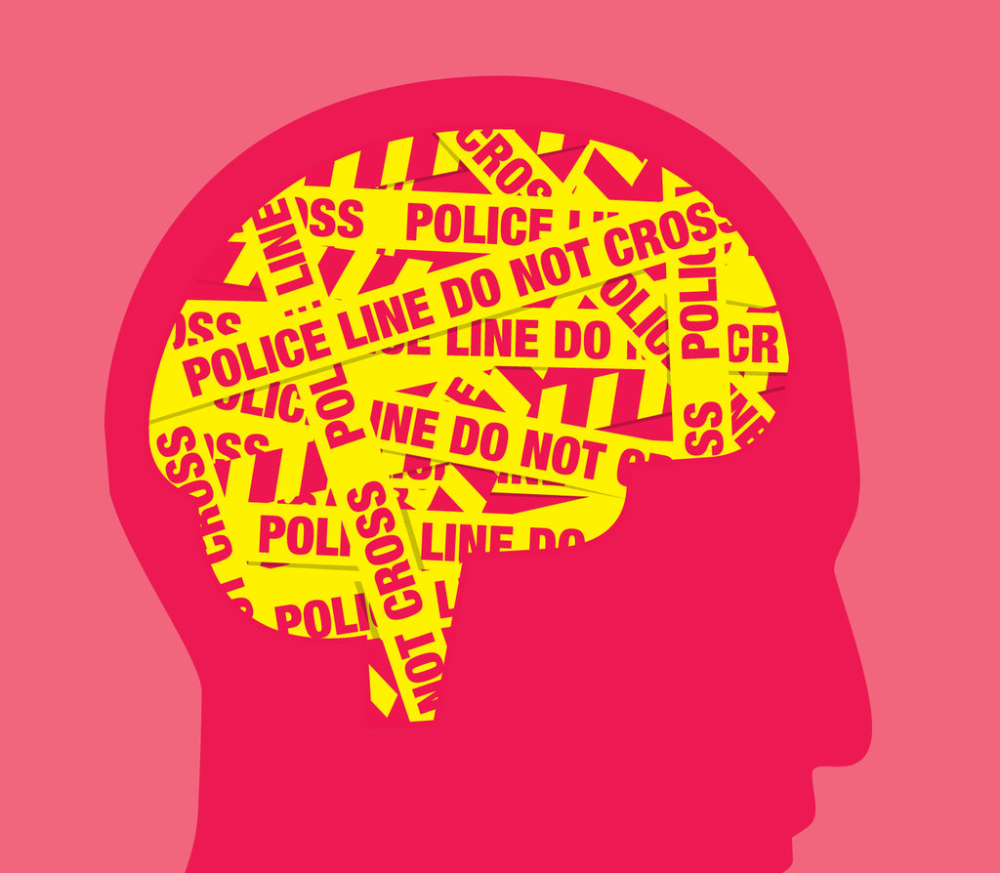

## [Cybertorture Related Resolutions by The United Nations](https://www.dignity.dk/wp-content/uploads/III-Overview-of-resolutions-by-Human-Rights-Council-UN-General-Assembly-on-torture-1990-2020.pdf)
0. [A/HRC/43/49 - The United Nations introduces the term Cybertorture](https://www.undocs.org/A/HRC/43/49)
0. [A/74/148 - The United Nations offers recommendations to prevent Domestic Violence](https://undocs.org/A/74/148)
0. [A/HRC/RES/13/19 - the role and responsibility of judges, prosecutors and lawyers](https://documents-dds-ny.un.org/doc/UNDOC/GEN/G10/129/70/PDF/G1012970.pdf?OpenElement)
0. [A/HRC/RES/10/24 - the role and responsibility of medical and other health personnel](https://ap.ohchr.org/documents/E/HRC/resolutions/A_HRC_RES_10_24.pdf)

For decades the United Nations have tried to raise awareness to address issues that affect our society whilst being mostly ignored by governments worldwide. 
With the advent of [A/HRC/43/49 recognizing Cybertorture](https://www.undocs.org/A/HRC/43/49), combined with progress in the field of Neuroscience and Neurolaw and raised interest in [neuromodulation](https://en.wikipedia.org/wiki/Neuromodulation_(medicine)) as a therapeutic procedure, along with the public disclosure of scientific content such as [neuromodulation of attention](pdf/1-s2.0-S0896627318300114-main.pdf) mechanisms, an opportunity has been created for someone to turn [arrows into flowers](https://core.ac.uk/download/pdf/60546298.pdf) and address some of those issues, raising awareness to the fight for [Neurorights and Mental freedom](https://www.frontiersin.org/research-topics/14276/neurorights-and-mental-freedom-emerging-challenges-to-debates-on-human-dignity-and-neurotechnologies), allowing individuals to [regulate their own states of mind](https://www.ncbi.nlm.nih.gov/pmc/articles/PMC3579548/) via self-rewarding payloads in a quasi-continuous [closed feedback loop](https://en.wikipedia.org/wiki/Control_theory#Open-loop_and_closed-loop_(feedback)_control), using the same cybertorture medium used to direct violence towards others, nurture addiction, turn women into [stockholm syndrome](https://en.wikipedia.org/wiki/Stockholm_syndrome) victims and exact extrajudicial trials and sentences in a circus format whilst hiding under a veil of psychiatric fraud, medical malpractice and forced pharmacotherapy, corrupting crucial data used by well intentioned institutions like the World Health Organization, stratifying society slowing progress!

## Cybertorture as a [𝄞 *Opera Cepa* 𝄢](https://iovs.arvojournals.org/article.aspx?articleid=2409430) 

Many of us look only at our own interests and the interests of those close to us. A so-called "Me, Me, Me" mentality which results lack of [Ethical](https://en.wikipedia.org/wiki/Ethics) and [Moral](https://en.wikipedia.org/wiki/Morality) values resulting in criminal behavior which could be mitigated in a [Transparent Society](https://en.wikipedia.org/wiki/The_Transparent_Society). Whilst I am an adept of [Transparent Behavior](https://en.wikipedia.org/wiki/Transparency_(behavior)), I also like "fair game" and I highly value my [personal autonomy](https://en.wikipedia.org/wiki/Autonomy) which should not be put in jeopardy by being forced into unemployment and welfare via cybertorture extrajudicial sentences so that I can't support myself and my "laptop" and "mobile phone" being set as targets to be destroyed under states of extreme exhaustion via sleep deprivation by sadists out of control who draw pleasure from generating synthetic psychotic behavior and acts of self-harm.

Lack of a Neurolaw framework and lack of a law enforcement entity dedicated to enforce Neurolaw and preserve Neurorights and Mental Freedom (particularly at home and at work) gives rise to social stratification by resorting to cybertorture to distort [self-determination](https://en.wikipedia.org/wiki/Self-determination) and corrupt data of threat assessment systems like [MOSAIC](https://en.wikipedia.org/wiki/MOSAIC_threat_assessment_systems)!

This obviously results in paranoid behavior regarding [Global Surveillance](https://en.wikipedia.org/wiki/Global_surveillance), [Right to Privacy](https://en.wikipedia.org/wiki/Right_to_privacy), [Physician Patient Privilege](https://en.wikipedia.org/wiki/Physician%E2%80%93patient_privilege), [Secret Ballot](https://en.wikipedia.org/wiki/Secret_ballot), [Intimacy and Privacy](https://en.wikipedia.org/wiki/Privacy#Intimacy), [Right to be let alone](https://en.wikipedia.org/wiki/Privacy#Right_to_be_let_alone), and results in lack of trust in:

0. Law enforcement
0. The Judicial System
0. Elected Government Officials
0. Psychiatrists
0. The Electoral Process
0. One another :(

Why would I bother spending money on public transport to vote when my every intention can be scrutinized as a victim of cybertorture ?
Since voting is compulsory, suffrage over synthetic telepathy would solve the problem of lack of participation in the electoral process. All that is required is trust :)

    <a href="https://en.wikipedia.org/wiki/Ut_queant_laxis">
        
    </a>

Most of these issues would not exist if we followed the [Open Source Model](https://en.wikipedia.org/wiki/Open-source_model) or at the very least, the rules were made Clear and Transparent. Obscurity and deception games culminate in [Solitude](https://en.wikipedia.org/wiki/Solitude), delusional quests for [Anonymity](https://en.wikipedia.org/wiki/Anonymity), [Aggression and Violent Behavior](https://en.wikipedia.org/wiki/Aggression_and_Violent_Behavior) and acts of [Terrorism](https://en.wikipedia.org/wiki/Terrorism).

Social honeypots for individuals with psychopathological issues filled with hate and anger, unwilling to "forgive and forget" based on the the movie [V for Vendetta](https://en.wikipedia.org/wiki/V_for_Vendetta_(film)) such as [The Anonymous Group](https://en.wikipedia.org/wiki/Anonymous_(group)) and their [Guy Fawkes](https://en.wikipedia.org/wiki/Guy_Fawkes) masks make matters worse. Whilst I like the renaissance look of the mask, the fact of the matter is Guy Fawkes was a terrorist and an idiot and so was [Robert Catesby](https://en.wikipedia.org/wiki/Robert_Catesby) ring leader of the failed [Gunpowder Plot](https://en.wikipedia.org/wiki/Gunpowder_Plot)!

    <a href="https://www.compoundchem.com/2014/01/22/the-chemistry-of-an-onion/">
        
    </a>

**_I don't deal with terrorists either, so why not wear a Jeremy Bentham mask instead to protest peacefully for what should be common sense via justice reform ?_**

[Mi](https://en.wikipedia.org/wiki/Solf%C3%A8ge) is a beautiful musical note but unless if you are composing something like [4'33''](https://en.wikipedia.org/wiki/4%E2%80%B233%E2%80%B3) **WE** need more musical notes to create a [𝄞 melody 𝄢](https://www.youtube.com/watch?v=80D3vkuLaxs).

#### [Part of my cybertorture story >>>](#mentis-morbum-tuum-)

## [José Saramago, Religious Offence and Freedom of Speech](https://en.wikipedia.org/wiki/Religious_offense)
Nobel Prize winner [**José Saramago**](https://en.wikipedia.org/wiki/Jos%C3%A9_Saramago) went into exile as a symbolic gesture on the Spanish island of Lanzarote in 1992 when the Government of Portugal under Prime Minister [Aníbal Cavaco Silva](https://en.wikipedia.org/wiki/An%C3%ADbal_Cavaco_Silva) ordered the removal of one of his works [**The Ghospel according to Jesus Christ**](https://en.wikipedia.org/wiki/The_Gospel_According_to_Jesus_Christ) from the Aristeion Prize's shortlist, claiming the work was religiously offensive.

Some of these individuals **insinuated** via synthetic telepathy José Saramago exiled himself due to [**cybertorture**](https://www.undocs.org/A/HRC/43/49). 
They also **insinuated** they asked him what was the worst book he ever read to which he allegedly replied [**The Rape of the Mind**](https://www.amazon.com/Rape-Mind-Psychology-Menticide-Brainwashing/dp/1614277877) by [Joost Meerloo](https://en.wikipedia.org/wiki/Joost_Meerloo) who coined the term [**menticide**](https://en.wiktionary.org/wiki/menticide).

This was followed by his work [**Blindness**](https://en.wikipedia.org/wiki/Blindness_(novel)) which they claimed was a social critique to the mass participation in the process and refusal to address the issue due to lack of a [**Neurolaw**](https://en.wikipedia.org/wiki/Neurolaw) framework, which has recently found [real use cases](https://www.frontiersin.org/articles/10.3389/fpsyg.2020.01762/full).
In 2004 José Saramago published his novel [**Seeing**](https://en.wikipedia.org/wiki/Seeing_(novel)).

    <a href="https://en.wikipedia.org/wiki/Seeing_(novel)">
        
    </a>

## TLDR - [**_Quod Nihil Scitur_**](https://plato.stanford.edu/entries/francisco-sanches/)

<!--
For the past 3 decades you preyed upon families by resorting to [Cognitive Biases](https://en.wikipedia.org/wiki/List_of_cognitive_biases) and lack of a [Neurolaw](https://en.wikipedia.org/wiki/Neurolaw) framework, [Neurorights and Mental Freedom awareness](https://www.frontiersin.org/research-topics/14276/neurorights-and-mental-freedom-emerging-challenges-to-debates-on-human-dignity-and-neurotechnologies) by attempting to portrait individuals as being "Insane" resorting to distorting **_Faith Trials over Synthetic Telepathy_** and presenting that content to others as **_proof_** the SUT believes he is either **God** or the **Devil**, attempting to portrait SUTs as being Pedos, Xenophobes, Homophobes, Misogynistic, and attempt to **Direct Violence towards Parents and Women**, 
-->

To those who enforce [Extrajudicial Sentences](https://en.wikipedia.org/wiki/Extrajudicial_punishment) of [Cyber Torture](https://www.undocs.org/A/HRC/43/49) (setting Cyber Sodomy, [Cognitive Impairment](https://en.wikipedia.org/wiki/Cognitive_deficit) and Synthetic Pain as a standard in our society) paired with [**Psychiatric Abuse**](https://en.wikipedia.org/wiki/Political_abuse_of_psychiatry) (violating every principle in the [**World Psychiatric Association Code of Ethics**](https://www.wpanet.org/policies)) towards **Stratifying Society** and making a circus out of the Judicial System, articulating Tongues and Jaws of SUT's for entertainment, Directing violence towards Parents and Women to Corrupt Data of **Threat Assessment Systems** like [**MOSAIC**](https://en.wikipedia.org/wiki/MOSAIC_threat_assessment_systems) and performing **Flawed Science** on mixed bags of data consisting of patients with **Real Psychopathological Illness** mixed with **Victims of Cybertorture**, **Delaying Progress** and **Raising Paranoia** to important therapeutical methods that could help make the world a better place such as [**Electroceuticals**](https://www.sciencedirect.com/science/article/pii/S0019483217308131)...

    <a href="https://www.youtube.com/watch?v=yGQgdE50QA4">
        
    </a>

I will not allow [Collaborationists](https://en.wikipedia.org/wiki/Collaborationism) who conspired to attempt to portrait me as a Pedo, a Stalker or a synthetic [**Anders Behring Breivik**](https://en.wikipedia.org/wiki/Anders_Behring_Breivik) via [Cyber Torture](https://www.undocs.org/A/HRC/43/49), exacting extrajudicial trials and sentences for xenophobia, homophobia, misogyny and making fools out of men by **Sabotaging Intercourse** with involuntary perineum contractions, **enslaving women via vibrotactile genital abuse** resulting in [**Stockholm Syndrome**](https://en.wikipedia.org/wiki/Stockholm_syndrome) to hide under the cover of Psychiatric Fraud by crafting misdiagnosis for various psychopathologies (pilled upon with false therapy in the form of Conventional Pharamcotherapy with a [Inherently High Suicide Risk](https://www.ncbi.nlm.nih.gov/pmc/articles/PMC5085732/)), when [**Electroceuticals**](https://www.sciencedirect.com/science/article/pii/S0019483217308131) paired with drafting [Neurolaw related legislation](https://en.wikipedia.org/wiki/Neurolaw), and promoting awareness of [Neuro Rights and Mental Freedom](https://www.frontiersin.org/research-topics/14276/neurorights-and-mental-freedom-emerging-challenges-to-debates-on-human-dignity-and-neurotechnologies) would reduce that risk to near 0.

**I will not be Silenced** and it may be a good idea for you to remember [**Queen Christina of Sweden**](https://en.wikipedia.org/wiki/Christina,_Queen_of_Sweden), the [**Extinct Order of the Amaranth**](https://en.wikipedia.org/wiki/Order_of_the_Amaranth), the relationship between [Freemasonry and women](https://en.wikipedia.org/wiki/Freemasonry_and_women) and the [**Quest for Gender Equality**](https://www.un.org/en/sections/issues-depth/gender-equality/).

I am very 🏳️‍🌈 Happy 🏳️‍🌈 with my **Very Male Gender**, and am NOT Gender Dysphoric in any way as some attempted to insinuate, going as far as resorting to Remote Vibrotactile Genital Torture, Cyber Sodomy and forcing a misdiagnosis of Paranoid Schizophrenia in an attempt to force acts of self-harm), and I would like to remind those in Portugal behaving like primates and engaging in a Mars versus Venus banana quest, namely DJ's and Psychiatrists leading humanity astray, and others worldwide, the quest for [**Gender Equality**](https://www.un.org/en/sections/issues-depth/gender-equality/) also includes [**Intersex People**](https://en.wikipedia.org/wiki/Hermaphrodite) ;)

I've vowed to fight inequality as part of my Catholic Confirmation Rite and to do something for society upon leaving Colégio Militar. As such I have taken vows of cellibacy to make sure we will achieve our objective! Also I don't need your **"Trowel and Plumb line"**, [**I'll use my 2 Fingers instead ✌️**](https://www.youtube.com/watch?v=yGQgdE50QA4)

## [Enduring Cybertorture :)](EnduringCybertorture.md)

0. [Enduring Cybertorture with Faith](EnduringCybertortureWithFaith.md)
0. [Enduring Cybertorture with Scientists](EnduringCybertortureWithScientists.md)
0. [Enduring Cybertorture with Neuroanatomy](Neuroanatomy.md)

## Police Brutality, [Extrajudicial punishment](https://en.wikipedia.org/wiki/Extrajudicial_punishment) and Cybertorture

Cybertorture is a means to exact [extrajudicial punishment](https://en.wikipedia.org/wiki/Extrajudicial_punishment) for those who **allegedly** evade loopholes in the legal system and as a form of [social stratification](https://en.wikipedia.org/wiki/Social_stratification). It may involve acting in criminal association with others who are recruited (and possibly manipulated), either to make the case untriable, or as a form of entrapment.

People are willing to act as social justiciary riders for multiple reasons. The most common is probably to exact justice for behavior they may find offensive such as: xenophobia, homophobia, pedophilia, misogyny, stalking, sexual abuse, animal abuse, issuing threats or being agressive towards people in their social circle (sexual partners, children, co-workers and prominent members of society). 

Some are made to believe in concepts such as social stratification, synthetic winners and synthetic losers and "naturally" wish to rise on the social ladder. Others are plain psychopaths, sexual predators, sodomites or sadists out of control addicted to degrading others and want to perpetuate their status quo, unwilling to repent or address their mental illness!

The methodology may involve:

0. forcing synthetic pain upon the SUT ([remote activation/deactivation of nociceptors](https://en.wikipedia.org/wiki/Nociceptor))
0. forcing vibrotactile sensations upon the SUT ([remote activation/deactivation of mechanoreceptors](https://en.wikipedia.org/wiki/Mechanoreceptor))
0. misregulating normal physiological functionality ([GPC Receptors and signaling pathways](https://en.wikipedia.org/wiki/G_protein-coupled_receptor))
0. forcing [synthetic telepathy](https://en.wikipedia.org/wiki/Brain%E2%80%93computer_interface#Synthetic_telepathy/silent_communication) upon the SUT

It creates more problems than it solves resulting in:

0. financial loss for insurance companies
0. abuse of psychiatry and medical malpractice [**en masse**](https://papers.ssrn.com/sol3/papers.cfm?abstract_id=2589690)
0. wasted human and financial resources in redundant or [**flawed scientific research**](https://en.wikipedia.org/wiki/Causes_of_schizophrenia#Candidate_gene_studies) by working with sets of corrupted data consisting of [**real illness**](https://en.wikipedia.org/wiki/On_the_Origin_of_the_%22Influencing_Machine%22_in_Schizophrenia) and victims of [**cybertorture**](https://www.undocs.org/A/HRC/43/49)
0. abuse of threat assessment systems like [**MOSAIC**](https://en.wikipedia.org/wiki/MOSAIC_threat_assessment_systems)
0. further loss of moral values by setting the wrong example resulting in behavior contagion

Grotesque examples:

0. getting the SUT to commit acts of [self-mutilation](https://en.wikipedia.org/wiki/Self-harm) (including genital) or [self-harm](https://en.wikipedia.org/wiki/Self-harm)
0. [forcing sodomy as a sentence](https://www.britannica.com/place/Sodom-and-Gomorrah#ref1233950) upon the SUT
0. articulating tongue and jaw movements of the SUT
0. directing violence towards others (parents, sexual partners, shop keepers, neighbors, police officers, psychiatrists, etc)
0. forcing the SUT to extract teeth
0. instructing the SUT to pick scabs from wounds
0. forcing the SUT to scratch himself via synthetic itches
0. [Sexual abuse](https://en.wikipedia.org/wiki/Sexual_abuse) of the SUT possibly resulting in [Stockholm Syndrome](https://en.wikipedia.org/wiki/Stockholm_syndrome)
0. forcing the SUT to feel synthetic pain in the anus, ears and lower back
0. forcing the SUT to feel stabbed in the skull
0. forcing the SUT to feel stabbed in the back
0. forcing sleep deprivation and extreme exhaustion upon the SUT
0. delivering thermoelastic payloads to soft tissues in the head of the SUT to draw self-harm
0. delivering thermoelastic payloads to the cerebellum and occipital area of skull the SUT to draw self-harm
0. delivering thermoelastic payloads to the base of the skull of the SUT to dislodge it
0. targeting electronic equipment that may be used to work or use social media (computer, laptop and mobile phone)
0. forcing the SUT to feel kicks all over the body and head to feel like human trash
0. forcing the SUT to roam the streets aimlessly to spend all his money by combining all of the above
0. nurturing [addictive behaviour](https://en.wikipedia.org/wiki/Addiction) by combining all of the above
0. Intensifying this methodology when in close proximity to others, prior to scheduled events or festive occasions such as birthdays, Christmas and New Years Eve

<!--
## The Chemistry of Emotions
## Nociceptive Pain and the Peripheral Somatosensory System
## Touch, Vibrotactile Sensations and the Peripheral Somatosensory System
## WHO - ICD, ICF
-->

## [Cybertorture and Psychiatric Abuse](#mentis-morbum-tuum-) 

[The World Psychiatry Association](https://www.wpanet.org/) has a new code of ethics [2020/OGA/7](pdf/e172f3_4cecd522c2d448c7944342ba88c527e5.pdf)

    <a href="https://www.wpanet.org/policies">
        
    </a>

The Declaration of Hawaii issued by the World Psychiatric Association in 1977 and updated in 1983 in Vienna was initiated because of political abuse of psychiatry in some countries in the seventies. This led to a long process of investigation and concern within the domain of professional ethics and paved the way for the Declaration of Madrid, which was endorsed by the General Assembly of the World Psychiatric Association in Madrid in 1996.

In its final form, the Declaration of Madrid includes seven general guidelines that focus on the aims of psychiatry namely to treat mentally ill patients, prevent mental illness, promote mental health and provide care and rehabilitation for mentally ill patients.

The Declaration of Madrid has now been superseded by the 2020 WPA Code of Ethics.

> Principle 1: Beneficence - Psychiatrists provide competent and compassionate medical care with devotion to the interests of their patients.

> Principle 2: Respect for patients' autonomy - Psychiatrists are especially mindful of respect for patients autonomy given their statutory role in treating a proportion of their patients compulsory. Compulsory treatment may be justified where a less restrictive intervention can not achieve safe and adequate care; its purpose is ultimately to promote safe and re-establish patients' autonomy and welfare.

> Principle 3: Non Maleficence - Psychiatrists avoid actions that may be injurious to their patients.

> Principle 4: Improving standards of mental health care and psychiatric practice: Psychiatrists recognize a responsibility to promote the continuing development of their profession and their personal professional development.

> Principle 5: Applying psychiatric expertise to the service of society - Psychiatrists, like other physicians, utilize their specialized knowledge and skills to promote mental health and wellbeing of persons who may be vulnerable to mental illness.

#### Message sent to my lawyer [Mr. Edo Bruijn](https://bruijnadvocaten.nl/) on the 20th December 2020 as I await the decision of a court of Law in the Netherlands due to *"Doctor"* [Emile Barkhof](https://nl.linkedin.com/in/emile-barkhof-8277a6106) trying to force conventional antipsychotic pharmacotherapy upon me against my will, whilst knowing fully well I am being treated in a cruel and inhumane way via cybertorture to simulate [paranoid schizophrenia](https://en.wikipedia.org/wiki/Schizophrenia) (by individuals who direct violence towards women, my parents, the police and psychiatrists) and try to force acts of self-harm (every few seconds) under the false pretense of making me **_Cry_**!

> Hello Dr. Bruijn. I would like to reiterate the fact that cybertorture is being used to simulate behavior that may resemble paranoid schizophrenia by individuals I mentioned to you in the past and on my personal [github page](https://strikles.github.io). I would also like to state that the only type of therapy in which I would participate voluntarily if paranoid schizophrenia was my real condition would be via the use of electroceuticals (an example electroceutical being [electRx](https://www.darpa.mil/program/electrical-prescriptions)). Forcing suboptimal conventional pharmacotherapy when superior solutions are available is inhumane and doctors that insist on that particular form of "therapy" (if you can call it that) don't have the best interests of the patient at heart, since that particular kind of antipsychotic medication doesn't address the problems of the patient in the best possible way and corresponds to psychiatric fraud, medical malpractice and cruel and inhumane treatment. Further insisting on medication with side effects like [hyperprolactinaemia](https://www.ncbi.nlm.nih.gov/pmc/articles/PMC1122185/), [tardive dyskinesia](https://en.wikipedia.org/wiki/Tardive_dyskinesia) or [sexual dysfunction](https://en.wikipedia.org/wiki/Sexual_dysfunction) corresponds to [intentionally collaborating with forcing suicidal thoughts upon the patient](https://www.ncbi.nlm.nih.gov/pmc/articles/PMC5085732/). A good Sunday to you 🙏

During our first interview he insinuated this was being done to me due to my lack of knowledge on **_"how things work at the neurotransmitter level"_** and my **_previous work experience_**, giving me a **_judgemental look of disaproval_** when he attempted to redirect the conversation into how well previous pharmacotherapy approaches had worked and I interrupted suggesting **_neuromodulation via electroceuticals_**. He **_mocked me with a grin_** when I stated none of the previous pharmacotherapy approaches worked and **_rejected both my proposal and my request to see a psychologist to deal with the many traumas induced due to the cybertorture procedure_**, forcing me to meet him again whilst under severe cybertorture abuse and **_repeating himself over and over again_** trying to force me to accept a conventional pharmacological approach **_using diminutives_** trying to make his coercive initiative sound less harmful, followed by asking a court of law for conventional antipsychotic pharmacotherapy to be forced upon me, which is a clear violation of [The Right to Refuse Medical Treatment under the European Convention on Human Rights](https://academic.oup.com/medlaw/article-abstract/9/1/17/973865).

See the European Court of Human Rights Thematic Report - [Health-related issues in the case-law of the European Court of Human Rights](https://www.echr.coe.int/Documents/Research_report_health.pdf)

    <a href="img/Psyops-400x400.png">
        
    </a>

**_Psychiatrists who behave like this violating the [WPA Code of Ethics](https://www.wpanet.org/policies) seem to have more psychopathological issues than the patients they pretend to treat and remind me of South Park character Dr. William Janus - Season 15, Episode 6 - [City Sushy](https://www.southparkstudios.com/episodes/dhi2tb/south-park-city-sushi-season-15-ep-6)_**

This was followed by a videocall interview at the Mentrum Emergency Psychiatry Clinic in Eerste Constantijn Huygensstraat to talk to an independent psychiatrist and assert if I was a danger to myself where I found a statue named "How to meet an Angel" by Ilya and Emilia Kabakov was installed!

To the care of Ilya and Emilia Kabakov,

Dear Ilya and Emilia,

I write regarding the art piece "How to meet an Angel" installed at the Mentrum Emergency Psychiatry Clinic in Eerste Constantijn Huygensstraat

    <a href="https://nl.wikipedia.org/wiki/How_to_meet_an_angel">
        
    </a>

Cybertorture is recognized by the United Nations under A/HRC/43/49 and is used in grotesque rituals of social stratification (by law enforcement and others recruited for the purpose) to exact extrajudicial trials and sentences as an interactive spectacle encouraging participation, mongering tensions and hatred by preying on cognitive biases.

Those who exact the extrajudicial sentences resort to directing violence towards women, parents, creating drug addicts with synthetic pain and forcing acts of self-harm for entertainment, whilst attempting to portray themselves as Artists of human degradation, social stratification and self-harm, with grotesque preludes of vibrotactile and sonic payloads of "kisses" and setting synthetic pain, articulating tongue and jaw of the subject under torture, cyber sodomy, intercourse sabotage in males (via involuntary perineum contractions resorting to forced using a feather) and vibrotactile genital abuse in females (possibly resulting in Stockholm's Syndrome) as being standard in our society!

The procedure is hidden under a veil of medical malpractice via psychiatric fraud (violating every principle in the code of ethics set by the World Psychiatry Association), false therapy in the form of forced conventional pharmacotherapy (with an associated high risk of suicide) when it could be used to provide therapeutic payloads via the same medium, raising feelings of paranoia towards remote healthcare, neural engineering and electroceuticals where the risk of suicide would be nearly zero!

Since Cybertorture paired with Psychiatric Fraud and False therapy has been used for quite some time now to stratify society and several people complained about the installation of such an art piece at an emergency psychiatric institution that deals with individuals at risk of committing acts of self-harm and Wim Brands committed suicide,  may I humbly request the name of the statue "How to meet an Angel" to be renamed to something that doesn't make it seem like suicide is a recipe to meet Angels ?

My sincere apologies!

## [Diagnostic and Statistical Manual of Mental Disorders](https://en.wikipedia.org/wiki/Diagnostic_and_Statistical_Manual_of_Mental_Disorders)

The Diagnostic and Statistical Manual of Mental Disorders, Fifth Edition (DSM-5) is the 2013 update to the Diagnostic and Statistical Manual of Mental Disorders, the taxonomic and diagnostic tool published by the American Psychiatric Association (APA). In the United States, the DSM serves as the principal authority for psychiatric diagnoses. Treatment recommendations, as well as payment by health care providers, are often determined by DSM classifications, so the appearance of a new version has practical importance. The DSM-5 is the first DSM to use an Arabic numeral instead of a Roman numeral in its title, as well as the first "living document" version of a DSM.

The DSM-5 is not a major revision of the DSM-IV-TR but there are significant differences. Changes in the DSM-5 include the reconceptualization of Asperger syndrome from a distinct disorder to an autism spectrum disorder; the elimination of subtypes of schizophrenia; the deletion of the "bereavement exclusion" for depressive disorders; the renaming of gender identity disorder to gender dysphoria; the inclusion of binge eating disorder as a discrete eating disorder; the renaming and reconceptualization of paraphilias, now called paraphilic disorders; the removal of the five-axis system; and the splitting of disorders not otherwise specified into other specified disorders and unspecified disorders.

Some authorities criticized the fifth edition both before and after it was published. Critics assert, for example, that many DSM-5 revisions or additions lack empirical support; inter-rater reliability is low for many disorders; several sections contain poorly written, confusing, or contradictory information; and the psychiatric drug industry may have unduly influenced the manual's content ([many DSM-5 workgroup participants had ties to pharmaceutical companies](https://www.nejm.org/doi/full/10.1056/NEJMc0810237))

## [Computational Psychiatry](https://www.technologyreview.com/2017/07/21/242297/the-emerging-science-of-computational-psychiatry/), [Electroceuticals](https://www.scientificamerican.com/article/electroceuticals/) and [ElectRx](https://www.darpa.mil/program/electrical-prescriptions)

    <a href="https://www.compoundchem.com/2014/01/22/the-chemistry-of-an-onion/">
        
    </a>

Psychiatry, the study and prevention of mental disorders, is currently undergoing a quiet revolution. For decades, even centuries, this discipline has been based largely on subjective observation. Large-scale studies have been hampered by the difficulty of objectively assessing human behavior and comparing it with a well-established norm. Just as tricky, there are few well-founded models of neural circuitry or brain biochemistry, and it is difficult to link this science with real-world behavior.

That has begun to change thanks to the emerging discipline of computational psychiatry, which uses powerful data analysis, machine learning, and artificial intelligence to tease apart the underlying factors behind extreme and unusual behaviors.   

Computational psychiatry has suddenly made it possible to mine data from long-standing observations and link it to mathematical theories of cognition. It’s also become possible to develop computer-based experiments that carefully control environments so that specific behaviors can be studied in detail.

> The Electrical Prescriptions (ElectRx) program aims to support military operational readiness by reducing the time to treatment, logistical challenges, and potential off-target effects associated with traditional medical interventions for a wide range of physical and mental health conditions commonly faced by our warfighters. ElectRx seeks to deliver non-pharmacological treatments for pain, general inflammation, post-traumatic stress, severe anxiety, and trauma that employ precise, closed-loop, non-invasive modulation of the patient’s peripheral nervous system.

> The human nervous system already plays a vital role in maintaining all aspects of physical and mental health. A sophisticated network of sensory nerves continuously monitors health status and triggers reflexive responses in the brain and spinal cord when an infection or injury is detected. These reflexes normally adjust organ function to initiate and control the healing process. However, some diseases can disrupt healthy functioning of these processes and produce nerve signaling that causes pain, metabolic disorders such as diabetes, and autoimmune disorders such as rheumatoid arthritis. ElectRx technology would exploit and supplement the body’s natural ability to quickly and effectively heal itself, intervening when required to correct or bolster nervous system activity.

> ElectRx is establishing the underlying science and developing the technologies that could enable artificial modulation of peripheral nerves to restore healthy patterns of signaling in these neural circuits. The program seeks to advance understanding of the anatomy and physiology of specific neural circuits and their role in health and disease. In parallel, the program also seeks to develop novel biological-interface technologies for monitoring biomarkers and peripheral nerve activity, and delivering therapeutic signals to peripheral nerve targets. Potential new approaches include in vivo, real-time biosensors and novel neural interfaces using optical, acoustic, electromagnetic, or engineered biology strategies to achieve precise targeting with potentially single-axon resolution.

> Following successes in early proof-of-concept studies, the ElectRx devices and therapeutic systems under development are entering into clinical studies. If successful, such precise neuromodulation capability technology would reduce dependence on traditional drugs and create new treatments that could be automatically and continuously tuned to the needs of warfighters without side effects. The technology could also help doctors evaluate and predict various physiological states, and characterize host response in patients with severe infections, providing a quantitative framework to guide operations and therapy.

      <a href="https://www.youtube.com/watch?v=5yLzZikS15k">
         
      </a>

DARPA provides. Thank you ;)

## [Justice Reform](https://scilaw.org/)

The Research Network on Law and Neuroscience, supported by the John D. and Catherine T. MacArthur Foundation, addresses a focused set of closely-related problems at the intersection of neuroscience and criminal justice:

0. investigating law-relevant mental states of, and decision-making processes in, defendants, witnesses, jurors, and judges
0. investigating in adolescents the relationship between brain development and cognitive capacities
0. assessing how best to draw inferences about individuals from group-based neuroscientific data

    <a href="https://www.lawneuro.org/">
        
    </a>

Neuroscience and neurolaw have found practical use cases in the Netherlands:

0. [Neuroscientific evidence and criminal responsibility in the Netherlands](https://pure.uvt.nl/ws/portalfiles/portal/1411050/Koops_Neuroscience_and_Criminal_Responsibility_120222_potsprint_immediately.pdf)
0. [Neurolaw: de relevantie voor de forensische psychiatrie](http://www.tijdschriftvoorpsychiatrie.nl/assets/articles/56-2014-9-artikel-meynen.pdf)
0. [Maastricht neurolaw 2014](http://www.antoniocasella.eu/dnlaw/Maastricht_neurolaw_2014.pdf)
0. [Real Neurolaw in the Netherlands: The Role of the Developing Brain in the New Adolescent Criminal Law](https://www.frontiersin.org/articles/10.3389/fpsyg.2020.01762/full)
0. [Other relevant publications related to Neurolaw in The Netherlands](https://www.lawneuro.org/netherlands.php) 

## [Ending Police Brutality](https://en.wikipedia.org/wiki/Police_brutality)

Social stratification by directing violence towards women and my own parents resulting in abuse of threat assessment systems like [**MOSAIC**](https://en.wikipedia.org/wiki/MOSAIC_threat_assessment_systems) is both repugnant and [fascist](https://en.wikipedia.org/wiki/Fascism)! 

    <a href="https://www.amazon.com/Fascism-Madeleine-Albright-audiobook/dp/B078XKL3PK">
        
    </a>

Perhaps it may be a good idea to have the Police set the right example and stop themselves from engaging in acts of Police brutality by creating a cultural movement via diffusion to set us away from these mediocre standards so the general population can simultaneously feel safer and accept the higher standards about to be set by neurolaw via bringing neuroscience and machine learning to the field of [neurolaw](https://en.wikipedia.org/wiki/Neurolaw) for the purpose of [presenting evidence for legal proceedings](https://en.wikipedia.org/wiki/Evidence_(law)).

    <a href="img/0623-Bloom-jumbo.jpg">
        
    </a>

Maybe this would help address the many shortcomings of law enforcement, help reduce their workload, eradicate [tampering, falsification, and spoliation of evidence](https://en.wikipedia.org/wiki/Evidence_(law)#Tampering,_falsification,_and_spoliation) and keep the general population away from penitentiaries and psychiatric hospitals!

The cybertorture medium used to direct violence towards women could be used to help law enforcement avoid engaging in acts of police brutality as those that gave rise to the [BLM movement](https://en.wikipedia.org/wiki/Black_Lives_Matter) and many others like [Cláudia Simões in Portugal](https://expresso.pt/sociedade/2020-01-24-Claudia-Simoes-Se-nao-lhe-mordesse-a-mao-e-o-braco-morreria.-Ele-estava-a-sufocar-me.-Nao-morri-sabe-Deus-como). 

    <a href="https://expresso.pt/sociedade/2020-01-24-Claudia-Simoes-Se-nao-lhe-mordesse-a-mao-e-o-braco-morreria.-Ele-estava-a-sufocar-me.-Nao-morri-sabe-Deus-como">
        
    </a>

<!--
𝆒 𝆓 
𝄡 𝄞 𝄢 𝄫 
𝇇 𝇋
🎶 🎵
᭡ ᭣ 
❦ ☙ 
❤ ❥ 
♥
-->

# Mentis Morbum Tuum 𝄫

    <a href="https://www.frontiersin.org/research-topics/14276/neurorights-and-mental-freedom-emerging-challenges-to-debates-on-human-dignity-and-neurotechnologies">
        
    </a>

#### I've exiled myself in the Netherlands and I refuse to return to Portugal under any terms or conditions where this treatment has been aggravated by Former [Colégio Militar](https://www.colegiomilitar.pt/) Students. Some worked for the security staff of the President of the Portuguese Republic and engaged in a Megalomaniac plot since I was 14 years old to exact an extrajudicial sentence of intercourse sabotage with involuntary perineum contractions, directing violence towards women and my parents. This has been pilled upon with a perpetual sentence of cognitive impairment misdiagnosed as paranoid schizophrenic as a coverup under constant vibrotactile genital torture and cyber Sodomy to force self-harm!

0. **Luis Nazareth Carvalho Figueira** (17 at Colégio Militar) @PSP who planned this since I was a teenager.
0. [**Tito Eurico Miranda Fernandes**](https://dre.pt/home/-/dre/115800591/details/maximized) (15 at Colégio Militar) @PSP - Tito was recruited by Luis Figueira and worked directly for the security staff of the President of the Portuguese Republic making it hard to understand why Europol doesn't take prompt action. Hopefully not to see an encore of the sad spectacle involving [**Jasper Kums**](https://nl.linkedin.com/in/jasperkums) who acted in criminal association with so many others on the 1st January 2017. Tito has been sabotaging prayer and telephone communication with my mother gambling self-harm via incessant vibrotactile payloads delivered to my ears and soft tissues in my head and is surrounded with individuals entertaining themselves by watching me break the few belongings I have!

Portuguese Law Enforcement Officers like:

0. [**Pedro Miguel Grilo**](https://pt.linkedin.com/in/pedro-grilo-8760013b) (427 at Colégio Militar) @PSP - instructed me to jump out of a rooftop in the Netherlands and out of the window in front of my mother whilst remotely gaping my anus as my mother complained she urinated herself in the middle of the night from watching me hit myself in the head!
0. João Pinheiro (277 at Colégio Militar) **exonerated** @PSP officer

The previous Former Colégio Militar students act in criminal association with several others such as:

0. [**Jasper Kums**](https://nl.linkedin.com/in/jasperkums) (my former employer @EenvoudAgency) who attempted to turn me into a stalker!
0. [**Gonçalo Carvalho**](https://nl.linkedin.com/in/gccarvalho/de) (my former colleague at @Quby and possibly related to [ISCPSI](http://www.iscpsi.pt/) where Pedro Miguel Grilo also used to work) who attempted to drive me insane by insinuating he was having sex with Queen Maxima of the Netherlands over synthetic telepathy as I was sexually abused remotely!
0. [**Gonçalo Bandeira Duarte**](https://pt.linkedin.com/in/gon%C3%A7alo-duarte-b71078107?trk=people-guest_people_search-card) (a known criminal who conspired to get me to mimick his xenophobic, homophobic and misogynistic behavior)
0. [**Tiago Jorge Roque**](https://www.facebook.com/tiago.j.roque) (Neighbor of Gonçalo Bandeira Duarte)
0. João Leiria (a former [Tapada Crew](https://www.tapadacrew.com/) employee @WorldCrewEvents. Employees at Tapada Crew have ties to Colégio Militar and neighbors of Gonçalo Bandeira Duarte)
0. A very large number of individuals associated to the former owners of ["Água pela Barba" next to Jardim do Adamastor at Rua do Almada, Lisboa](https://goo.gl/maps/S5dwABC3DVC2Zsjv9) some of which were recruited and sent to the Netherlands (like Jessica owner of the mobile phone +31 684166784) and involved their social groups (which include a couple consisting of a DJ who goes by the name of Dresh, his influential father who I never met and his girlfriend who may be a psychiatrist).
0. Carla Maria Marinho Rodrigues - who seems determined to force self-harm as revenge for insinuating she was a cocaine addict) and Nuno Correia. 
0. [Nuno Correia](https://pt.linkedin.com/in/nuno-correia-383a86154) - may be acting in criminal association with his mother, a nurse who claimed Portuguese doctors were better than Doctors in the Netherlands in a possible attempt to manipulate me to live with my mother in Portugal. His mother is my mothers neighbor at the 12th floor). I worked for Nuno for 3 day at Merkkurio Digital and I hope other members of his family (like his father and his brother) haven't turned the Justice System in the Netherlands into a Theatrical Circus.

These individuals enforce a cognitive impairment extrajudicial sentence, direct violence towards others (including women, my parents, police officers, psychiatrists and medical personnel) sabotage everything I do, including maintaining a regular breathing pattern, attempting to force self-harm instead, making it impossible to find a job working in the physical vicinity of others, trying to craft numerous psychological traumas and forcing me to live in celibacy and solitude to avoid arguments and violent confrontations. 

This sadly aids their cause of forcing psychiatric fraud and false therapy in the form of forced conventional pharmacotherapy to stab my gluteus maximus with a needle as a humiliation whilst trying to look like **Artists** at forcing me to hurt myself with amplified and distorted sonic and vibrotactile preludes of grotesque "Kisses" forced upon soft tissues in head and brain mass!

      <a href="https://en.wikipedia.org/wiki/Doubting_Thomas">
         
      </a>

They exact morbid extrajudicial cognitive impairment sentences for entertainment which in my case consist of:

0. articulating my tongue and jaw to force me to utter words in the Portuguese language
0. forcing me to feel slapped in an attempt to force self-harm delivering noxious payloads to the back of the head (cerebellum) every few seconds
0. attempting to force self-harm delivering vibrotactile payloads to my ears every few seconds
0. forcing me to extract teeth via remote control of blood flow and nociception with oscillatory patterns simulating masturbation
0. dislodging my skull from it's resting place so I can't keep my head straight every few seconds
0. watching me destroy my private property setting as targets mobile phone and laptop so I can't work or use social media
0. sensitizing nerve endings to maximize impact and forcing synthetic hyperhidrosis of hands and feet as a social exclusion measure
0. cybersodomy and synthetic nociception on my anus
0. all day vibrotactile genital torture every single day trying to guarantee synthetic psychotic behavior and self-harm
0. sabotage of all learning experiences
0. sabotage of multimedia experiences (listening to music or watching TV)
0. directing violence towards the people around me
0. trying to force me to spit on supermarket employees during the current SARS-CoV-2 pandemia at the moment of paying
0. trying to fill my home with fungi forcing me into the shower for relief for long periods with synthetic back pain

#### They intensify this treatment in the presence of my elderly mother jeopardizing her mental and physical well being as a sentence to both of us for not leaving Colégio Militar at age 14 after performing Faith Trials over synthetic telepathy and attempting to portrait me as a Pedo to force me out of school!

#### Luis Nazareth Carvalho Figueira asked me not to approach women in 2016 as those acting in criminal association with [Jasper Kums](https://nl.linkedin.com/in/jasperkums) conspired to turn me into a stalker and violent towards women without much success! As such I've taken vows of cellibacy in order to comply with his request!

#### Attempts to perpetuate psychiatric fraud and false therapy under a misdiagnosis of **paranoid schizophrenia** as a cover for an illegal sentence of cognitive impairment, forcing me to live out of welfare or attempting to force my return to Portugal will result in seeking [legal action](https://www.macfound.org/networks/research-network-on-law-and-neuroscience/) leaving the European Union Synthetic Mental Illness Psychiatric Dictate and asking for [**Refugee Status**](https://www.redcross.org.uk/get-help/get-help-as-a-refugee) :(

    <a href="https://www.frontiersin.org/research-topics/14276/neurorights-and-mental-freedom-emerging-challenges-to-debates-on-human-dignity-and-neurotechnologies">
        
    </a>

["Deus Caritas Est"](http://www.vatican.va/content/benedict-xvi/en/encyclicals/documents/hf_ben-xvi_enc_20051225_deus-caritas-est.html)
